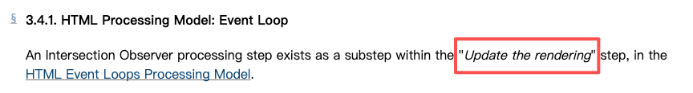

# Intersection Observer API 交叉观察器

Intersection Observer API 是一种现代浏览器提供的**高性能、<font color="red">异步监听</font>元素与视口（或指定祖先元素）交叉状态变化的接口**。
它解决了传统 `scroll` 事件监听方式带来的性能瓶颈，常用于实现**图片懒加载、无限滚动、元素动画触发、曝光统计**等功能。
Intersection Observer 处理步骤作为 “更新渲染” 步骤的一个子步骤，存在于 HTML 事件循环处理模型（Event Loop）中。


---

### 一、核心概念

- **Target（目标元素）**：你希望监听的 DOM 元素。
- **Root（根元素）**：用于作为交叉参照的容器元素，默认是浏览器视口（`null`）。
- **Intersection（交叉）**：目标元素与根元素的重叠区域。
- **Threshold（阈值）**：目标元素可见比例达到多少时触发回调，取值范围是 `0~1`。
- **rootMargin**：扩展或缩小根元素的检测区域，类似 CSS 的 `margin`。

---

### 二、基本用法（三步走）

```javascript
// 1. 创建观察器
const observer = new IntersectionObserver(
  (entries, observer) => {
    entries.forEach(entry => {
      if (entry.isIntersecting) {
        console.log('元素进入视口')
        observer.unobserve(entry.target) // 停止观察
      }
    })
  },
  {
    root: null, // 使用视口作为根
    rootMargin: '0px', // 可扩展检测区域
    threshold: 0.1 // 10% 可见时触发
  }
)

// 2. 获取目标元素
const target = document.querySelector('.target')

// 3. 开始观察
observer.observe(target)
```

---

### 三、执行机制：

`IntersectionObserver` 的执行机制可以概括为以下 4 步：

1. 注册阶段  
   创建实例时，浏览器把 `root`、`rootMargin`、`threshold` 解析成「相交判定参数」，并把回调函数 `_callback` 存入内部队列，但**不会立即触发任何计算**。

2. 采样阶段（异步 + 合并）  
   当页面发生滚动、缩放、动画帧或 DOM 变更时，浏览器在**合成线程**里批量计算所有被观察元素与 root 的相交矩形，得到新的 `intersectionRatio`。  
   只要「旧比例→新比例」跨越了某个 `threshold`，就把该元素的 `IntersectionObserverEntry` 推入**微任务队列**；否则直接丢弃，主线程**零阻塞**。

3. 回调阶段（空闲时执行）  
   当前 JavaScript 调用栈清空后，浏览器在空闲时段把微任务队列里的 `entries` 一次性交给 `_callback`，并传入 `observer` 自身。  
   因此回调永远是**异步、批量、防抖**的；同一帧内多次滚动只会触发一次回调。

4. 清理阶段  
   若执行了 `unobserve()` 或 `disconnect()`，浏览器把对应元素从 `_observationTargets` 数组移除；当数组为空时，停止采样，释放内存。

一句话总结：  
`IntersectionObserver` 把「相交计算」搬到合成线程，**只在跨越阈值时把结果批量投递到微任务队列**，从而用最小开销实现懒加载、无限滚动、曝光埋点等功能。

### 四、典型应用场景

#### 1. 图片懒加载

```javascript
const images = document.querySelectorAll('img[data-src]')

const imgObserver = new IntersectionObserver(
  (entries, observer) => {
    entries.forEach(entry => {
      if (entry.isIntersecting) {
        const img = entry.target
        img.src = img.dataset.src
        observer.unobserve(img)
      }
    })
  },
  {
    threshold: 0.1,
    rootMargin: '100px' // 提前加载
  }
)

images.forEach(img => imgObserver.observe(img))
```

#### 2. 无限滚动加载数据

当底部加载提示元素进入视口时触发数据请求：

```javascript
const loadMoreObserver = new IntersectionObserver(
  entries => {
    if (entries[0].isIntersecting) {
      loadMoreData() // 自定义加载函数
    }
  },
  { threshold: 1.0 }
)

const sentinel = document.querySelector('#load-more')
loadMoreObserver.observe(sentinel)
```

#### 3. 滚动触发动画

```javascript
const animatedElements = document.querySelectorAll('.animate-on-scroll')

const animationObserver = new IntersectionObserver(
  entries => {
    entries.forEach(entry => {
      if (entry.isIntersecting) {
        entry.target.classList.add('is-visible')
        animationObserver.unobserve(entry.target)
      }
    })
  },
  { threshold: 0.2 }
)

animatedElements.forEach(el => animationObserver.observe(el))
```

---

### 五、React 中使用示例（自定义 Hook）

```javascript
import { useEffect, useRef, useState } from 'react'

function useInView(options) {
  const ref = useRef()
  const [isInView, setIsInView] = useState(false)

  useEffect(() => {
    const observer = new IntersectionObserver(([entry]) => {
      if (entry.isIntersecting) {
        setIsInView(true)
        observer.unobserve(entry.target)
      }
    }, options)

    if (ref.current) observer.observe(ref.current)

    return () => observer.disconnect()
  }, [options])

  return [ref, isInView]
}
```

使用方式：

```javascript
function LazyImage({ src, alt }) {
  const [ref, isInView] = useInView({ threshold: 0.1 })

  return (
    <div ref={ref}>
      {isInView ?  : <div>Loading...</div>}
    </div>
  )
}
```

---

### 六、注意事项

- **兼容性**：支持 Chrome 51+、Firefox 55+、Safari 12.1+，旧浏览器需引入 [polyfill](https://github.com/w3c/IntersectionObserver/tree/main/polyfill)。
- **性能优化**：观察完成后及时调用 `unobserve()` 或 `disconnect()`，避免内存泄漏。
- **调试技巧**：可通过 `entry.intersectionRatio`、`entry.boundingClientRect` 等属性进行调试。

---

### 七、总结

Intersection Observer API 是现代前端开发中不可或缺的性能优化工具。它以**异步、高效、简洁**的方式，替代了传统的滚动监听方案，广泛应用于懒加载、动画、曝光统计等场景。掌握它，将显著提升页面性能与用户体验。

---

**参考资料**：

- [IntersectionObserver API&应用场景&示例代码详解原创 - CSDN博客](https://blog.csdn.net/m0_55049655/article/details/148773904)
- [【Web API】浏览器才是你的“后端”：探索强大的 Web API - CSDN博客](https://blog.csdn.net/2301_79858914/article/details/150699281)
- [快速滚动场景的 IntersectionObserver 有坑？你们踩了吗？](https://juejin.cn/post/7186454896151887927)
- [Intersection Observer - w3c](https://www.w3.org/TR/intersection-observer/#intersection-observer-callback)
