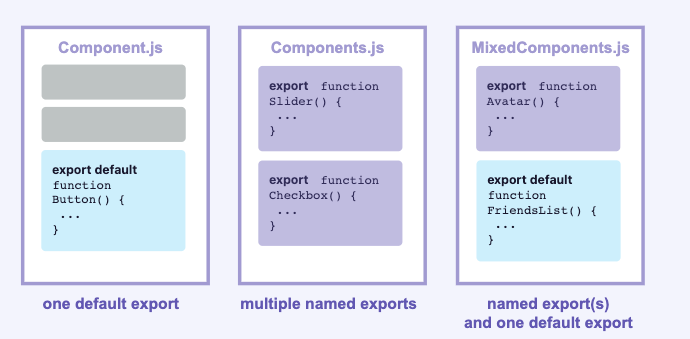

# React Basics

**React** 应用程序是由 **组件** 组成的。一个组件是 UI（用户界面）的一部分，它拥有自己的逻辑和外观。组件可以小到一个按钮，也可以大到整个页面。

**React** 组件是返回标签的 **JavaScript** 函数：

```jsx
function MyButton() {
  return <button>My Button</button>
}
export default MyButton
```

**React 组件必须以大写字母开头，而 HTML 标签则必须是小写字母。** `export default` 关键字指定了文件中的主要组件。

## 显示数据

`JSX` 会让你把标签放到 `JavaScript` 中。而大括号会让你 “回到” `JavaScript` 中，这样你就可以从你的代码中嵌入一些变量并展示给用户。
你还可以将 `JSX` 属性 “转义到 `JavaScript`”，但你必须使用 **大括号** 而非引号。例如，`className={title}` 是将 **title** 变量传递给 **className**，作为 `CSS` 的 `class`。

```jsx
const info = {
  name: 'react',
  color: 'red'
}

function MyComponent() {
  return (
    <>
      <h2 className="title">Hello {info.name}</h2>
      <p style={{ color: info.color }}>这是一个段落</p>
    </>
  )
}
export default MyComponent
```

## 使用 JSX 编写标签

上面所使用的标签语法被称为 JSX。它是可选的，但大多数 React 项目会使用 JSX，主要是它很方便。JSX 允许你在 JavaScript 中编写类似 HTML 的标签,但比 HTML 更加严格。你必须闭合标签，如 `<br />`。你的组件也不能返回多个 JSX 标签。你必须将它们包裹到一个共享的父级中，比如 `<div>...</div>` 或使用空的 `<>...</>` 包裹：

> `JSX` and `React` 是相互独立的 东西。但它们经常一起使用，但你**可以**单独使用它们中的任意一个，`JSX` 是一种语法扩展，而 `React` 则是一个 `JavaScript` 的库。

### JSX 规则

1. **只能返回一个根元素。** 如果想要在一个组件中包含多个元素，需要用一个父标签把它们包裹起来。如果你不想在标签中增加一个额外的 `<div>` ，可以用 `<>` 和 `</>` 元素来代替。

   ```jsx
   function MyComponent() {
     return (
       <>
         <h1>Hello World</h1>
         <p>这是一个段落</p>
       </>
     )
   }
   export default MyComponent
   ```

   **这个空标签被称作 Fragment。React Fragment 允许你将子元素分组，而不会在 HTML 结构中添加额外节点。**

2. **标签必须闭合。** JSX 要求标签必须正确闭合。像 `` 这样的自闭合标签必须书写成 ``，而像 `<li>oranges` 这样只有开始标签的元素必须带有闭合标签，需要改为 `<li>oranges</li>`。

   ```jsx
   function MyComponent() {
     return (
       <>
         
         <ul>
           <li>1</li>
           <li>2</li>
         </ul>
       </>
     )
   }
   export default MyComponent
   ```

3. **使用驼峰式命名法给 <s>所有</s> 大部分属性命名！** `JSX` 最终会被转化为 `JavaScript`，而 `JSX` 中的属性也会变成 `JavaScript` 对象中的键值对。在你自己的组件中，经常会遇到需要用变量的方式读取这些属性的时候。但 `JavaScript` 对变量的命名有限制。例如，变量名称不能包含 `-` 符号或者像 `class` 这样的保留字。所以在 `React` 中，大部分 `HTML` 和 `SVG` 属性都用驼峰式命名法表示。例如，需要用 `strokeWidth` 代替 `stroke-width`。由于 `class` 是一个保留字，所以在 `React` 中需要用 `className` 来代替。这也是 `DOM` 属性中的命名:

   ```jsx
   function MyComponent() {
     return (
       <>
         
       </>
     )
   }
   export default MyComponent
   ```

> **高级提示：使用 `JSX` 转化器**
> 将现有的 `HTML` 中的所有属性转化 `JSX` 的格式是很繁琐的。我们建议使用 **转化器** 将 `HTML` 和 `SVG` 标签转化为 `JSX`。这种转化器在实践中非常有用。但我们依然有必要去了解这种转化过程中发生了什么，这样你就可以编写自己的 `JSX` 了。

### 在 **JSX** 中通过大括号使用 **JavaScript**

`JSX` 允许你在 `JavaScript` 中编写类似 `HTML` 的标签，从而使渲染的逻辑和内容可以写在一起。有时候，你可能想要在标签中添加一些 `JavaScript` 逻辑或者引用动态的属性。这种情况下，你可以在 `JSX` 的大括号内来编写 `JavaScript`。

1. **使用引号传递字符串。** 当你想把一个字符串属性传递给 JSX 时，把它放到单引号或双引号中：

   ```jsx
   function MyComponent() {
     return (
       <>
         
       </>
     )
   }
   export default MyComponent
   ```

   这里的 **src的属性值** 和 **alt的属性值** 及 **class的属性值** 就是被作为字符串传递的。

2. 但如果你想要 **动态地指定** `src` 或 `alt` 的值呢？你可以 用 `{` 和 `}` 替代 `"` 和 `"` 以使用 `JavaScript` 变量,大括号可以使你直接在标签中使用 `JavaScript`。

   ```jsx
   function MyComponent() {
     const src = 'https://picsum.photos/400/225?random=1'
     const alt = '随机图片 1'
     return (
       <>
         
       </>
     )
   }
   export default MyComponent
   ```

   **在 JSX 中，只能在以下两种场景中使用大括号：**
   - 用作 JSX 标签内的文本：`<h1>{name}'s To Do List</h1>` 是有效的，但是 `<{tag}>Gregorio Y. Zara's To Do List</{tag}>` 无效。
   - 用作紧跟在 = 符号后的 属性：`src={src}` 会读取 `src` 变量，但是 `src="{src}"` 只会传一个字符串 `{src}`。

3. **使用 “双大括号”：JSX 中的 CSS 和 对象。** 除了字符串、数字和其它 JavaScript 表达式，你甚至可以在 JSX 中传递对象。对象也用大括号表示，例如 `{ name: "Hedy Lamarr", inventions: 5 }`。因此，为了能在 JSX 中传递，你必须用另一对额外的大括号包裹对象：`person={{ name: "Hedy Lamarr", inventions: 5 }}`。你可能在 JSX 的内联 CSS 样式中就已经见过这种写法了。React 不要求你使用内联样式（使用 CSS 类就能满足大部分情况）。但是当你需要内联样式的时候，你可以给 `style` 属性传递一个对象：

   ```jsx
   function MyComponent() {
     const src = 'https://picsum.photos/400/225?random=1'
     const alt = '随机图片 1'
     return (
       <>
         
       </>
     )
   }
   export default MyComponent
   ```

   所以当你下次在 JSX 中看到 `{{` 和 `}}`时，就知道它只不过是包在大括号里的一个对象罢了！

   > 内联 `style` 属性 使用驼峰命名法编写。例如，**HTML** `<ul style="background-color: black">` 在你的组件里应该写成 `<ul style={{ backgroundColor: 'black' }}>`。

4. 还可以将多个表达式合并到一个对象中，在 JSX 的大括号内分别使用它们：
   ```jsx
   function MyComponent() {
     const img = {
       src: 'https://picsum.photos/400/225?random=1',
       alt: '随机图片 1'
     }
     return (
       <>
         
       </>
     )
   }
   export default MyComponent
   ```
   **JSX** 是一种模板语言的最小实现，因为它允许你通过 **JavaScript** 来组织数据和逻辑。

### 总结：

- **JSX** 引号内的值会作为字符串传递给属性。
- 大括号让你可以将 **JavaScript** 的逻辑和变量带入到标签中。
- 它们会在 **JSX** 标签中的内容区域或紧随属性的 = 后起作用。
- `{{` 和 `}}` 并不是什么特殊的语法：它只是包在 **JSX** 大括号内的 **JavaScript** 对象。

## 添加样式

在 `React` 中，你可以使用 `className` 来指定一个 `CSS` 的 `class`。它与 `HTML` 的 `class` 属性的工作方式相同：``
然后，你可以在一个单独的 `CSS` 文件中为它编写 `CSS` 规则：

```css
.avatar {
  border-radius: 50%;
}
```

`React` 并没有规定你如何添加 `CSS` 文件。最简单的方式是使用 `HTML` 的 `<link>` 标签。<br/>

在 `React` 组件中编写和引入 `CSS` 样式且避免影响全局，主要有以下几种常用方案，核心思路是通过**样式隔离**实现局部作用域：

### 1. CSS Modules（推荐）

`CSS Modules` 是 `React` 项目中最常用的局部样式方案，通过将`CSS` 类名进行哈希处理（如 `button` 变为 `Button_module__3k2j`），确保类名唯一，避免全局污染。

#### 使用步骤：

1. **命名规范**：将CSS文件命名为 `[组件名].module.css`（固定后缀 `.module.css`）
2. **导入使用**：在组件中通过 `import` 导入，以对象形式访问类名

**示例**：

```css
/* Button.module.css */
/* 局部样式，不会影响其他组件 */
.button {
  padding: 8px 16px;
  background: blue;
  color: white;
}

/* 嵌套样式也会被隔离 */
.button:hover {
  background: darkblue;
}
```

```jsx
// Button.jsx
import React from 'react'
// 导入CSS Modules文件，得到一个样式对象
import styles from './Button.module.css'

const Button = () => {
  // 通过样式对象访问类名（自动哈希处理）
  return <button className={styles.button}>点击我</button>
}

export default Button
```

### 2. Styled Components（CSS-in-JS方案）

通过JavaScript直接创建带样式的组件，样式与组件完全绑定，天然隔离。需要先安装依赖：

```bash
npm install styled-components
# 或
yarn add styled-components
```

#### 使用示例：

```jsx
import React from 'react'
import styled from 'styled-components'

// 创建带样式的组件（样式仅作用于该组件）
const StyledButton = styled.button`
  padding: 8px 16px;
  background: green;
  color: white;
  border: none;
  border-radius: 4px;

  &:hover {
    /* 支持嵌套语法 */
    background: darkgreen;
  }
`

const Button = () => {
  // 直接使用样式组件
  return <StyledButton>Styled按钮</StyledButton>
}

export default Button
```

### 3. CSS-in-JS 其他方案

除了Styled Components，还有 `@emotion/styled` 等库，用法类似：

```bash
npm install @emotion/react @emotion/styled
```

```jsx
import { styled } from '@emotion/styled'

const StyledDiv = styled.div`
  color: red;
  font-size: 16px;
`

const MyComponent = () => <StyledDiv>局部红色文本</StyledDiv>
```

### 4. 引入外部CSS并隔离

如果需要引入外部普通CSS文件（非Module），可通过**命名空间**手动隔离：

1. 给外部CSS添加唯一前缀（如组件名）
2. 在组件中仅使用带前缀的类名

**示例**：

```css
/* 外部文件 external.css */
/* 添加组件名作为前缀，避免全局冲突 */
MyComponent_title {
  font-size: 20px;
  color: #333;
}

MyComponent_content {
  line-height: 1.5;
}
```

```jsx
// MyComponent.jsx
import React from 'react'
// 导入外部CSS
import './external.css'

const MyComponent = () => {
  // 使用带前缀的类名
  return (
    <div>
      <h2 className="MyComponent_title">标题</h2>
      <p className="MyComponent_content">内容</p>
    </div>
  )
}
```

### 总结

- **推荐优先使用CSS Modules**：简单直观，无需额外学习成本，适合大多数场景。
- **需要动态样式逻辑**：选Styled Components或Emotion，支持通过props动态修改样式。
- **引入外部普通CSS**：必须通过命名空间手动隔离，避免全局污染。

这些方案均能确保样式仅作用于当前组件，不会影响全局或其他组件。

## 条件渲染

通常你的组件会需要根据不同的情况显示不同的内容。在 **React** 中，你可以通过使用 **JavaScript** 的 `if` 语句、`&&` 和 `? :` 运算符来选择性地渲染 **JSX**。

### 1. 使用 `if` 语句

```jsx
function MyComponent({ isLoggedIn }) {
  if (isLoggedIn) {
    return <h2>Welcome back!</h2>
  } else {
    return <h2>Please sign up.</h2>
  }
}
```

### 2. 使用 `&&` 运算符

你会遇到的另一个常见的快捷表达式是 [JavaScript 逻辑与（&&）运算符](https://developer.mozilla.org/zh-CN/docs/Web/JavaScript/Reference/Operators/Logical_AND)。在 **React** 组件里，通常用在当条件成立时，你想渲染一些 **JSX**，或者不做任何渲染。使用 `&&`，你也可以实现仅当 `isLoggedIn` 为 `true` 时，渲染 `<h2>Welcome back!</h2>`。

```jsx
function MyComponent({ isLoggedIn }) {
  return <>{isLoggedIn && <h2>Welcome back!</h2>}</>
}
```

### 3. 使用 `? :` 运算符

**JavaScript** 有一种紧凑型语法来实现条件判断表达式——[条件运算符](https://developer.mozilla.org/zh-CN/docs/Web/JavaScript/Reference/Operators/Conditional_operator) 又称“三目运算符”。

```jsx
function MyComponent({ isLoggedIn }) {
  return (
    <>
      <h2>{isLoggedIn ? 'Welcome back!' : 'Please sign up.'}</h2>
    </>
  )
}
```

### 4. 选择性地返回 `null`

当你在组件中返回 `null` 时，React 会渲染出什么？答案是：**什么都没有**。这在你需要根据条件来决定是否渲染某些内容时非常有用。

```jsx
function MyComponent({ isLoggedIn }) {
  return <>{isLoggedIn ? <h2>Welcome back!</h2> : null}</>
}
```

实际上，在组件里返回 `null` 并不常见，因为这样会让想使用它的开发者感觉奇怪。通常情况下，你可以在父组件里选择是否要渲染该组件。

### 5. 选择性地将 JSX 赋值给变量

```jsx
function MyComponent({ isLoggedIn }) {
  const message = isLoggedIn ? <h2>Welcome back!</h2> : <h2>Please sign up.</h2>
  return <>{message}</>
}
```

### 总结

- 在 React 中，你可以使用 JavaScript 来控制分支逻辑。
- 你可以使用 `if` 语句来选择性地返回 JSX 表达式。
- 你可以选择性地将一些 JSX 赋值给变量，然后用大括号将其嵌入到其他 JSX 中。
- 在 JSX 中，`{cond ? <A /> : <B />}` 表示 “当 `cond` 为真值时, 渲染 `<A />`，否则 `<B />`”。
- 在 JSX 中，`{cond && <A />}` 表示 “当 `cond` 为真值时, 渲染 `<A />`，否则不进行渲染”。
- 快捷的表达式很常见，但如果你更倾向于使用 if，你也可以不使用它们。

### 总结

- 在 React，你可以使用 JavaScript 来控制分支逻辑。
- 你可以使用 if 语句来选择性地返回 JSX 表达式。
- 你可以选择性地将一些 JSX 赋值给变量，然后用大括号将其嵌入到其他 JSX 中。
- 在 JSX 中，{cond ? <A /> : <B />} 表示 “当 cond 为真值时, 渲染 <A />，否则 <B />”。
- 在 JSX 中，{cond && <A />} 表示 “当 cond 为真值时, 渲染 <A />，否则不进行渲染”。
  快捷的表达式很常见，但如果你更倾向于使用 if，你也可以不使用它们。

## 列表渲染

```jsx
const products = [
  { title: 'Cabbage', id: 1 },
  { title: 'Garlic', id: 2 },
  { title: 'Apple', id: 3 }
]
const listItem = products.map(product => (
  <li key={product.id}>{product.title}</li>
))
return <ul>{listItem}</ul>
```

或

```jsx
return (
  <ul>
    {products.map(product => (
      <li key={product.id}>{product.title}</li>
    ))}
  </ul>
)
```

`<li>` 有一个 `key` 属性。对于列表中的每一个元素，你都应该传递一个字符串或者数字给 `key`，用于在其兄弟节点中唯一标识该元素。通常 `key` 来自你的数据，比如数据库中的 ID。如果你在后续插入、删除或重新排序这些项目，React 将依靠你提供的 key 来思考发生了什么。

## 响应事件

```jsx
function MyButton() {
  const handleClick = () => {
    console.log('click')
  }
  return <button onClick={handleClick}>My Button</button>
}
export default MyButton
```

`onClick={handleClick}` 的结尾**没有**小括号！不要 **调用** 事件处理函数：你只需 **把函数传递给事件** 即可。当用户点击按钮时 React 会调用你传递的事件处理函数。

## 状态(state)

```jsx
import { useState } from 'react'

function MyButton() {
  const [count, setCount] = useState(0)
  const handleClick = () => {
    setCount(count + 1)
  }
  return <button onClick={handleClick}>My Button {count}</button>
}
export default MyButton
```

`useState` 是一个 React Hook。它让你在函数组件中添加状态。`useState` 接受状态的初始值，并返回一个包含当前状态和更新该状态的函数的数组。你可以多次调用 `useState` 来添加多个状态变量。

## 使用Hook

以 `use` 开头的函数被称为 **Hook**。**useState** 是 **React** 提供的一个内置 **Hook**。你可以在 [React API](https://zh-hans.react.dev/reference/react) 参考中找到其他内置的 **Hook**。你也可以通过组合现有的 **Hook** 来编写属于你自己的 **Hook**。

**Hook** 比普通函数更为严格。你只能在你的组件（或其他 **Hook**）的 **顶层** 调用 **Hook**。如果你想在一个条件或循环中使用 `useState`，请提取一个新的组件并在组件内部使用它。

## 组件的导入与导出

组件的神奇之处在于它们的可重用性：你可以创建一个由其他组件构成的组件。但当你嵌套了越来越多的组件时，则需要将它们拆分成不同的文件。这样可以使得查找文件更加容易，并且能在更多地方复用这些组件。
假如ReactBasics文件夹中存在index.tsx(.tsx表明是typescript文件并使用了JSX语法)文件、components文件夹。components文件夹里的MyButton文件导出MyButton组件，在index.tsx文件中引入MyButton组件。

```jsx
// MyButton.tsx
import { useState } from 'react'

function MyButton() {
  ...
  return <button onClick={handleClick}>My Button {count}</button>
}
export default MyButton
```

```jsx
// index.tsx
import MyButton from './components/MyButton'

function ReactBasics() {
  ...
  return <> <MyButton /></>
}
export default ReactBasics
```

> **注意**
> 引入过程中，你可能会遇到一些文件并未添加 `.tsx` 文件后缀，如下所示：
> `import MyButton from './components/MyButton';`
> 无论是 `'./components/MyButton.tsx'` 还是 `'./components/MyButton'`，在 **React** 里都能正常使用，只是前者更符合 [原生 ES 模块](https://developer.mozilla.org/zh-CN/docs/Web/JavaScript/Guide/Modules)。

### 默认导出 vs 具名导出

这是 **JavaScript** 里两个主要用来导出值的方式：默认导出和具名导出。到目前为止，我们的示例中只用到了默认导出。但你可以在一个文件中，选择使用其中一种，或者两种都使用。**一个文件里有且仅有一个 _默认_ 导出，但是可以有任意多个 _具名_ 导出**。


组件的导出方式决定了其导入方式。当你用默认导入的方式，导入具名导出的组件时，就会报错。如下表格可以帮你更好地理解它们：
|语法 |导出语句 |导入语句|
|--- |------- |-------------|
|默认 |export <font color='red'>default</font> function Button() {}| import Button from './Button.js';|
|具名 |export function Button() {} |import <font color='red'>{</font> Button <font color='red'>}</font> from './Button.js';|

当使用默认导入时，你可以在 `import` 语句后面进行任意命名。比如 `import Banana from './Button.js'`，如此你能获得与默认导出一致的内容。相反，**对于具名导入，导入和导出的名字必须一致**。这也是称其为 **具名** 导入的原因！

**通常，文件中仅包含一个组件时，人们会选择默认导出，而当文件中包含多个组件或某个值需要导出时，则会选择具名导出。** 无论选择哪种方式，请记得给你的组件和相应的文件命名一个有意义的名字。我们不建议创建未命名的组件，比如 export default () => {}，因为这样会使得调试变得异常困难。

## 将 Props 传递给组件

**React** 组件使用 **_props_** 来互相通信。每个父组件都可以提供 **props** 给它的子组件，从而将一些信息传递给它。**Props** 可能会让你想起 **HTML** 属性，但你可以通过它们传递任何 **JavaScript** 值，包括对象、数组和函数。

```jsx
// 子组件
function Avatar({ person, size }) {
  return (
    
  )
}
export default Avatar
```

```jsx
// 父组件
export default function Profile() {
  return (
    <Avatar
      person={{
        name: '随机图片 1',
        imageSrc: 'https://picsum.photos/400/225?random=1'
      }}
      size={100}
    />
  )
}
export default Profile
```

**Props** 使你独立思考父组件和子组件。 例如，你可以改变 `Profile` 中的 `person` 或 `size` props，而无需考虑 `Avatar` 如何使用它们。 同样，你可以改变 `Avatar` 使用这些 props 的方式，不必考虑 `Profile`。

你可以将 **props** 想象成可以调整的“旋钮”。它们的作用与函数的参数相同 —— 事实上，**props** 正是 组件的唯一参数！ **React** 组件函数接受一个参数，一个 `props` 对象：

```jsx
function Avatar(props) {
  let person = props.person
  let size = props.size
  // ...
}
```

通常你不需要整个 `props` 对象，所以可以将它解构为单独的 `props`。
在声明 **props** 时， 不要忘记 `(` 和 `)` 之间的一对花括号 `{` 和 `}` ：

```jsx
function Avatar({ person, size }) {
  // ...
}
```

这种语法被称为 “解构”，等价于于从函数参数中读取属性：

```jsx
function Avatar(props) {
  let person = props.person
  let size = props.size
  // ...
}
```

### 给 prop 指定一个默认值

如果你想在没有指定值的情况下给 prop 一个默认值，你可以通过在参数后面写 = 和默认值来进行解构：

```jsx
function Avatar({ person, size = 100 }) {
  // ...
}
```

现在， 如果 `<Avatar person={...} />` 渲染时没有 `size` **prop**， `size` 将被赋值为 `100`。
默认值仅在缺少 `size` **prop** 或 `size={undefined}` 时生效。 但是如果你传递了 `size={null}` 或 `size={0}`，默认值将 <font color='red'>**不**</font> 被使用。

### 使用 JSX 展开语法传递 props

有时候，传递 props 会变得非常重复：

```jsx
function Profile3({ person, size, isSepia, thickBorder }) {
  return (
    <Avatar3
      person={person}
      size={size}
      isSepia={isSepia}
      thickBorder={thickBorder}
    />
  )
}
```

重复代码没有错（它可以更清晰）。但有时你可能会重视简洁。一些组件将它们所有的 **props** 转发给子组件，正如 `Profile` 转给 `Avatar` 那样。因为这些组件不直接使用他们本身的任何 **props**，所以使用更简洁的“展开”语法是有意义的：

```jsx
function Profile4(props) {
  return <Avatar3 {...props} />
}
```

这会将 `Profile` 的所有 **props** 转发到 `Avatar`，而不列出每个名字。

**请克制地使用展开语法。** 如果你在所有其他组件中都使用它，那就有问题了。 通常，它表示你应该拆分组件，并将子组件作为 JSX 传递。

### 将 JSX 作为子组件传递

html中经常嵌套浏览器内置标签，用来实现页面效果，如：

```html
<div>
  
</div>
```

组件也可以嵌套，如：

```jsx
<Card>
  <Avatar />
</Card>
```

当你将内容嵌套在 **JSX** 标签中时，父组件将在名为 `children` 的 **prop** 中接收到该内容。例如，下面的 `Card` 组件将接收一个被设为 `<Avatar />` 的 `children` **prop** 并将其包裹在 **div** 中渲染：

```jsx
function Card({ children }) {
  return <div className="card">{children}</div>
}

export function Profile5() {
  return (
    <Card>
      <Avatar
        person={{
          name: '随机图片 5',
          imageSrc: 'https://picsum.photos/400/225?random=5'
        }}
        size={60}
      />
    </Card>
  )
}
```

尝试用一些文本替换 `<Card>` 中的 `<Avatar>`，看看 `Card` 组件如何包裹任意嵌套内容。它不必“知道”其中渲染的内容。你会在很多地方看到这种灵活的模式。

可以将带有 `children` **prop** 的组件看作有一个“洞”，可以由其父组件使用任意 **JSX** 来“填充”。你会经常使用 `children` **prop** 来进行视觉包装：面板、网格等等。

### Props 随时间变化

下面的 Clock 组件从其父组件接收两个 props：color 和 time。

```jsx
// 子组件
function Clock({ color, time }) {
  return <p style={{ fontSize: '36px', color: color }}>{time}</p>
}
```

```jsx
// 父组件
...
export default function TimeChange() {
  const [time, setTime] = useState(new Date().toLocaleTimeString())
  const [color, setColor] = useState('#FFB6C1')
  const colorChangeHandler = (e: React.ChangeEvent<HTMLSelectElement>) => {
    setColor(e.target.value)
  }
  useEffect(() => {
    const timer = setInterval(() => {
      setTime(new Date().toLocaleTimeString())
    }, 1000) // 每秒更新一次
    return () => {
      clearInterval(timer) // 组件卸载时清除定时器
    }
  }, [])
  return (
    <>
      <select name="color" onChange={colorChangeHandler}>
        {colorOptions.map(element => (
          <option key={element.color} value={element.color}>
            {element.name}
          </option>
        ))}
      </select>
      <Clock color={color} time={time} />
    </>
  )
}
```

这个例子说明，**一个组件可能会随着时间的推移收到不同的 props**。 **Props** 并不总是静态的！在这里，`time` **prop** 每秒都在变化。当你选择另一种颜色时，`color` **prop** 也改变了。**Props** 反映了组件在任何时间点的数据，并不仅仅是在开始时。

然而，props 是 [不可变的](https://en.wikipedia.org/wiki/Immutable_object)（一个计算机科学术语，意思是“不可改变”）。当一个组件需要改变它的 props（例如，响应用户交互或新数据）时，它不得不“请求”它的父组件传递 **不同的 props** —— 一个新对象！它的旧 props 将被丢弃，最终 JavaScript 引擎将回收它们占用的内存。

**不要尝试“更改 props”**。 当你需要响应用户输入（例如更改所选颜色）时，你可以“设置 state”，你可以在 State章节中继续了解。

**总结：**

- 要传递 props，请将它们添加到 JSX，就像使用 HTML 属性一样。
- 要读取 props，请使用 `function Avatar({ person, size })` 解构语法。
- 你可以指定一个默认值，如 `size = 100`，用于缺少值或值为 `undefined` 的 props 。
- 你可以使用 `<Avatar {...props} />` JSX 展开语法转发所有 props，但不要过度使用它！
- 像 `<Card><Avatar /></Card>` 这样的嵌套 JSX，将被视为 Card 组件的 children prop。
- **Props** 是只读的时间快照：每次渲染都会收到新版本的 props。
- 你不能改变 props。当你需要交互性时，你可以设置 state。

## 共享状态

有时你希望多个组件共享状态。你可以将状态提升到它们的最近公共父组件中，然后通过 props 将状态和更新状态的函数传递给子组件。
父组件：

```jsx
import { useState } from 'react'
import MyButtonShared from './components/MyButton2'
function ReactBasics() {
  const [count, setCount] = useState(0)
  const handleClick = () => {
    setCount(count + 1)
  }
  return (
    <div>
      <MyButtonShared count={count} onClick={handleClick} />
      <MyButtonShared count={count} onClick={handleClick} />
    </div>
  )
}
export default ReactBasics
```

子组件：

```jsx
function MyButtonShared({
  count,
  onClick
}: {
  count: number
  onClick: () => void
}) {
  return <button onClick={onClick}>My Button {count}</button>
}
export default MyButtonShared
```
