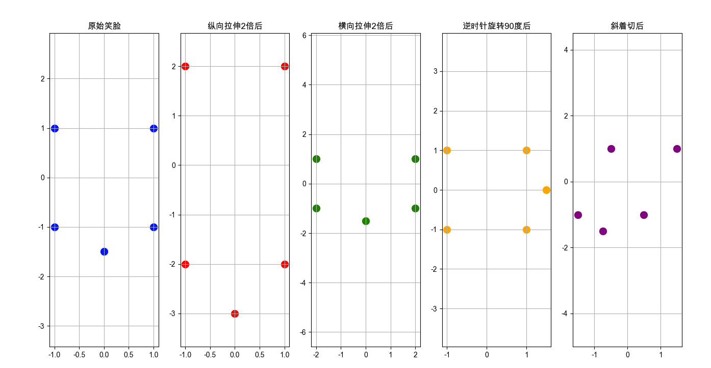
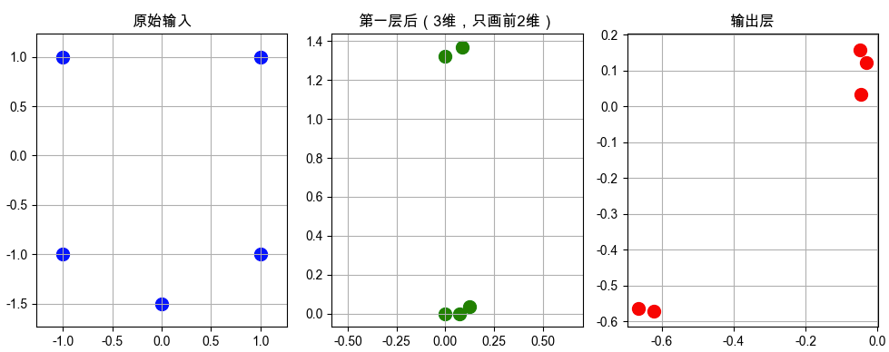

# 学习计划

数学基础差，**直接硬刚公式＝劝退**。  
把“补数学”本身当成一个**机器学习项目**：用**最小必要集+可视化+代码**去训练自己，跳过证明，直奔“能看懂算法”即可。下面给你一份**“零证明、可运行”的数学急救包**，按周推进，每一步都有**视频+代码+图**，保证你能边学边用。

### 原则

1. **先图形直觉，再公式**
2. **用Python跑例子，一行代码一张图**
3. **只学ML最常用的20%知识点**
4. **每周输出：一张图 + 一段代码 + 一句话总结**

### 4周数学冲刺表（可打印）

| 周  | 主题     | 必须会的点                            | 可视化神器                               | 3分钟代码示例                           | 急救视频                           |
| --- | -------- | ------------------------------------- | ---------------------------------------- | --------------------------------------- | ---------------------------------- |
| 1   | 线性代数 | 向量=箭头，矩阵=变换，乘法=拉伸旋转   | `numpy.linalg` + `matplotlib.quiver`     | 把[[1,0],[0,2]]作用在笑脸图案上，看拉伸 | 3Blue1Brown《线性代数的本质》1-4集 |
| 2   | 微积分   | 导数=斜率=变化率，偏导=多维斜率       | `matplotlib.pyplot.plot` + `np.gradient` | 画 y=x²，用红线标出x=1处斜率            | 3Blue1Brown《微积分的本质》1-3集   |
| 3   | 概率论   | 期望=平均值，方差=波动大小，正态=钟形 | `seaborn.histplot` + `scipy.stats`       | 扔10000次骰子，画柱状图→平滑成钟形      | Khan Academy《概率与统计》前30视频 |
| 4   | 优化基础 | 梯度下降=下山，学习率=步长            | `matplotlib.contour` + `mlxtend`         | 可视化二维损失面，看小红点一步步下山    | Andrew Ng 机器学习第1-2周          |

### 每日30分钟套路

1. **看10分钟动画**（3Blue1Brown / Khan）
2. **抄5行代码**（上面表格的示例）
3. **改1个参数**（把学习率0.1→0.9，看爆炸）
4. **写1句话笔记**（发推特/小红书，形成正反馈）

### 学完4周能达到什么

- 看吴恩达视频不再被“梯度”、“协方差”吓住
- 读sklearn文档知道`fit`背后在求什么
- 能自己调学习率、解释过拟合“山太高”

### 长期补数学策略

| 阶段   | 方法                                                         |
| ------ | ------------------------------------------------------------ |
| 入门后 | 把“数学”当超参数调——缺啥补啥，用现学现卖                     |
| 进阶   | 刷《Mathematics for Machine Learning》（MML Book）+ 对应代码 |
| 高阶   | 复现论文时，再回头补证明，形成“需求驱动”                     |

### 一句话总结

**数学不是门槛，是滤镜**；先用可视化+代码把“模糊轮廓”看清，再决定是否深入证明。  
按上面4周跑完，你就能**边学机器学习边补数学**，而不是被数学挡在门外。

---

你不需要学高数、微积分、复变函数……
机器学习初期真正需要的数学，其实就三块：

| 模块              | 你需要掌握什么                                                                                           | 推荐学习方式                                                                          | 耗时     |
| ----------------- | -------------------------------------------------------------------------------------------------------- | ------------------------------------------------------------------------------------- | -------- |
| 1. 坐标与向量     | - 平面直角坐标系（x, y）<br>- 向量 = 有方向的箭头（如 [2, 3] 表示从原点指向 (2,3) 的箭头）               | 在纸上画点、画箭头<br>或用 [GeoGebra](https://www.geogebra.org/graphing) 在线工具拖动 | 1~2 小时 |
| 2. 矩阵与线性变换 | - 矩阵是一个“变形规则”<br>- 矩阵 × 向量 = 新向量（图形被拉伸/旋转）<br>- 单位矩阵 [[1,0],[0,1]] = 不变形 | 看 [3Blue1Brown 第1~4集](https://www.bilibili.com/video/BV1ys411472E)（动画超直观！） | 2~3 小时 |
| 3. 基础概率与统计 | - 平均值、标准差<br>- “概率 = 可能性大小”（0~1之间）<br>- 正态分布（钟形曲线）                           | 用生活例子理解：<br>“考试平均分70”、“身高分布”                                        | 2 小时   |

✅ 总计不到 10 小时，就能覆盖机器学习前 80% 的数学需求！

❌ 完全不用碰的内容（至少现在不用）：

- 极限、导数、积分
- 微分方程
- 线性空间、特征子空间（这些是进阶内容）

---

# 矩阵把笑脸拉伸、压缩、旋转

看这个简单的例子，在一个 2×2 的矩阵，可以对平面上的图形做“拉伸、压缩、旋转”等变形。尝试理解「矩阵 = 空间变形」这个核心直觉，本文python代码版本3.13.1。

比如：

- 矩阵 [[1, 0], [0, 2]] 的意思是：**x 方向不变，y 方向拉长 2 倍** → 脸变高了（像照哈哈镜）

这就像你在手机上拉伸一张照片——**背后就是矩阵在起作用**。

而机器学习中，神经网络、PCA、图像处理……大量用到这种“用矩阵改变数据形状”的操作。

```python
import matplotlib.pyplot as plt
import numpy as np

# === 新增：解决中文乱码 ===
plt.rcParams['font.sans-serif'] = ['Arial Unicode MS', 'SimHei', 'DejaVu Sans']  # 支持中文的字体列表
plt.rcParams['axes.unicode_minus'] = False  # 正常显示负号（如 -1）
# =========================

# 1. 定义一个简单的“笑脸”：用5个点表示（眼睛、嘴）
points = np.array([
    [-1, 1],   # 左眼
    [1, 1],    # 右眼
    [-1, -1],  # 嘴左
    [0, -1.5], # 嘴中
    [1, -1]    # 嘴右
]).T  # 转置成 2×5 矩阵（每列是一个点）,原本每行一个点，现在变成：第一行是所有 x 坐标，第二行是所有 y 坐标 → 方便矩阵运算。

# 2. 定义拉伸矩阵：纵向拉伸2倍
A = np.array([[1, 0],
              [0, 2]])

# 3. 应用矩阵：新点 = A × 原点
new_points = A @ points  # @ 是矩阵乘法

# 2.1 横向拉伸2倍
A1=np.array([[2,0],[0,1]])
# 3.1 应用矩阵：新点 = A1 × 原点
new_points1=A1@points

# 2.2 逆时针旋转90度
A2=np.array([[0,-1],[1,0]])
# 3.2 应用矩阵：新点 = A2 × 原点
new_points2=A2@points

# 2.3 斜着切
A3=np.array([[1,0.5],[0,1]])
# 3.3 应用矩阵：新点 = A3 × 原点
new_points3=A3@points

# 4. 画图对比
plt.figure(figsize=(16, 8))

# 原始笑脸
plt.subplot(1, 5, 1) #准备画5个图，这是第一个
plt.scatter(points[0], points[1], c='blue', s=100) # 在 (x,y) 位置画一个点（scatter = 散点），points[0]	取第一行 → 所有点的 x 坐标，points[1]	取第二行 → 所有点的 y 坐标
plt.title("原始笑脸")
plt.axis('equal') #让 x 和 y 的单位长度一样（否则圆会变椭圆）
plt.grid(True) # 显示网格线

# 纵向拉伸后的笑脸
plt.subplot(1, 5, 2)
plt.scatter(new_points[0], new_points[1], c='red', s=100)
plt.title("纵向拉伸2倍后")
plt.axis('equal')
plt.grid(True)
## 横向拉伸2倍后的笑脸
plt.subplot(1, 5, 3)
plt.scatter(new_points1[0], new_points1[1], c='green', s=100)
plt.title("横向拉伸2倍后")
plt.axis('equal')
plt.grid(True)

## 逆时针旋转90度后的笑脸
plt.subplot(1, 5, 4)
plt.scatter(new_points2[0], new_points2[1], c='orange', s=100)
plt.title("逆时针旋转90度后")
plt.axis('equal')
plt.grid(True)
## 斜着切后的笑脸
plt.subplot(1, 5, 5)
plt.scatter(new_points3[0], new_points3[1], c='purple', s=100)
plt.title("斜着切后")
plt.axis('equal')
plt.grid(True)

plt.show()
```

演示截图：


---

# 神经网络

神经网络是一种模仿人脑神经元结构和功能的数学模型或计算模型，用于实现机器学习算法，尤其是深度学习算法。以下是神经网络的基本组成部分和工作原理的解释：

1. **基本结构**

   神经网络由大量的节点（或称为“神经元”）和这些节点之间的连接组成。这些节点通常被组织成层，主要包括：
   - **输入层（Input Layer）**：接收外部输入数据（如图片的像素值、文本的特征向量），仅传递数据，不做计算。
   - **隐藏层（Hidden Layers）**：位于输入层和输出层之间，可以有一层或多层，负责提取数据的抽象特征，对输入数据进行处理和转换。隐藏层数量≥2 的网络，称为 “深层神经网络”，即深度学习的核心。
   - **输出层（Output Layer）**：产生最终的输出结果。

2. **神经元（Neuron）**

   每个神经元是一个计算单元，它接收来自其他神经元的输入信号，对这些信号进行加权求和，然后通过一个非线性函数（激活函数）产生输出。

3. **权重（Weights）和偏置（Biases）**
   - **权重（Weights）**：每个输入对应一个权重（可理解为 “连接强度”），权重越大，该输入对输出的影响越大。
   - **偏置（Bias）**：每个神经元都有一个额外的输入，常被设置为1，用于调整神经元的激活阈值，增加模型灵活性。

4. **激活函数（Activation Function）**

   激活函数用于引入非线性，使得神经网络能够学习和模拟复杂的函数。它的的作用就是打破线性限制，让神经网络能拟合任意复杂的形状。常见的激活函数包括：
   - Sigmoid函数
   - Tanh函数
   - ReLU（Rectified Linear Unit）函数
   - Leaky ReLU函数
   - Softmax函数（常用于输出层）

5. **前向传播（Forward Propagation）**

   输入数据从输入层开始，逐层经过隐藏层，最终到达输出层。在每一层中，神经元根据输入、权重和偏置计算输出，并传递给下一层。

6. **损失函数（Loss Function）**

   损失函数衡量神经网络的预测输出与真实标签之间的差异。常见的损失函数包括：
   - 均方误差（MSE）
   - 交叉熵损失（Cross-Entropy Loss）

7. **反向传播（Backpropagation）**

   反向传播是一种训练神经网络的算法，通过计算损失函数对权重和偏置的梯度，然后从输出层向输入层反向传播这些梯度，以更新权重和偏置，从而最小化损失函数。

8. **优化算法（Optimization Algorithm）**

   优化算法用于调整神经网络的权重和偏置，以最小化损失函数。常见的优化算法包括：
   - 梯度下降（Gradient Descent）
   - 动量梯度下降（Momentum Gradient Descent）
   - Adam优化算法（Adaptive Moment Estimation）

9. **训练过程**
   神经网络的训练过程包括前向传播和反向传播的多次迭代。通过不断调整权重和偏置，神经网络逐渐学习到输入数据与输出结果之间的映射关系。
   训练神经网络通常包括以下步骤：
   - 初始化权重和偏置。
   - 进行前向传播，计算预测输出。
   - 计算损失函数。
   - 进行反向传播，计算梯度。
   - 使用优化算法更新权重和偏置。
   - 重复以上步骤，直到损失函数收敛或达到预定的训练次数。

简单来说，神经网络就是用数学模型（矩阵）来模拟人脑的“神经元”，实现“学习”和“预测”，**神经网络 = 一堆矩阵相乘 + 激活函数**。举个例子，神经网络就是把输入数据（比如一张图片）**一层一层地用矩阵变换**，每变一次就加一点“非线性魔法”，最后变成预测结果（比如“这是猫” or “这是狗”）。

上面例子我们用一个矩阵`A`把点`(x,y)`变换成`(x',y')`, 多个矩阵连起来用：`B @ (A @ x) = (B @ A) @ x`

神经网络就是用这样的矩阵变换，把输入数据“一层一层”地“抽象”成更“复杂”的特征，最终输出预测结果。

```plaintext
输入 → [矩阵1] → [加偏置] → [激活函数] → [矩阵2] → [激活函数] → 输出
```

- 矩阵 = 学习到的“变形规则”
- 激活函数 = 引入“非线性”，让网络能拟合复杂曲线（比如弯曲的笑脸边界）

代码示例：

将上面5个点笑脸 作为输入，做一个超小模型

```python
# 极简代码演示：一个“两层小神经网络”

import numpy as np
import matplotlib.pyplot as plt

# 解决中文显示
plt.rcParams['font.sans-serif'] = ['Arial Unicode MS']
plt.rcParams['axes.unicode_minus'] = False

# 1. 输入：5个点（每个点是2维）
X = np.array([
    [-1, 1],    # 左眼
    [1, 1],     # 右眼
    [-1, -1],   # 嘴左
    [0, -1.5],  # 嘴中
    [1, -1]     # 嘴右
])  # shape: (5, 2)

# 2. 第一层权重（随机初始化）：2维 → 3维
W1 = np.random.randn(2, 3) * 0.5
b1 = np.zeros(3)

# 3. 第二层权重：3维 → 2维（比如分类：眼睛 / 嘴巴）
W2 = np.random.randn(3, 2) * 0.5
b2 = np.zeros(2)

# 4. 前向传播（forward pass）
def relu(x):
    return np.maximum(0, x)  # 激活函数：负数变0，正数不变

# 第一层：X @ W1 + b1 → 激活
hidden = relu(X @ W1 + b1)   # shape: (5, 3)
# hidden = X @ W1 + b1
# 第二层：hidden @ W2 + b2
output = hidden @ W2 + b2    # shape: (5, 2)

# 5. 画图对比
plt.figure(figsize=(10, 4))

plt.subplot(1, 3, 1)
plt.scatter(X[:, 0], X[:, 1], c='blue', s=100)
plt.title("原始输入")
plt.axis('equal')
plt.grid(True)

plt.subplot(1, 3, 2)
plt.scatter(hidden[:, 0], hidden[:, 1], c='green', s=100)
plt.title("第一层后（3维，只画前2维）")
plt.axis('equal')
plt.grid(True)

plt.subplot(1, 3, 3)
plt.scatter(output[:, 0], output[:, 1], c='red', s=100)
plt.title("输出层")
plt.axis('equal')
plt.grid(True)

plt.tight_layout()
plt.show()

# 固定随机种子，让结果可重现，下面输出会显示变量的值
np.random.seed(42)
X2 = np.array([[-1, 1], [1, 1], [-1, -1], [0, -1.5], [1, -1]])
W2 = np.random.randn(2, 3) * 0.5
b2 = np.zeros(3)

print("X2 =\n", X2)
print("\nW2 =\n", W2)
print("\nX2 @ W2 =\n", X2 @ W2)
print("\nAfter ReLU =\n", np.maximum(0, X2 @ W2))
```

输出截图：


从上面输出可以看出，**数据在每一层都被“扭曲”了**，—— 这就是神经网络的工作方式！

上面的函数如果不使用激活函数 ReLU 时，那么输出就是线性的，无论有多少层，输出都是输入的线性组合。可能的变换包括：
|变换类型| 例子| 是否保持“笑脸感”|
|---|--- |---|
|旋转| 脸歪了| ✅ 是|
|拉伸| 脸变高/变宽| ✅ 是|
|剪切（shear）| 脸斜了（像斜体字）| ⚠️ 有点怪，但还是直线结构|
|投影（极端拉伸）| 脸压成一条线| ❌ 几乎看不出是脸了|

如果**全程只用矩阵乘法 + 加偏置（即线性变换）**，那么：

- 直线 → 还是直线
- 平行线 → 还是平行线
- 整体形状 → 只能被**拉伸、压缩、旋转、剪切、平移**
- **不能弯曲、不能折叠、不能让笑脸变成心形**

这种变换叫做**仿射变换（Affine Transformation）**，它是“线性的”（或“线性+平移”）。
