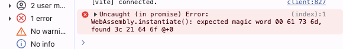

# markdown笔记文件在项目页面中展示

- 插件应用在 home 页面
- 项目页面中展示markdown文件，需要安装插件**markdown-it**，安装命令：`npm i markdown-it@^14 @types/markdown-it@^14 -D`
- 安装完成后，在项目中引入插件

  ```tsx
  import MarkdownIt from 'markdown-it'
  ```

- 引入插件后，创建一个markdown实例：

  ```tsx
  const md = new MarkdownIt({
    html: true,
    linkify: true,
    typographer: true
  })
  ```

- 引入完成后，在项目中使用markdown实例渲染markdown文件：

  ```tsx
  interface Props {
    mdUrl: string
  }
  const MarkdownReader = ({ mdUrl }: Props) => {
    const [html, setHtml] = useState('')

    useEffect(() => {
      void fetch(mdUrl)
        .then(r => r.text())
        .then(src => {
          setHtml(md.render(src))
        })
    }, [mdUrl])

    return (
      <StyledArticle
        className="markdown-body"
        dangerouslySetInnerHTML={{ __html: html }}
      />
    )
  }
  ```

- markdown-it 默认只输出「裸」HTML，没有附带任何 CSS 样式。
- 为了使渲染的 Markdown 内容更美观，我们需要引入一些 CSS 样式。
- 一种简单的方法是使用 GitHub 风格的 Markdown 渲染器，它会自动添加必要的 CSS 样式。
- 我们可以安装 `markdown-it-github` 插件来实现这个功能，安装命令：`npm i -D github-markdown-css`。
- 安装完成后，在项目中引入插件：
  ```tsx
  import 'github-markdown-css/github-markdown.css'
  ```
- css 样式引入完成后，在项目中直接使用`className="markdown-body"`即可。
- 渲染完成后，页面中展示的 markdown 文件就会有 GitHub 风格的样式了。
- 最后，我们可以在父组件中使用 `MarkdownReader` 组件来展示 markdown 文件：
  ```tsx
  import MarkdownReader from './MarkdownReader'
  ;<MarkdownReader mdUrl="/path/to/markdown.md" />
  ```

## 构建保存修改时实时预览markdown阅读器-第一种方案可行，第二种方案不可行

- (✅)开发时写插件，把任意目录映射成 URL。（只在 vite dev 时生效）
  - 在 `vite.config.ts` plugins配置中新增**serve-docs-images**

    ```ts
    ...
    plugins: [
      ...
      {
        name: 'serve-docs-images',
        apply: 'serve', // 只在 dev server 生效
        configureServer(server) {
          // 1️⃣ Markdown 文件
          server.middlewares.use('/docs', (req, res, next) => {
            if (!req.url) {
              next()
              return
            }
            // 去掉首字母 /，拼成文件系统路径
            const file = resolve('src/assets/docs', req.url.slice(1))
            try {
              const content = readFileSync(file, 'utf-8')
              res.setHeader('Content-Type', 'text/markdown')
              res.end(content)
            } catch {
              next() // 交给下一条规则（图片）
            }
          })

          // 2️⃣ 图片资源
          server.middlewares.use('/images', (req, res, next) => {
            if (!req.url) {
              next()
              return
            }
            // 去掉首字母 /，拼成文件系统路径
            const file = resolve('src/assets/docs/images', req.url.slice(1))
            try {
              const stat = statSync(file)
              if (!stat.isFile()) {
                next()
                return
              }
              // 让浏览器按二进制流下载
              const stream = createReadStream(file)
              stream.pipe(res)
            } catch {
              res.statusCode = 404
              res.end('Not found')
            }
          })
        }
      }
    ],
    ```

  - 组件监听 HMR 事件(**src/components/MarkdownReader.tsx**)

    ```tsx
    ...
    const MarkdownReader: React.FC<Props> = ({ fileName }) => {
      const [html, setHtml] = useState<string>('')

      const load = async () => {
        try {
          const res = await fetch(`/docs/${fileName}`)
          const src = await res.text()
          setHtml(md.render(src))
        } catch {
          setHtml('<p>加载失败</p>')
        }
      }

      useEffect(() => {
        load()

        // 监听 HMR：vite 会把 /docs/** 当作模块，文件改动会触发 update
        if (import.meta.hot) {
          import.meta.hot.on('vite:beforeUpdate', () => load())
        }
      }, [fileName])

    ...
    ```

  - 父组件保持不变, `src/components/MdTabs.tsx` 里只要把 `mdUrl` 换成 `fileName` 即可：

    ```tsx
    ...
    children: <MarkdownReader fileName={fileName} />

    ```

- **生产环境**下需要把 Markdown 与图片 **预渲染成静态资源** 或 **部署时映射目录**
  - 构建时自动拷贝--**vite.config.ts** 追加一行 `build.copy`

    ```ts
    import { defineConfig } from 'vite'
    import react from '@vitejs/plugin-react'
    import { cpSync } from 'fs'

    export default defineConfig({
      plugins: [react()],
      // 开发插件保持不变
      build: {
        rollupOptions: {
          plugins: [
            {
              name: 'copy-docs',
              closeBundle() {
                // 构建完成后把 docs 整个拷到 dist/docs
                cpSync('src/assets/docs', 'dist/docs', { recursive: true })
              }
            }
          ]
        }
      }
    })
    ```

  - **nginx / Apache 静态映射**--把生产服务器的静态目录指到 src/assets/docs：
    ```nginx
    # nginx.conf -- 假设项目根目录为 /path/to/project
    location /docs/ {
      alias /path/to/project/src/assets/docs/;
    }
    ```

- (❌)把 `src/assets/docs` 目录**声明成 Vite “公共”目录**，利用 Vite 的 **HMR（热更新）** 机制，文件一变动就**自动触发 fetch**，阅读器实时刷新，**无需改 docs 路径**。
  - 声明目录为 `public`（不改物理位置）

    ```ts
    import { defineConfig } from 'vite'
    import react from '@vitejs/plugin-react'

    export default defineConfig({
      plugins: [react()],
      // 把 src/assets/docs 当作 /docs 暴露出来
      publicDir: 'src/assets/docs'
    })
    ```

  - 修改`vite.config.ts`文件，增加`publicDir: 'src/assets/docs'`报错：
    
  - 修改`publicDir: 'src/assets/docs'` 以后，**整个目录被当成静态文件根目录，构建产物里包含的 `.wasm`（WebAssembly）文件也被映射到了 `/` 根路径**。浏览器试图把 **HTML 404** 页面 当成 `.wasm` 来解析，于是出现：`WebAssembly.instantiate(): expected magic word 00 61 73 6d, found 3c 21 64 6f ...`错误。
  - 实践证明：**修改 `publicDir` → 会覆盖默认 `public/` 目录**。（修改前问过AI修改publicDir是否会影响原public文件夹，得到答复说不会受影响，也不会被“覆盖”。后经实践证明，这个说法是错误的。）

## vite项目的**public 目录**

你可以把所有静态资源都放在**public**目录下，包括 HTML、图片、字体、样式表、脚本等。

- 如果你有下列这些资源：
  - 不会被源码引用（例如 `robots.txt`）
  - 必须保持原有文件名（没有经过 hash）
  - ...或者你压根不想引入该资源，只是想得到其 URL。

那么你可以将该资源放在指定的 `public` 目录中，它应位于你的项目根目录。该目录中的资源在开发时能直接通过 `/` 根路径访问到，并且打包时会被完整复制到目标目录的根目录下。

目录默认是 `<root>/public`，但**可以通过 `publicDir` 选项来配置**。

请注意，应该始终使用根绝对路径来引入 `public` 中的资源 —— 举个例子，`public/icon.png` 应该在源码中被引用为 `/icon.png`。
