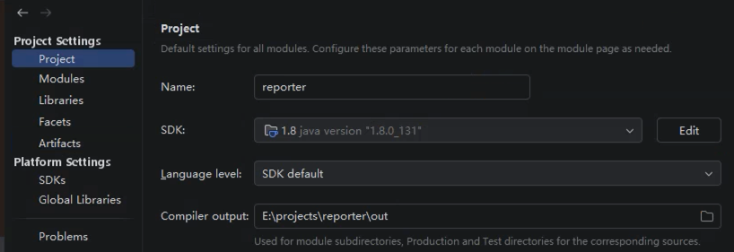
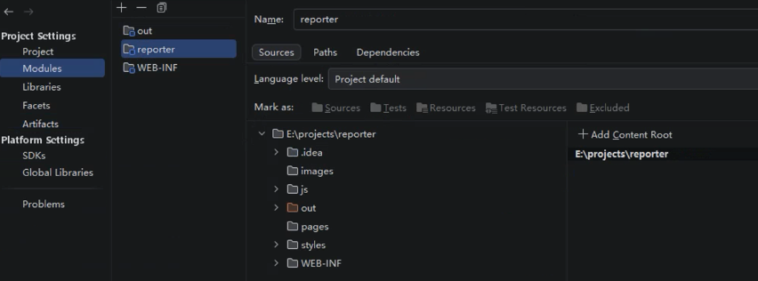
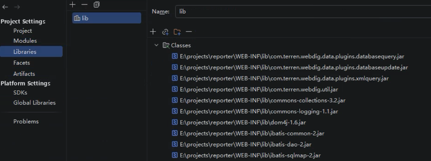
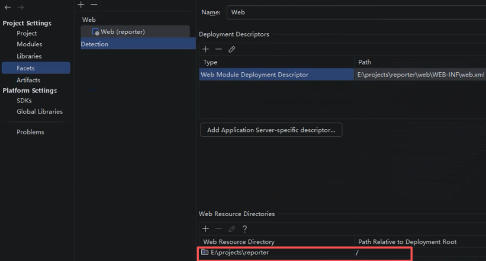
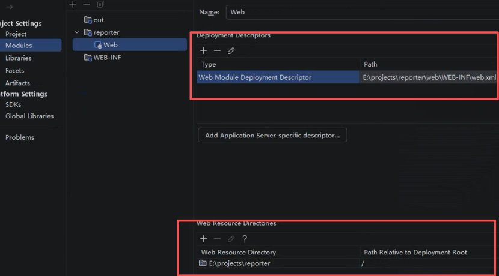
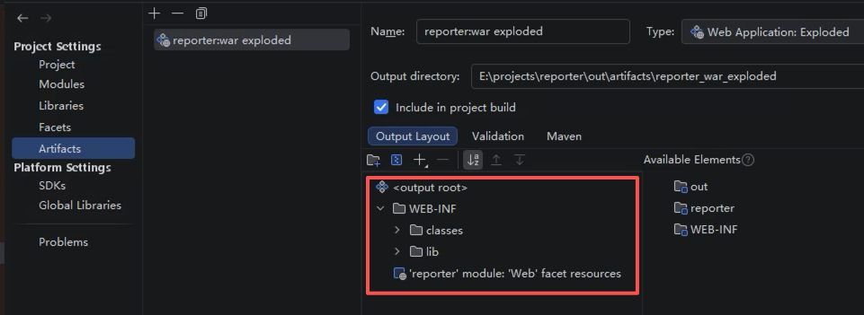
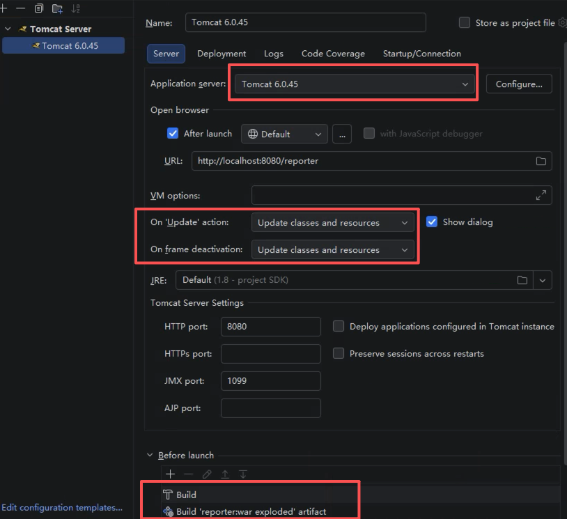
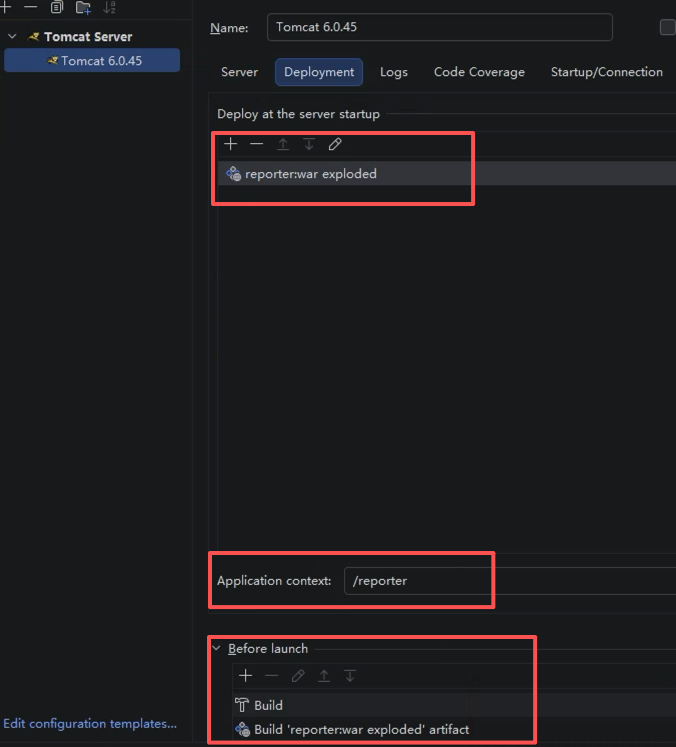
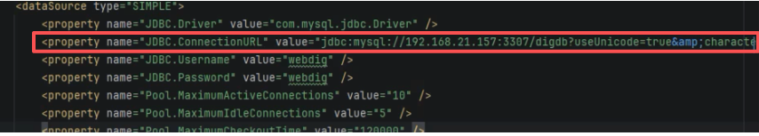

# Reporter项目IDEA配置和运行过程

## IDEA配置 Reporter 项目

### 1.设置 JDK

- `File` → `Project Structure` → `Project`

- `Project SDK`: 选择 JDK 版本，我用的是JDK8

- `Project language level`: 选择与 JDK 相同的版本



### 2. 设置 Modules

- `File` → `Project Structure` → `Modules`

- 在 **Modules** 页，点左上角 `+` → `New Module`

- 左侧选 `Java`, 右侧`name`一般和项目名一致

- 右侧`Content Root`：选你项目的根文件夹（最外层那个）

- 点 `Create`

- 选中 `reporter` 模块，切换到 `Sources` 标签页，如图所示：



### 3. 添加 Tomcat 库

- `File` → `Project Structure` → `Libraries`

- 点击 `+` → `Java`

- 浏览选择你的 Tomcat 6 安装目录下的 `lib` 文件夹

- 勾选添加（这样编译时就能找到 servlet-api.jar 等）



### 4. 配置 Facets

- `File` → `Project Structure` → `Facets`

- 点击 `+` → `Web` → 选中你的reporter模块，点击 OK

- 此时IDEA跳转到Modules模块 → 修改红框圈住的内容至正确路径 →
- 最后保存修改 → Apply → OK




### 5. 配置 Artifact（最重要！）

- `File` → `Project Structure` → `Artifacts`

- 勾选页面顶部的 `Include in project build`（必须勾选）

- 点击 `+` → `Web Application: Exploded` → `From Modules...`

- 在右边 `Available Elements` 里，展开 `WEB-INF`，双击 `'WEB-INF' compile output`，它会自动加到左边的 `<output root>` 下。

- 再双击 `lib (Project Library)`，也加到左边。

- 再双击 `'reporter' module: 'Web' facet resources`，也加到左边。

- 最后保存修改 → Apply → OK



### 6. 配置 Tomcat运行环境

1. `Run` → `Edit Configurations` → `+` → `Tomcat Server` → `Local`

2. **Server 标签页**：
   - `Application server`: Tomcat 6

   - `HTTP port`: 8080

   - `On 'Update' action`: 选 `Update classes and resources` ---（如果修改了类结构（比如新增 / 删除方法、成员变量），还是需要重启 Tomcat，普通的方法内修改可以直接热更新）

   - `On frame deactivation`: 选 `Update classes and resources` ---（如果修改了类结构（比如新增 / 删除方法、成员变量），还是需要重启 Tomcat，普通的方法内修改可以直接热更新）

3. **Deployment 标签页**：
   - 点击 `+` → `Artifact` → 选择之前创建的 `report:war exploded`

   - `Application context`: 填 `/reporter`

   
   

## 在 Linux Debian 上使用 Docker 安装 MySQL 的完整步骤

### 第一步：更新包管理器

```bash
apt update
```

### 第二步：拉取MySQL 5.7镜像（兼容老项目）

```bash
docker pull mysql:5.7
```

### 第三步：创建数据持久化目录

```bash
mkdir -p /data/mysql/mysql-data
```

### 第四步：运行 MySQL 容器

```bash
docker run -d \
 --name mysql-dev \
 --restart always \
 -p 3307:3306 \
 -v /data/mysql/mysql-data:/var/lib/mysql \
 -e MYSQL_ROOT_PASSWORD=root123456 \
 -e MYSQL_DATABASE=digdb \
 -e MYSQL_USER=webdig \
 -e MYSQL_PASSWORD=webdig \
 mysql:5.7 \
 --character-set-server=utf8 \
 --collation-server=utf8_general_ci
```

**参数说明：**

- `-p 3307:3306`：将容器的 3306 映射到宿主机的 3307（避免与可能存在的其他 MySQL 冲突）
- `-v /data/mysql/mysql-data`:/var/lib/mysql：数据持久化
- `--restart always`：服务器重启后自动启动容器
- `--name mysql-dev`：容器名称

### 第五步：导入你的数据库

#### 一：将文件复制到容器

```bash
# 将文件复制到容器

docker cp /home/tomcat6/webapps/report/WEB-INF/classes/digdb.sql mysql-dev:/tmp/digdb.sql
```

#### 二：进入容器执行

```bash
# 进入容器

docker exec -it mysql-dev bash
```

#### 三：进入mysql

```bash
# 1. 进入 MySQL

bash-4.2# mysql -uroot -proot123456 digdb

# 2. 在 MySQL 中执行

mysql> USE digdb;
mysql> SOURCE /tmp/digdb.sql;
mysql> EXIT;
```

#### 四：验证导入成功

```bash
# 查看表列表

docker exec mysql-dev mysql -uroot -proot123456 -e "USE digdb; SHOW TABLES;”

# 查看表数量

docker exec mysql-dev mysql -uroot -proot123456 -e "USE digdb; SELECT COUNT(\*) FROM information_schema.tables WHERE table_schema='digdb';"
```

#### 五步：配置远程访问权限

```bash
# 进入容器

docker exec -it mysql-dev bash
bash-4.2# mysql -uroot -proot123456 digdb
mysql> USE digdb;
mysql> SELECT user, host FROM mysql.user WHERE user='webdig';
mysql> CREATE USER ‘webdig'@'192.168.20.122' IDENTIFIED BY ‘webdig’;
mysql> GRANT ALL PRIVILEGES ON digdb.\* TO 'webdig'@'192.168.20.122';
mysql> FLUSH PRIVILEGES;
mysql> SELECT user, host FROM mysql.user WHERE user='webdig';
```

#### 第六步：修改代码配置文件-SqlMapConfig.xml



至此项目可以进行正常运行，接下来就请继续我们的代码修改吧！
