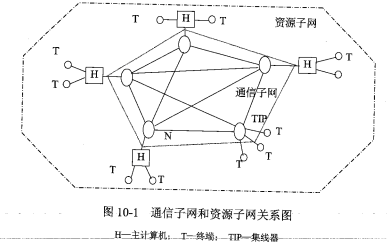
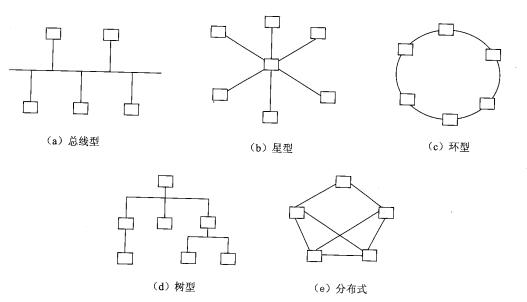
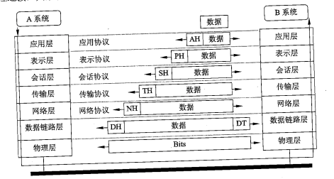
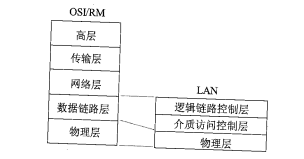
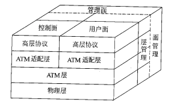
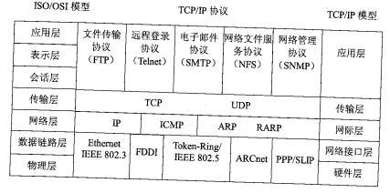
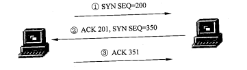
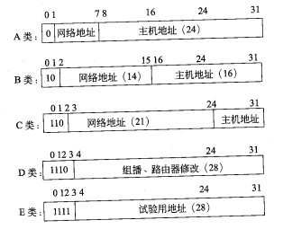
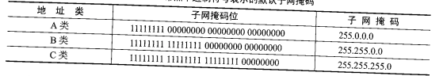

# 计算机网络概述

计算机网络发展过程大致可以划分为以下4个阶段:

- 具有通信功能的单机系统
- 具有通信功能的多机系统
- 以共享资源为目的的计算机网络
- 以局域网及因特网为支撑环境的分布式计算机系统

计算机网络提供的主要功能有:

- 数据通信
- 资源共享
- 负载均衡
- 高可靠性

计算机网络按照数据通信和数据处理的功能可分为两层:内层通信子网和外层资源子网,如下图所示。通信子网(图中虚线内)的结点计算机和高速通信线路组成独立的数据系统,承担全网的数据传输、交换、加工和变换等通信处理工作,即将一台计算机的输出信息传送给另一台计算机。资源子网(图中点划线内虚线外)包括计算机、终端、通信子网接口设备、外部设备(如打印机、磁带机和绘图机等)及各种软件资源等,它负责全网的数据处理和向网络用户提供网络资源及网络服务。

通信子网和资源子网的划分,完全符合国际标准化组织所制定的开放式系统互连参考模型(OSI)的思想。其中,通信子网对应于 OSI 中的低三层(物理层、数据链路层、网络层),而资源子网对应于OSI 中的高三层(会话层、表示层、应用层)。这种划分将通信子网的任务从主机中抽取出来,由通信子网中的设备专门解决数据传输和通信控制问题。而资源子网中的计 算机可集中精力处理数据,从而提高主机效率和网络的整体性能。

## 网络的分类和拓扑结构

计算机网络的分类方式很多,按照不同的分类原则,可以得到各种不同类型的计算机网络。 例如,按通信距离可分为广域网、局域网和城域网;按信息交换方式可分为电路交换网、分组 交换网和综合交换网;按网络拓扑结构可分为星型网、树型网、环型网和总线网;按通信介质 可分为双绞线网、同轴电缆网、光纤网和卫星网等;按传输带宽可分为基带网和宽带网;按使 用范围可分为公用网和专用网;按速率可分为高速网、中速网和低速网;按通信传播方式可分为广播式和点到点式。

网络拓扑结构是指网络中通信线路和结点的几何排序,用于表示整个网络的结构外貌,反一映各结点之间的结构关系。它影响着整个网络的设计、功能、可靠性和通信费用等重要方面,是计算机网络十分重要的要素。常用的网络拓扑结构有总线型、星型、环型、树型和分布式结构等。

广域网与局域网所使用的网络拓扑结构有所不同,广域网多用分布式或树型结构,而局域网常使用总线型、环型、星型或树型结构。

## ISO/OSI 网络体系结构

ISO/OSI 网络体系结构是国际标准化组织(ISO)制定的开放式系统互连参考模型(Open Systems Interconnection Reference Model, OSI 模型),它将计算机网络划分为七层,每层都具有特定的功能和协议。OSI 模型的七层分别是:

- 物理层: 物理层提供为建立、维护和拆除物理链路所需的机械、电 气、功能和规程的特性;提供有关在传输介质上传输非结构的位流及物理链路故障检测指示。 用户要传递信息就要利用一些物理媒体,如双绞线、同轴电缆等,但具体的物理媒体并不在OSI 的7层之内,有人把物理媒体当作第0层,物理层的任务就是为它的上一层提供一个物 理连接,以及它们的机械、电气、功能和过程特性。例如规定使用电缆和接头的类型,传送信号的电压等。**在这一层,数据还没有被组织**,仅作为原始的位流或电气电压处理,**单位是位**。
- 数据链路层: 数据链路层负责在两个相邻结点间的线路上无差错地传送以**帧**为单位的数据,并进行流量控制。每一帧包括一定数量的数据和一些必要的控制信息。和物理层相似,数据链路层要负责建立、维持和释放数据链路的连接。在传送数据时,如果接收点检测到所传数据中有差错,就要通知发送方重发这一帧。
- 网络层: 网络层负责在网络中选择合适的路由,并将数据从源端传送到目的端。它的主要功能是**逻辑地址寻址**和**路由选择**。
- 传输层: 传输层负责在源端和目的端之间建立逻辑连接,并透明地传送**报文**。它的主要功能是**端到端的通信服务**和**差错控制**。
- 会话层: 会话层负责在用户之间建立、管理和终止会话连接,并提供**同步服务**和**对话控制**。在会话层及以上的高层中,数据传送的单位不再另外命名,统称为报文。会话层不参与具体的传输,它提供包括访问验证和会话管理在内的建立和维护应用之间通信的机制。例如服务器验证用户登录便是由会话层完成的。
- 表示层: 表示层负责在用户之间进行数据格式转换、加密和压缩等处理,以保证不同系统之间的数据兼容性和安全性。
- 应用层: 应用层负责向用户提供网络服务,如文件传输、电子邮件、万维网等。它的主要功能是**数据表示**和**应用协议**。

OSI/RM 中的1~3层主要负责通信功能,一般称为通信子网层。上三层(即5~7层)属 于资源子网的功能范畴,称为资源子网层。**传输层**起着衔接上、下三层的作用。

参考模型的信息流向:

如图10-4所示,设 A系统的用户要向 B系统的用户传送数据。A系统用户的数据先送入应用层,该层给它附加控制信息 AH(头标)后,送入表示层。表示层对数据进行必要的变换并加头标PH后送入会话层。会话层也加头标 SH 送入传输层。传输层将长报文分段后并加头标TH送至网络层。网络层将信息变成报文分组,并加组号 NH 送数据链路层。数据链路层将信息加上头标和尾标(DH 及DT)变成帧,经物理层按位发送到对方(B 系统)。B 系统接收到信息后,按照与A系统相反的动作,层层剥去控制信息,最后把原数据传送给B系统的用户。 可见,两系统中只有物理层是实通信,其余各层均为虚通信。因此,图10-4中只有两物理层之间有物理连接,其余各层间均无连线。

## 网络互连硬件

网络互连设备可以有**中继器(实现物理 层协议转换,在电缆间转发二进制信号)**、**网桥(实现物理层和数据链路层协议转换)**、**路由器 (实现网络层和以下各层协议转换)**、**网关(提供从最低层到传输层或以上各层的协议转换)**和**交换机等**。

网络线路与用户结点具体连接时,需要网络传输介质的互连设备。如T形头(细同轴电缆连接器)、收发器、RJ-45(屏蔽或非屏蔽双绞线连接器)、RS232 接口(目前计算机与线路接口的常用方式)、DB-15 接口(连接网络接口卡的AUI 接口)、VB35 同步接口(连接远程的高速同步接口)、网络接口单元和调制解调器(数字信号与模拟信号转换器)等。

- 物理层的互连设备有中继器(Repeater)和集线器(Hub)。
  - 中继器(Repeater): 中继器是一种物理层设备，用于在电缆段之间再生和转发二进制信号，从而扩展网络的传输距离。它通过重新生成干净的信号来克服衰减，但不具备错误检测或纠正能力，也不能改变信号的传输速率。
  - 集线器(Hub): 集线器是一种物理层设备，用于连接多个计算机或其他网络设备。它的主要功能是将接收到的信号广播到所有其他端口，从而实现局域网内的通信。集线器不能改变信号速率，所有端口共享带宽。虽然以集线器为中心的星型拓扑在物理线路断开时仅影响单个节点，但若某个节点发生电气或信号异常，故障可能通过 Hub 扩散至整个网络，影响所有设备的正常通信。因此，现代网络已普遍采用交换机替代集线器。集线器可分为**无源(Passive) 集线器**、**有源(Active)集线器**和**智能(Intelligent)集线器**。
    - 无源集线器只负责把多段介质连接在一起,不对信号做任何处理,每一种介质段只允许扩展到最大有效距离的一半。
    - 有源集线器类似于无源集线器,但它具有对传输信号进行再生和放大从而扩展介质长度的功能。
    - 智能集线器除具有有源集线器的功能外,还可将网络的部分功能集成到集线器中,如网络管理、选择网络传输线路等。
- 数据链路层的互连设备有网桥(Bridge)和交换机(Switch)。
  - 网桥(Bridge): 网桥是一种数据链路层设备,用于连接多个局域网,实现不同局域网之间的通信。它的主要功能是将接收到的帧根据目的地址进行转发,并过滤掉无效的帧。网桥通常用于连接多个局域网,但不能改变信号的速率。
  - 交换机(Switch): 交换机是一种数据链路层设备,用于连接多个计算机或其他网络设备,实现局域网内的通信。它的主要功能是将接收到的帧根据目的地址进行转发,并过滤掉无效的帧。交换机通常用于连接多个计算机或其他网络设备,但不能改变信号的速率。

- 路由器(Router): 路由器是一种网络层设备,用于连接多个逻辑上分开的网络。逻辑网络是指一个单独的网络或一个子网,当数据从一个子网传输到另一个子网时,可通过路由器来完成。

  路由器具有很强的异种网互连能力,互连网络的最低两层协议可以互不相同,通过驱动软 件接口到第三层而得到统一。对于互连网络的第三层协议,如果相同,可使用单协议路由器进 行互连;如果不同,则应使用多协议路由器。多协议路由器同时支持多种不同的网络层协议, 并可以设置为允许或禁止某些特定的协议。所谓支持多种协议,是指支持多种协议的路由,而不是指不同类协议的相互转换。

  通常把网络层地址信息称为网络逻辑地址,把数据链路层地址信息称为物理地址。路由器最主要的功能是选择路径。在路由器的存储器中维护着一个路径表,记录各个网络的逻辑地址,用于识别其他网络。在互连网络中,当路由器收到从一个网络向另一个网络发送的信息包时,将丢弃信息包的外层,解读信息包中的数据,获得目的网络的逻辑地址,使用复杂的程序来决定信息经由哪条路径发送最合适,然后重新打包并转发出去。路由器的功能还包括过滤、存储转发、流量管理和介质转换等。一些增强功能的路由器还可有加密、数据压缩、优先和容错管理等功能。由于路由器工作于网络层,它处理的信息量比网桥要多,因而处理速度比网桥慢。

- 网关(Gateway): 网关(Gateway)是应用层的互连设备。在一个计算机网络中,当连接不同类型且协议差别较大的网络时,则要选用网关设备。网关的功能体现在 OSI模型的最高层,它将协议进行转 换,将数据重新分组,以便在两个不同类型的网络系统之间进行通信。由于协议转换是一件复杂的事,一般来说,网关只进行一对一转换,或是少数几种特定应用协议的转换,网关很难实现通用的协议转换。

传输介质是信号传输的媒体,常用的介质分为有线介质和无线介质。有线介质有双绞线、同轴电缆和光纤等;无线介质有微波、红外线和激光、卫星。

在一个局域网中,其基本组成部件为服务器、客户端、网络设备（网络设备主要指一些硬件设备,如网卡、收发器、中继器、集线器、网桥和路由器等。网卡是一种必不可少的网络设备,常用的网卡有 Ethernet(以太网)网卡、ARCNET 网卡、ESTA 总线网网卡和Token-Ring 网卡等。）、通信介质（数据的传输媒体,不同的通信介质有着不同的传输特性。）和网络软件等。

## 局域网协议

一个局域网的基本组成主要有网络服务器、网络工作站、网络适配器和传输介质。这些设 备在特定网络软件支持下完成特定的网络功能。决定局域网特性的主要技术有3个方面:用于 传输数据的传输介质;用于连接各种设备的拓扑结构;用于共享资源的介质访问控制方法。它 们在很大程度上决定了传输数据的类型、网络的响应时间、吞吐量和利用率,以及网络应用等 各种网络特性。不同的局域网协议最重要的区别是介质访问控制方法,它对网络特性具有十分
重要的影响。

- LAN 模型: ISO/OSI 的7层参考模型本身不是一个标准,在制定具体网络协议和标准时,要以参考模型作为“参照基准”,并说明与该“参照基准”的对应关系。在 OSI/RM IEEE 802 局域网(LAN) 标准中只定义了物理层和数据链路层两层,并根据 LAN 的特点把数据链路层分成逻辑链路控 制(Logical Link Control,LLC)子层和介质访问控制(Medium 还加强了数据链路层的功能,把网络层中的寻址、排序、流控和差错控制等功能放在 Access Control, MAC)子层,来实现。
  
  - 物理层和OSI物理层的功能一样,主要处理在物理链路上发送、传递和接收非结构化的比特流,包括对带宽的频道分配和对基带的信号调制、建立、维持、撤销物理链路,处理机械的、电气的和过程的特性。其特点是可以采用一些特殊的通信媒体,在信息组成的格式上可以有多种。
  - MAC主要功能是控制对传输介质的访问,MAC与网络的具体拓扑方式以及传输介质的类型有关,主要是介质的访问控制和对信道资源的分配。MAC层还实现帧的寻址和识别,完成帧检测序列产生和检验等功能。
  - LLC可提供两种控制类型,即面向连接服务和非连接服务。其中,面向连接服务能够提供可靠的信道。逻辑链路控制层提供的主要功能是数据帧的封装和拆除,为高层提供网络服务的逻辑接口,能够实现差错控制和流量控制。

- 以太网: 以太网技术可以说是局域网技术中历史最悠久和最常用的一种,它采用的“存取方法”是 带冲突检测的载波监听多路访问协议(Carrier-Sense Multiple Access with Collision Detection,CSMA/CD)技术。目前,以太网主要包括3种类型:IEEE 802.3中定义的标准局域网,速度为10Mbps,传输介质为细同轴电缆; IEEE 802.3u中定义的快速以太网,速度为 100Mbps, 传输介质为双绞线:IEEE 802.3z中定义的千兆以太网,速度为 1000Mbps,传输介质为光纤或双绞线。
- 令牌环网: 令牌环是环型网中最普遍采用的介质访问控制方法,它适用于环型网络结构的分布式介质访问控制,其流行性仅次于以太网。令牌环网的传输介质虽然没有明确定义,但主要基于屏蔽双绞线和非屏蔽双绞线两种,拓扑结构可以有多种,如环型(最典型)、星型(采用得最多)和总线型(一种变形)。编码方法为差分曼彻斯特编码。

  IEEE 802.5的介质访问使用的是令牌环控制技术,工作过程为:首先,令牌环网在网络中传递一个很小的帧,称为“令牌”,只有拥有令牌环的工作站才有权力发送信息;令牌在网络上依次顺序传递,当工作站要发送数据时等待捕获一个空令牌,将要发送的信息附加到后边,发往下一站,如此直到目标站,然后将令牌释放;工作站要发送数据时,如果经过的令牌不是空的,则等待令牌释放。

  当信息帧绕环通过各站时,各站都要将帧的目的地址与本站地址相比较,如果地址符合, 说明是发送给本站的,则将帧复制到本站的接收缓冲器中,同时将帧送回到环上,使帧继续沿 环传送;如果地址不符合,则简单地将信息帧重新送到环上即可。

- FDDI: FDDI( Fiber Distributed Data Interfaceface,光纤分布式数据接口)是一种高速局域网,传输速率为 100Mbps,传输介质为光纤。FDDI 采用令牌环控制技术,与令牌环网相似,但 FDDI 网的传输介质为光纤,传输距离更远,传输速率也更快。光纤中传送的是光信号,有光脉冲表示 1,无光脉冲表示 0。这种简单编码的缺点是没有同步功能。在同轴电缆或双绞线作为传输介质的局域网中,通常采用曼彻斯特编码方式。它利 用中间的跳变作为同步信号。这样对每一位数据单元产生两次瞬变,使带宽的利用率降低。在 5位编码的32种组合中,实际只使用了24种,其中的16种用来做数据,其余8种用来做控制 符号(如帧的起始和结束符号等)。在4B/5B编码中,5位码中的“1”码至少为两位,按 NRZI编码原理,信号中就至少有两次跳变,因此接收端可得到足够的同步信息。

- 无线局域网(CSMA/CA): 无线局域网（WLAN）基于 IEEE 802.11 系列标准，使用电磁波作为传输介质。由于无线环境中难以检测冲突，其 MAC 层采用 CSMA/CA（载波侦听多路访问/冲突避免）机制来协调多个设备对信道的访问。早期的 802.11b 标准支持最高 11 Mbps 的速率，典型室内通信距离约为 30–100 米，而现代 Wi-Fi 标准（如 802.11ac/ax）已实现千兆级速率和更广覆盖。

## 广域网协议

广域网通常是指覆盖范围大、传输速率低、以数据通信为主要目的的数据通信网。在地域分布很远、很分散,以至于无法用直接连接来接入局域网的场合,广域网(WAN)通过专用的或交换式的连接把计算机连接起来。这种广域连接可以是通过公众网建立的,也可以通过服务于某个专业部门的专用网建立起来。相对来说,广域网显得比较错综复杂,目前主要用于广域传输的协议比较多,例如 PPP(点对点协议)、DDN、ISDN(综合业务数字网)、FR(帧中继)和 ATM(异步传输模式)等。

- 点对点协议(PPP): 点对点协议主要用于“拨号上网”这种广域连接模式。它的优点是简单、具备用户验证能力、可以解决IP分配等。它主要通过拨号或专线方式建立点对点连接发送数据,使其成为各种主机、网桥和路由器之间简单连接的一种通用的解决方案。家庭拨号上网就是通过PPP在用户端和运营商的接入服务器之间建立通信链路。目前,宽带接入正在取代拨号上网,在宽带接入技术日新月异的今天,PPP 也衍生出新的应用。典型的应用是在ADSL (Asymmetrical Digital Subscriber Line,非对称数据用户线)接入方式当中,PPP 与其他的协议共同派生出了符合宽带接入要求的新的协议,例如 PPPoE和PPPOA。 利用以太网(Ethernet)资源在以太网上运行 PPP来进行用户认证接入的方式称为PPPoE。PPPoE既保护了用户方的以太网资源,又完成了 ADSL的接入要求,是目前 ADSL 接入方式中 应用最广泛的技术标准。同样,在ATM网络上运行PPP来管理用户认证的方式称为 PPPOA。 它与PPPoE的原理相同,作用相同。不同的是,它是在 ATM网络上,而PPPoE 是在以太网网 络上运行,所以要分别适应 ATM 标准和以太网标准。
- 数字用户线(xDSL): xDSL是各种数字用户线的统称,根据各种宽带通信业务需要,目前还有DSL技术和产品,例如ADSL(Asymmetric DSL,不对称数字用户线)、SDSL(Single Pair DSL,单对线数字用 户环路)、IDSL (ISDN DSL, ISDN 用的数字用户线)、RADSL(Rate Adaptive DSL,速率自 适应非对称型数字用户线)和 VDSL (Very High Bit Rate DSL,甚高速数字用户线)等。
- 数字专线: 数字数据网(Digital Data Network, DDN)是采用数字传输信道传输数据信号的通信网,可提供点对点、点对多点透明传输的数据专线出租电路,为用户传输数据、图像和声音等信息。 数字数据网是以光纤为中继干线的网络,组成DDN的基本单位是结点,结点间通过光纤连接,构成**网状**的拓扑结构。 DDN专线就是市内或长途的数据电路,电信部门将它们出租给用户做资料传输使用后,它们就变成了用户的专线,直接进入电信的 DDN网络,因为这种电路是采用固定连接的方式,不需要经过交换机房,所以称之为固定 DDN 专线。DDN 专线不仅需要铺设专用线路(在DDN的客户端需要一个称为DDN Modem 的CSU/DSU 设备以及一个路由器)从用户端进入主干网络,而且需要付电信月租费、网络使用费和电路租用费等。其优势是网络传输速率高、时延小、 质量好、网络透明度高、可支持任何规程、安全可靠。
- 帧中继(Frame Relay, FR): 是<u>在用户网络接口之间提供用户信息流的双向传送,并保持顺序不变的一种承载业务</u>。用户信息以帧为单位进行传输,并对用户信息流进行统计复用。帧中继是综合业务数字网标准化过程中产生的一种重要技术,它是在数字光纤传输线路逐渐代替原有的模拟线路、用户终端智能化的情况下由X25 分组交换技术发展起来的一种传输技术。帧中继是一种基于可变帧长的数据传输网络,在传输过程中,网络内部可以采用“帧交换”,即以帧为单位进行传送;也可采用“信元交换”,即以信元(53字节长)为单位进行传送。帧中继提供一种简单的面向连接的虚电路分组服务,包括交换虚电路连接和永久虚电路连接。帧中继的优点包括降低网络互连费用、简化网络功能、提高网络性能、采用国际标准、各厂商产品相互兼容等。
- 异步传输模式(Asynchronous Transfer Mode, ATM): 是B-ISDN的关键核心技术,它是一种面向分组的快速分组交换模式,使用了异步时分复用技术,将信息流分割成固定长度的信元。使用统一的信息单位能比较容易地实现各种信息流混合在一起的多媒体通信,并能根据业务类型、速率的需求动态地分配有效容量。ATM能够根据需要改变传送速率,对高速信息传递频次高,对低速信息传递频次低,按照统计复用的原理进行传输和交换,故 ATM 完全可以用单一 的交换方式灵活、有效地支持频带分布范围极广的各种业务。

  在ATM网络中,数据以定长的信元为单位进行传输,信元由信元头和信元体构成,每个信元53个字节,其中信元头5个字节,信元体48个字节。

  ATM 的参考模型由4层构成,分别是用户层、ATM适配层、ATM 层和物理层。

  

- X.25 协议: X.25 在本地DTE 和远程DTE之间提供一个全双工、同步的透明信道,并定义了3个相互独立的控制层:物理层、数据链路层和分组层,它们分别对应于 ISO/OSI 的物理层、链路层和网络层。

  

  X.25 是在公用数据网上以分组方式进行操作的DTE(数据终端设备)和 DCE (数据通信设备)之间的接口。X.25只是对公用分组交换网络的接口规范说明,并不涉及网络的内部实现, 它是面向连接的,支持交换式虚电路和永久虚电路。X.25 的分组由一个可变长度的包头（通常为 3–6 字节）和一个用户数据字段组成。用户数据字段的最大长度可在呼叫建立时协商，常见值包括 128、256、512 或 1024 字节。包头包含逻辑信道号、分组类型、控制信息等，用于虚电路管理和差错控制。X.25 协议提供了可靠的数据传输服务,通过使用重传机制来确保数据的正确传输。

## TCP/IP 协议族

TCP/IP包含许多重要的基本特性,这些特性主要表现在5个方面:逻 辑编址、路由选择、域名解析、错误检测和流量控制以及对应用程序的支持等。

- 逻辑编址: 每一块网卡在出厂时就由厂家分配了一个独一无二的永久性的物理地址。在Internet 中,为每台连入因特网的计算机分配一个逻辑地址,这个逻辑地址被称为 IP地址。一个IP 地址可以包括一个网络ID号,用来标识网络;一个子网络 ID号,用来标识网络上的一个子网;另外,还有一个主机 ID号,用来标识子网络上的一台计算机。这样,通过这个分配给某台计算机的IP地址,就可以很快地找到相应的计算机。
- 路由选择: 在 TCP/IP中包含了专门用于定义路由器如何选择网络路径的协议,即 IP数据包的路由选择。
- 域名解析: 虽然 TCP/IP 采用的是32位的 IP地址,但考虑到用户记忆方便,专门设计了一种方便的字母式地址结构,称为域名或 DNS (域名服务)名字。将域名映射为 IP 地址的操作称为域名解析。域名具有较稳定的特点,而 IP 地址较易发生变化。
- 错误检测和流量控制。TCP/IP 具有分组交换确保数据信息在网络上可靠传递的特性这些特性包括检测数据信息的传输错误(保证到达目的地的数据信息没有发生变化),确认已传递的数据信息已被成功地接收,监测网络系统中的信息流量,防止出现网络拥塞。

### TCP/IP模型与OSI 模型的对比:

从上图可知, TCP/IP 分层模型由4个层次构成,即应用层、传输层、网际层和网络接口层,对各层的功能简述如下:

- 应用层: 应用层处在分层模型的最高层,用户调用应用程序来访问 TCP/IP互连网络, 以享受网络上提供的各种服务。应用程序负责发送和接收数据。每个应用程序可以选择所需要的传输服务类型,并把数据按照传输层的要求组织好,再向下层传送,包括独立的报文序列和连续字节流两种类型。
- 传输层: 传输层的基本任务是提供应用程序之间的通信服务,这种通信又称端到端的通信。传输层既要系统地管理数据信息的流动,还要提供可靠的传输服务,以确保数据准确而有序地到达目的地。为了这个目的,传输层协议软件需要进行协商,让接收方回送确认信息及让发送方重发丢失的分组。在传输层与网际层之间传递的对象是传输层分组。
- 网际层: 网际层又称 IP层,主要处理机器之间的通信问题。它接收传输层请求,传送某个具有目的地址信息的分组。该层主要完成以下功能:
  - 分组封装到IP 数据报(IP Datagram)中,填入数据报的首部(也称为报头),使用路由算法选择把数据报直接送到目标机或把数据报发送给路由器,然后再把数据报交给下面的网络接口层中对应的网络接口模块。
  - 处理接收到的数据报,检验其正确性。使用路由算法来决定是在本地进行处理,还是 继续向前发送。如果数据报的目标机处于本机所在的网络,该层软件就把数据报的报头剥去, 再选择适当的传输层协议软件来处理这个分组。
  - 适时发出ICMP的差错和控制报文,并处理收到的ICMP报文。
- 网络接口层。网络接口层又称数据链路层,处于 TCP/IP协议层之下,负责接收 IP数据报,并把数据报通过选定的网络发送出去。该层包含设备驱动程序,也可能是一个复杂的、使用自己的数据链路协议的子系统。

### 网络接口层协议

TCP/IP协议不包含具体的物理层和数据链路层,只定义了网络接口层作为物理层与网络层 的接口规范。这个物理层可以是广域网,例如X.25公用数据网,也可以是局域网,例如 Ethernet、Token-Ring 和FDDI等。任何物理网络只要按照这个接口规范开发网络接口驱动程序,就能够与TCP/IP 协议集成起来。网络接口层处在TCP/IP协议的最底层,主要负责管理为物理网络准备数据所需的全部服务程序和功能。

### 网际层协议

网际层是整个TCP/IP 协议族的重点。在网际层定义的协议除了IP外,还有 ICMP、ARP和RARP 等几个重要的协议。

- IP协议: IP所提供的服务通常被认为是无连接的(Connectionless)和不可靠的(Unreliable)。事实 上,在网络性能良好的情况下,IP传送的数据能够完好无损地到达目的地。所谓无连接的传输, 是指没有确定目标系统在已做好接收数据准备之前就发送数据。与此相对应的就是面向连接的(Connection Oriented) 传输(如TCP),在该类传输中,源系统与目的系统在应用层数据传送之 前需要进行三次握手。至于不可靠的服务,是指目的系统不对成功接收的分组进行确认,IP只 是尽可能地使数据传输成功。但是只要需要,上层协议必须实现用于保证分组成功提供的附加服务。
  由于IP只提供无连接、不可靠的服务,所以把差错检测和流量控制之类的服务授权给了其他的各层协议,这正是 TCP/IP 能够高效工作的一个重要保证。这样,可以根据传送数据的属性来确定所需的传送服务以及客户应该使用的协议。例如,传送大型文件的FTP会话需要面向连接的、可靠的服务(因为如果稍有损坏,就可能导致整个文件无法使用)。

  IP 的主要功能包括将上层数据(如 TCP、UDP 数据)或同层的其他数据(如ICMP 数据) 封装到IP数据报中;将 IP数据报传送到最终目的地;为了使数据能够在链路层上进行传输,对数据进行分段;确定数据报到达其他网络中的目的地的路径。

  IP 协议软件的工作流程:当发送数据时,源计算机上的 IP协议软件必须确定目的地是在同一个网络上,还是在另一个网络上。IP通过执行这两项计算并对结果进行比较,才能确定数据到达的目的地。如果两项计算的结果相同,则数据的目的地确定为本地;否则,目的地应为远程的其他网络。如果目的地在本地,那么IP协议软件就启动直达通信;如果目的地是远程计算机,那么 IP 必须通过网关(或路由器)进行通信,在大多数情况下,这个网关应当是默认网关。当源IP完成了数据报的准备工作时,它就将数据报传递给网络访问层,网络访问层再将数据报传送给传输介质,最终完成数据帧发往目的计算机的过程。

  当数据抵达目的计算机时,网络访问层首先接收该数据。网络访问层要检查数据帧有无错误,并将数据帧送往正确的物理地址。假如数据帧到达目的地时正确无误,网络访问层便从数据帧的其余部分中提取数据有效负载(Payload),然后将它一直传送到帧层次类型域指定的协议。在这种情况下,可以说数据有效负载已经传递给了 IP。

- ARP 和RARP 协议:
  地址解析协议(Address Resolution Protocol, ARP)及反地址解析协议(RARP)是驻留在网际层中的另一个重要协议。**ARP的作用是将IP地址转换为物理地址, RARP的作用是将物理地址转换为IP地址**。网络中的任何设备,主机、路由器和交换机等均有唯一的物理地址,该地址通过网卡给出,每个网卡出厂后都有不同的编号,这意味着用户所购买的网卡有着唯一的物理地址。另一方面,为了屏蔽底层协议及物理地址上的差异,IP 协议又使用了IP地址,因此, 在数据传输过程中,必须对 IP地址与物理地址进行相互转换。

  用ARP 进行IP地址到物理地址转换的过程为:当计算机需要与任何其他的计算机进行通信时,首先需要查询 ARP高速缓存,如果 ARP 高速缓存中这个IP地址存在,便使用与它对应 的物理地址直接将数据报发送给所需的物理网卡;如果 ARP 高速缓存中没有该IP地址,那么 ARP便在局域网上以广播方式发送一个 ARP 请求包。如果局域网上IP地址与某台计算机中的 IP地址相一致,那么该计算机便生成一个 ARP 应答信息,信息中包含对应的物理地址。ARP 协议软件将IP地址与物理地址的组合添加到它的高速缓存中,这时即可开始数据通信。

  RARP 负责物理地址到IP地址的转换,这主要用于无盘工作站。网络上的无盘工作站在网卡上有自己的物理地址,但无 IP地址,因此必须有一个转换过程。为了完成这个转换过程,网络中有一个RARP服务器,网络管理员事先必须把网卡上的 IP 地址和相应的物理地址存储到IP RARP 服务器的数据库中。

- 网际层协议——ICMP 协议: Internet 控制信息协议(Internet Control Message Protocol, ICMP)是网际层的另一个比较重要的协议。由于IP是一种尽力传送的通信协议,即传送的数据报可能丢失、重复、延迟或乱序,因此 IP 需要一种避免差错并在发生差错时报告的机制。**ICMP 就是一个专门用于发送差错报文的协议**。ICMP 定义了5种差错报文(源抑制、超时、目的不可达、重定向和要求分段) 和4种信息报文(回应请求、回应应答、地址屏蔽码请求和地址屏蔽码应答)。IP 在需要发送一个差错报文时要使用ICMP,而 ICMP也是利用IP来传送报文的。ICMP 是让IP更加稳固、有效的一种协议,它使得 IP 传送机制变得更加可靠。而且ICMP还可以用于测试因特网,以得到一些有用的网络维护和排错的信息。例如,著名的 ping 工具就是利用ICMP 报文进行目标是否可达测试。

- 传输层协议——TCP: TCP (Transmission Control Protocol,传输控制协议)是整个 TCP/IP协议族中最重要的协议之一。它在IP 提供的不可靠数据服务的基础上为应用程序提供了一个**可靠的、面向连接的、全双工的数据传输服务**。

  利用TCP在源主机和目的主机之间建立和关闭连接操作时,均需要通过三次握手来确认 建立和关闭是否成功。三次握手方式如图10-14所示,它通过“序号/确认号”使得系统正常工作,从而使它们的序号达成同步。TCP 建立连接的三次握手过程如下:

  
  (1)源主机发送一个 SYN (同步)标志位为1的TCP数据包,表示想与目标主机进行通信,并发送一个同步序列号(如SEQ=200)进行同步。

  (2)目标主机同意进行通信,则响应一个确认(ACK 位置1),并以下一个序列号为参考进行确认(如201)。

  (3)源主机以确认来响应目标主机的 TCP包,这个确认中包括它想要接收的下一个序列号(该帧可以含有发送的数据)。至此连接建立完成。

  同样,关闭连接也进行三次握手。

- 传输层协议——UDP: 用户数据报协议(User Datagram Protocol,UDP)是一种**不可靠的、无连接的协议**,可以保证应用程序进程间的通信。与同样处在传输层的面向连接的TCP相比,UDP 是一种无连接的协议,它的错误检测功能要弱得多。可以这样说,TCP 有助于提供可靠性;而 UDP 有助于提高传输的高速率性。例如,必须支持交互式会话的应用程序(如FTP等)往往使用TCP;而自己进行错误检测或不需要错误检测的应用程序(如DNS、SNMP等)往往使用UDP。

  UDP协议软件的主要作用是将 UDP消息展示给应用层,它并不负责重新发送丢失的或出错的数据消息,不对接收到的无序 IP数据报重新排序,不消除重复的 IP数据报,不对已收到 的数据报进行确认,也不负责建立或终止连接。这些问题是由使用 UDP 进行通信的应用程序 负责处理的。

  TCP虽然提供了一个可靠的数据传输服务,但它是以牺牲通信量来实现的。也就是说,为了完成同样一个任务,TCP 需要更多的时间和通信量。这在网络不可靠的时候通过牺牲一些时间换来达到网络的可靠性是可行的,但在网络十分可靠的情况下,则可以采用 UDP, 通信量的 浪费就会很小。

### 应用层协议

随着计算机网络的广泛应用,人们也已经有了许多基本的、相同的应用需求。为了让不同平台的计算机能够通过计算机网络获得一些基本的、相同的服务,也就应运而生了一系列应用级的标准,实现这些应用标准的专用协议被称为应用级协议,相对于 OSI参考模型来说,它们 处于较高的层次,所以也称为高层协议。应用层的协议有 NFS、Telnet、SMTP、DNS、SNMP和FTP等.

## internet

Internet 是世界上规模最大、覆盖面最广且最具影响力的计算机互连网络,它是将分布在世界各地的计算机采用开放系统协议连接在一起,用来进行数据传输、信息交换和资源共享。

从用户的角度来看,整个 Internet 在逻辑上是统一的、独立的,在物理上则由不同的网络互连而成。从技术角度看, Internet 本身不是某一种具体的物理网络技术,它是能够互相传递信 息的众多网络的一个统称,或者说它是一个网间网,只要人们进入了这个互联网,就是在使用Internet。正是由于 Internet的这种特性,使得广大 Internet用户不必关心网络的连接,而只关心网络提供的丰富资源。Internet 由美国的ARPANET网络发展而来,因此,它沿用了 ARPANET 使用的TCP/IP协议,由于该协议非常有效且使用方便,许多操作系统都支持它,无论是服务器还是个人计算机都可安装使用。在Internet 中分布着一些覆盖范围很广的大网络,这种网络称为“Internet 主干网”,它们
一般属于国家级的广域网。例如,我国的 CHINANET和 CERNET 等就是中国的Internet 主干网。主干网一般只延伸到一些大城市或重要地方,在那里设立主干网结点。每一个主干网结点 可以通过路由器将广域网与局域网连接起来,一个结点还可以通过另外的路由器与其他局域网再互连,由此形成一种网状结构。

Internet 地址格式主要有两种书写形式:域名格式和 IP地址格式。

- 域名: 域名(Domain Name)通常是用户所用的主机的名字或地址。域名格式由若干部分组成,每个部分又称子域名,它们之间用“”分开,每个部分最少由两个字母或数字组成。域名通常按分层结构来构造,每个子域名都有其特定的含义。通常情况下,一个完整、通用的层次型主机域名由以下4个部分组成:

  计算机主机名.本地名.组名.最高层域名

  从右到左,子域名分别表示不同的国家或地区的名称(只有美国可以省略表示国家的顶级域名)、组织类型、组织名称、分组织名称和计算机名称等。域名地址的最后一部分子域名称为高层域名(或顶级域名),它大致上可以分成两类:一类是组织性顶级域名;另一类是地理性顶级域名。例如:www.dzkjdx.edu.cn cn是地理性顶级域名,表示“中国”。www.263.net net 是组织性顶级域名,表示“网络技术组织机构”。如果一个主机所在的网络级别较高,它可能拥有的域名仅包含3个部分: 本地名. 组名.最高层域名。

- IP 地址: Internet 地址是按名字来描述的,这种地址表示方式易于理解和记忆。实际上,Internet 中的主机地址是用IP地址来唯一标识的。这是因为 Internet 中所使用的网络协议是TCP/IP协议,故每个主机必须用IP地址来标识。每个IP地址都由4个小于256的数字组成,数字之间用“”分开。Internet 的IP 地址共 有32位,4个字节。它有两种表示格式:二进制格式和十进制格式。二进制格式是计算机所认识的格式,十进制格式是由二进制格式“翻译”过去的,主要是为了便于使用和掌握。例如,十进制IP地址 129.102.4.11 与二进制的10000001 0110011000000100.00001011相同,显然表示成带点的十进制格式方便得多。

  Internet 中的地址可分为5类:A类、B类、C类、D类和E类。各类的地址分配方案如图所示。在IP地址中,全0代表的是网络,全1代表的是广播。

  
  - A类网络地址占有1个字节 (8位), 定义最高位为0来标识此类地址,余下7位为真正的网络地址,支持1~126个网络。后面的3个字节 (24位)为主机地址,共提供2²4-2个端点的寻址。A类网络地址第一个字节的十进制值为000~127。

  - B类网络地址占有两个字节,使用最高两位为10来标识此类地址,其余 14位为真正的网络地址,主机地址占后面的两个字节(16位),所以 B类全部的地址有 (2¹4−2)× (216_2) =16 382×65 534 个。B类网络地址第一个字节的十进制值为128~191。
  - C类网络地址占有3个字节,它是最通用的 Internet 地址。使用最高三位为110 来标识此类地址,其余21 位为真正的网络地址,因此C类地址支持2²1_2个网络。主机地址占最后1个 字节,每个网络可多达2°-2个主机。C类网络地址第一个字节的十进制值为192~223。
  - D类地址是相当新的。它的识别头是1110,用于组播,例如用于路由器修改。D类网络地址第一个字节的十进制值为224~239。
  - E类地址为实验保留,其识别头是 1111。E 类网络地址第一个字节的十进制值为240~255。

网络软件和路由器使用子网掩码(Subnet Mask)来识别报文是仅存放在网络内部还是被路由转发到其他地方。在一个字段内,1的出现表明一个字段包含所有或部分网络地址,0表明主机地址位置。例如,最常用的C类地址使用前3个字节来识别网络,最后一个字节(8位)识别主机。因此,子网掩码是255.255.255.0。

子网地址掩码是相对特别的IP地址而言的,如果脫离了 IP地址就毫无意义。它的出现一般是跟着一个特定的IP地址,用来为计算这个IP 地址中的网络号部分和主机号部分提供依据。 换句话说,就是在写一个IP地址后,用于指明哪些是网络号部分,哪些是主机号部分。子网掩码的格式与IP地址相同,所有对应网络号的部分用1填上,所有对应主机号的部分用0填上。

如果需要将网络进行子网划分,此时子网掩码可能不同于以上默认的子网掩码。例如,138.96.58.0 是一个8位子网化的B类网络ID。基于B类的主机ID的8位被用来表示子网化的网络,对于网络 138.96.39.0,其子网掩码应为255.255.255.0。
