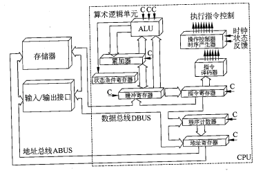

# 1. 计算机系统基础知识

## 1.1 计算机系统硬件基本组成

- 计算机系统是指由**硬件**和**软件**组成的整体，它们协同工作来运行程序。
- 计算机的基本硬件系统由**运算器**、**控制器**、**存储器**、**输入设备**和**输出设备**5大部分组成。
- 运算器、控制器等部件被集成在一起被称为**中央处理单元（CPU）**。
- CPU是硬件系统的核心,用于数据的加工处理,能完成各种算术、逻辑运算及控制功能。
- 存储器是计算机系统中的记忆设备,分为内部存储器和外部存储器。前者速度高、容量小,一般用于临时存放程序、数据及中间结果。而后者容量大、速度慢,可以长期保存程序和数据。
- 输入设备和输出设备合称为外部设备(简称外设),输入设备用于输入原始数据及各种命令,而输出设备则用于输出计算机运行的结果。

## 1.2 中央处理单元

**中央处理单元(CPU)** 是计算机系统的核心部件,它负责获取程序指令、对指令进行译码并加以执行。

### CPU 的功能

- **程序控制**：CPU通过执行指令来控制程序的执行顺序,这是 CPU 的重要功能。
- **操作控制**：一条指令功能的实现需要若干操作信号配合来完成,CPU 产生每条指令的操作信号并将操作信号送往对应的部件,控制相应的部件按指令的功能要求进行操作。
- **时间控制**：CPU对各种操作进行时间上的控制,即指令执行过程中操作信号的出现时间、持续时间及出现的时间顺序都需要进行严格控制。
- **数据处理**：。CPU通过对数据进行算术运算及逻辑运算等方式进行加工处理,数据加工处理的结果被人们所利用。所以,对数据的加工处理也是 CPU 最根本的任务。
- **中断处理**：CPU在执行指令过程中,如果出现了某些异常情况或需要与外部设备进行通信,则需要暂停当前指令的执行,转而去处理这些情况或通信请求。这就是中断处理。

### CPU 的组成

CPU主要由运算器、控制器、寄存器组和内部总线等部件组成，如图所示：

- **运算器(ALU)**：运算器由算术逻辑单元(Arithmetic and Logic Unit, ALU)、累加寄存器、数据缓冲寄存器和状态条件寄存器等组成,它是数据加工处理部件,用于完成计算机的各种算术和逻辑运算。 相对控制器而言,运算器接受控制器的命令而进行动作,即运算器所进行的全部操作都是由控 制器发出的控制信号来指挥的,所以它是执行部件。
  - 运算器有如下两个主要功能：
    - **算术运算**：执行所有的算术运算,如加、减、乘、除等基本运算及附加运算。
    - **逻辑运算**：执行所有的逻辑运算并进行逻辑测试,如与、或、非、异或等。
  - 运算器中各组成部件的功能：
    - 算术逻辑单元(ALU)：ALU是运算器的重要组成部件,负责处理数据,实现对数据的算术运算和逻辑运算。
    - 累加寄存器(AC)：AC通常简称为累加器,它是一个通用寄存器,其功能是当运算器的算术逻辑单元执行算术或逻辑运算时,为 ALU提供一个工作区。例如,在执行一个减法运算前,先将被减数取出暂存在 AC中,再从内存储器中取出减数,然后同 AC 的内容相减将所得的结果送回AC中。运算的结果是放在累加器中的,运算器中**至少要有一个**累加寄存器。
    - 数据缓冲寄存器(DR)：在对内存储器进行读/写操作时,用 DR 暂时存放由内存储器读/写的一条指令或一个数据字,将不同时间段内读/写的数据隔离开来。DR的主要作用为:作为CPU 和内存、外部设备之间数据传送的中转站;作为 CPU 和内存、外围设备之间在操作速度上的缓冲;在单累加器结构的运算器中,数据缓冲寄存器还可兼作为操作数寄存器。
    - 状态条件寄存器(PSW)：PSW 保存由算术指令和逻辑指令运行或测试的结果建立的各种条件码内容,主要分为**状态标志**和**控制标志**,例如运算结果进位标志(C)、运算结果溢出标志(V)、运算结果为0标志(Z)、运算结果为负标志(N)、中断标志(I)、方向标志(D)和单步标志等。这些标志通常分别由1位触发器保存,保存了当前指令执行完成之后的状态。通常,一个算术操作产生一个运算结果,而一个逻辑操作产生一个判决。
- **控制器**：用于控制整个 CPU的工作,它决定了计算机运行过程的自动化。它不仅要保证程序的正确执行,而且要能够处理异常事件。控制器一般包括**指令控制逻辑**、**时序控制逻辑**、**总线控制逻辑**和**中断控制逻辑**等几个部分。
  - 指令控制逻辑要完成取指令、分析指令和执行指令的操作,其过程分为取指令、指令译码、按指令操作码执行、形成下一条指令地址等步骤。
