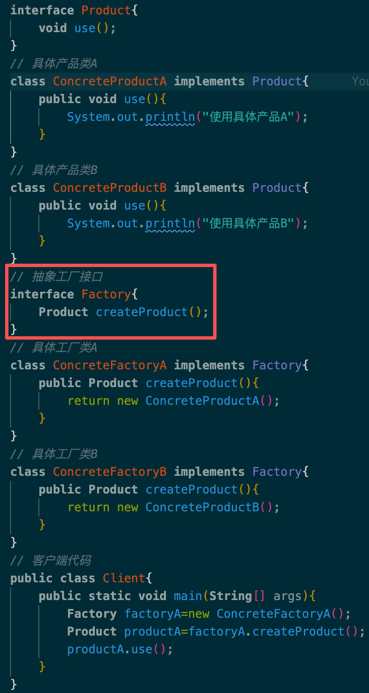
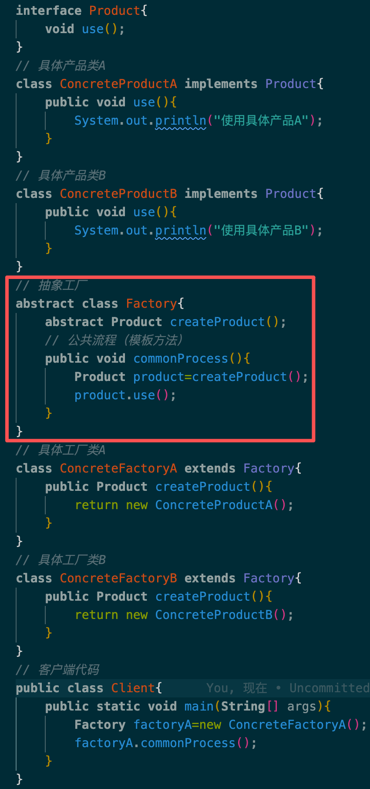

# 设计模式

## 创建型设计模式

创建型模式抽象了实例化过程,它们帮助一个系统独立于如何创建、组合和表示它的那些对象。一个类创建型模式使用继承改变被实例化的类,而一个对象创建型模式将实例化委托给另一个对象。

随着系统演化得越来越依赖于对象复合而不是类继承,创建型模式变得更为重要。当这种情况发生时,重心从对一组固定行为的硬编码(Hard-coding)转移为定义一个较小的基本行为集,这些行为可以被组合成任意数目的更复杂的行为。这样创建有特定行为的对象要求的不仅仅是实例化一个类。

在这些模式中有两个不断出现的主旋律。

- 第一,它们都将关于该系统使用哪些具体的类的信息封装起来。
- 第二,它们隐藏了这些类的实例是如何被创建和放在一起的。整个系统关于这些对象所知道的是由抽象类所定义的接口。

因此,创建型模式在什么被创建,谁创建它,它是怎样被创建的,以及何时创建这些方面给予了很大的灵活性。它们允许用结构和功能差别很大的“产品”对象配置一个系统。配置可以是静态的(即在编译时指定),也可以是动态的(在运行时)。

### 1.单例模式

单例模式（Singleton）是**创建型设计模式**，保证一个类**全局仅有一个实例**，并提供一个全局访问点获取该实例，禁止外部手动创建新对象。

#### 适用场景：

- **全局唯一资源管理**：配置文件、日志工具、数据库连接池、缓存管理器、硬件控制器；
- **避免资源重复消耗**：防止多次实例化占用内存 / 网络 / 文件句柄；
- **全局状态同步**：全应用共享同一组数据（如用户信息、主题配置）；
- **统一入口管控**：规范资源的创建、修改、销毁逻辑，避免混乱。

#### 两种经典实现方式：

| 类型   | 特点                                                 | 考试高频考点                           |
| ------ | ---------------------------------------------------- | -------------------------------------- |
| 饿汉式 | 类加载时创建实例，**线程安全**，无延迟加载           | 适用于高频使用、资源占用小的场景       |
| 懒汉式 | 首次调用时创建实例，**延迟加载**，原生写法线程不安全 | 需加锁保证线程安全，适用于低频使用场景 |

- 饿汉式实现：

  ```java
  public class Singleton{
      // 私有静态变量，类加载时即初始化
      private static final Singleton instance=new Singleton();
      // 私有构造方法，防止外部实例化
      private Singleton(){}
      //公共静态方法，提供全局访问点，返回唯一实例
      public static Singleton getInstance(){
          return instance;
      }
  }
  ```

- 懒汉式实现：

  ```java
  public class Singleton{
      // 似有静态变量，volatile禁止指令重排
      private static volatile Singleton instance;
      // 私有构造方法，防止外部实例化
      private Singleton(){}
      //全局访问点，提供唯一实例
      public static Singleton getInstance(){
          if(instance==null){
              synchronized(Singleton.class){
                  if(instance==null){
                      instance=new Singleton();
                  }
              }
          }
          return instance;
      }
  }
  ```

### 2.工厂模式

**工厂模式**是一种**创建型设计模式**，它的核心思想是：

> 将对象的创建过程封装起来，使客户端代码不直接依赖具体类，而是通过统一的接口来获取对象。

#### 适用场景：

- **对象创建复杂**：对象创建过程复杂，涉及多个步骤或参数；
- **解耦客户端与具体类**：客户端不需要知道具体类的实现细节，只需通过工厂接口获取对象；
- **需要灵活扩展**：系统需要频繁添加新产品类型，工厂模式可以方便地进行扩展。

#### 工厂模式的三种常见形式：

| 特性             | 简单工厂                                           | 工厂方法                                                                       | 抽象工厂                                               |
| ---------------- | -------------------------------------------------- | ------------------------------------------------------------------------------ | ------------------------------------------------------ |
| 是否 GoF 模式    | ❌ 否                                              | ✅ 是                                                                          | ✅ 是                                                  |
| 创建对象数量     | 单一产品                                           | 单一产品                                                                       | 多个相关产品（产品族）                                 |
| 扩展新产品的难度 | 高（需改工厂）                                     | 低（加子类）                                                                   | 中（需改接口）                                         |
| 核心思想         | 用一个静态方法 + 参数判断，返回不同的产品实例      | 定义一个创建对象的接口，但让子类决定实例化哪个类。即：把对象的创建延迟到子类。 | 创建一组相关或相互依赖的对象，而无需指定它们的具体类。 |
| 特点             | 通过一个工厂类根据参数决定创建哪种具体产品类的实例 | 定义一个创建对象的接口，让子类决定实例化哪一个类                               | 提供一个接口，用于创建一系列相关或相互依赖的对象       |
| 核心机制         | 静态方法 + if/switch                               | 继承 + 多态                                                                    | 接口 + 组合                                            |
| 典型应用         | 日志记录器、配置加载                               | 数据库驱动、日志框架                                                           | 跨平台UI、多主题系统                                   |
| 考试高频考点     | 适用于产品种类较少且变化不大的场景                 | 适用于产品种类较多且经常变化的场景                                             | 适用于需要创建多个产品族且产品之间有关系的场景         |

- 简单工厂代码实现

  ```java
  interface Product{
    void use();
  }
  // 具体产品类A
  class ConcreteProductA implements Product{
    public void use(){
        System.out.println("使用具体产品A");
    }
  }
  // 具体产品类B
  class ConcreteProductB implements Product{
    public void use(){
        System.out.println("使用具体产品B");
    }
  }
  class SimpleFactory{
    public static Product createProduct(String type){
        if("A".equals(type)) return new ConcreteProductA();
        if("B".equals(type)) return new ConcreteProductB();
        return null;
    }
  }
  public class Client{
    public static void main(String[] args){
        Product product=SimpleFactory.createProduct("A");
        product.use();
    }
  }
  ```

- 工厂方法代码实现

  | 接口实现方法                                          | 抽象类实现方法                                            |
  | ----------------------------------------------------- | --------------------------------------------------------- |
  |  |  |

  > 问：工厂方法模式应该用接口还是抽象类实现？
  >
  > 答：
  >
  > - 经典 GoF 实现使用抽象类，因为它支持在父类中定义公共流程（模板方法）。
  > - 但在现代 Java 开发中，若工厂仅需定义创建契约、无需共享逻辑，优先使用接口，因其更灵活、支持多实现、便于测试和函数式编程。
  > - 实际选择应根据是否需要状态管理和流程控制来决定。

- 抽象工厂代码实现
  ```java
  interface Button{void click();}
  interface CheckBox{void check();}
  // 具体按钮类A
  class WinButton implements Button{
    public void click(){
        System.out.println("点击Windows按钮");
    }
  }
  class MacButton implements Button{
    public void click(){
        System.out.println("点击Mac按钮");
    }
  }
  class WinCheckBox implements CheckBox{
    public void check(){
        System.out.println("选中Windows复选框");
    }
  }
  class MacCheckBox implements CheckBox{
    public void check(){
        System.out.println("选中Mac复选框");
    }
  }
  // 抽象工厂接口
  interface GUIFactory{
    Button createButton();
    CheckBox createCheckBox();
  }
  // 具体工厂类A
  class WinFactory implements GUIFactory{
    public Button createButton(){
        return new WinButton();
    }
    public CheckBox createCheckBox(){
        return new WinCheckBox();
    }
  }
  // 具体工厂类B
  class MacFactory implements GUIFactory{
    public Button createButton(){
        return new MacButton();
    }
    public CheckBox createCheckBox(){
        return new MacCheckBox();
    }
  }
  // 客户端代码
  public class Client{
    public static void main (String[] args){
        GUIFactory factoryA=new WinFactory();
        Button button=factoryA.createButton();
        CheckBox checkBox=factoryA.createCheckBox();
        button.click();
        checkBox.check();
    }
  }
  ```

### 3. prototype 原型模式

- **归类**：**创建型模式**（Creational Pattern）。
- **意图**：用原型实例指定创建对象的种类，并且通过拷贝这些原型创建新的对象。
- **适用场景**：
  1.  创建对象成本较大（如初始化需要很长时间、占用很多CPU资源）。
  2.  需要动态地生成对象实例，且这些实例的状态差异不大。
- **关键词**：**Clone（克隆）**、**Copy（拷贝）**、**implements Cloneable**、**避免重复初始化**、**对象创建成本高**。
- **浅拷贝 (Shallow Copy)**：只复制对象本身和基本数据类型变量。对象内部引用的**其他对象**（如数组、引用类型），仍然指向原来的地址。
  - _后果：修改克隆对象的引用类型数据，原对象也会变。_
- **深拷贝 (Deep Copy)**：不仅复制对象本身，还把对象内部引用的所有对象都复制一份。
  - _后果：克隆对象与原对象彻底独立。_
- **代码实现**：
  - 实现 `Cloneable` 接口，重写 `clone()` 方法（浅拷贝）。

    ```java
    class ConcretePrototype implements Cloneable{
        private String filed;

        // 构造函数
        public ConcretePrototype(String filed){
            this.filed=filed;
        }
        // 重写clone方法
        public Object clone(){
            Object obj=null;
            try{
                obj=super.clone();
            }catch(CloneNotSupportedException e){
                System.out.println("克隆失败");
            }
            return obj;
        }
    }
    public class Client{
        public static void main(String[] args){
            ConcretePrototype prototype=new ConcretePrototype("原始值");
            ConcretePrototype clone=(ConcretePrototype)prototype.clone();
            System.out.println(clone.filed);
        }
    }
    ```

  - 深拷贝的两种实现方式
    - 方式一：通过重写 `clone()` 方法，手动克隆内部引用对象。
      **原理**：在主对象的 `clone()` 方法中，不仅调用自己的 `super.clone()`，还要显式地调用内部引用对象的 `clone()` 方法。

      **前提**：内部引用的对象（如 `Address`）也必须实现 `Cloneable` 接口。

      ```java
      class Address implements Cloneable{
          public String city;

          public Address(String city){
              this.city=city;
          }
          // 重写clone方法
          public Object clone(){
              try{
                  super.clone();
              }catch(CloneNotSupportedException e){
                  return null;
              }
          }
      }
      class Student implements Cloneable{
          Student copy=null;
          try{
              copy=(Student)super.clone();
              copy.address=(Address)this.address.clone();
          }catch(CloneNotSupportedException e){
              e.printStackTrace();
          }
          return copy;
      }
      ```

    - 方式二：使用序列化（Serialization）实现深拷贝。
      **原理**：将对象转换为字节流，再从字节流中恢复对象，实现深拷贝。

      **前提**：对象及其内部引用的所有对象都必须实现 `Serializable` 接口。

      这里模拟一个**周报（WeeklyLog）**包含**附件（Attachment）**的场景。

      ```java
      class Attachment implements Serializable {
          private String name;

          public Attachment(String name) {
              this.name = name;
          }

          public void setName(String name) {
              this.name = name;
          }

          public String getName() {
              return this.name;
          }
      }

      // 2. 主对象：周报（必须实现 Serializable）
      class WeeklyLog implements Serializable {
          private String title;
          private Attachment attachment; // 引用类型

          public WeeklyLog(String title, Attachment attachment) {
              this.title = title;
              this.attachment = attachment;
          }

          // getters & setters
          public Attachment getAttachment() {
              return attachment;
          }

          // 【核心代码】通过序列化实现深拷贝
          public WeeklyLog deepClone() throws IOException, ClassNotFoundException {
              // --- 写入流 (序列化) ---
              // 创建字节输出流
              ByteArrayOutputStream bao = new ByteArrayOutputStream();
              // 创建对象输出流
              ObjectOutputStream oos = new ObjectOutputStream(bao);
              // 将当前对象(this)写入流中
              oos.writeObject(this);

              // --- 读出流 (反序列化) ---
              // 从字节流中取出数据
              ByteArrayInputStream bis = new ByteArrayInputStream(bao.toByteArray());
              ObjectInputStream ois = new ObjectInputStream(bis);

              // 读取并强制转换为 WeeklyLog 类型
              return (WeeklyLog) ois.readObject();
          }

          public void show() {
              System.out.println("周报标题: " + title + ", 附件名: " + attachment.getName());
          }
      }

      // 3. 测试客户端
      public class Client {
          public static void main(String[] args) {
              try {
                  // 创建原型对象
                  Attachment att = new Attachment("原始文档.doc");
                  WeeklyLog log_original = new WeeklyLog("第一周周报", att);

                  System.out.println("--- 克隆前 ---");
                  log_original.show();

                  // 调用深拷贝方法
                  WeeklyLog log_new = log_original.deepClone();

                  // 修改新对象的附件名称（以此验证是否影响了原对象）
                  log_new.getAttachment().setName("新文档.pdf");

                  System.out.println("\n--- 克隆后并修改新对象 ---");
                  System.out.print("原对象: ");
                  log_original.show(); // 应该保持 "原始文档.doc"

                  System.out.print("新对象: ");
                  log_new.show();      // 应该是 "新文档.pdf"

                  System.out.println("\n结果：原对象未受影响，深拷贝成功！");

              } catch (Exception e) {
                  e.printStackTrace();
              }
          }
      }
      ```

      如果考试中出现这种代码，或者是让你分析优缺点，注意以下几点：
      1.  **接口不同**：
          - 普通 Clone 方式实现的是 `Cloneable` 接口。
          - 序列化方式实现的是 `Serializable` 接口（这是一个标记接口，没有方法需要实现）。
      2.  **流的选择**：
          - 使用 `ByteArrayOutputStream` / `ByteArrayInputStream` 是因为我们只想在**内存**中完成拷贝，不需要把文件存到硬盘上（那样太慢了）。
      3.  **异常处理**：
          - 序列化操作涉及 IO，所以必须处理 `IOException` 和 `ClassNotFoundException`。

      ### 4. 两种深拷贝方式对比（必背）

      在软考上午题中，可能会考这两种方式的比较：

      | 比较维度       | 方式一：重写 clone() (多重克隆)                                     | 方式二：序列化 (Serialization)                                                |
      | :------------- | :------------------------------------------------------------------ | :---------------------------------------------------------------------------- |
      | **代码复杂度** | **高**。如果对象嵌套很多层（A含B，B含C...），每一层都要重写 clone。 | **低**。不管嵌套多少层，只要都实现了 Serializable，主类写一段流操作代码即可。 |
      | **运行效率**   | **高**。直接操作内存复制。                                          | **低**。涉及流的转换、序列化/反序列化开销大。                                 |
      | **适用场景**   | 对象结构简单，追求高性能。                                          | 对象结构极其复杂（多层嵌套），对性能要求不严苛。                              |

## 结构性设计模式

结构型设计模式涉及如何组合类和对象以获得更大的结构。结构型类模式采用继承机制来 组合接口或实现。一个简单的例子是采用多重继承方法将两个以上的类组合成一个类,结果这 个类包含了所有父类的性质。这一模式尤其有助于多个独立开发的类库协同工作。其中一个例子是类形式的Adapter 模式。一般来说,适配器使得一个接口与其他接口兼容,从而给出了多个不同接口的统一抽象。为此,类适配器对一个 adaptee 类进行私有继承。这样,适配器就可以用 adaptee 的接口表示它的接口。

结构型对象模式不是对接口和实现进行组合,而是描述了如何对一些对象进行组合,从而 实现新功能的一些方法。因为可以在运行时刻改变对象组合关系,所以对象组合方式具有更大的灵活性,而这种机制用静态类组合是不可能实现的。结构型模式的一个重要特征是它们可以动态地改变对象组合关系,从而使得系统更灵活,更容易扩展。结构型模式的一个重要应用领域是图形界面设计,其中许多组件都是通过组合其他组件来实现的。

- Composite 模式是结构型对象模式的一个实例。它描述了如何构造一个类层次式结构,这一结构由两种类型的对象所对应的类构成。其中的组合对象使得用户可以组合基元对象以及其他的组合对象,从而形成任意复杂的结构。
- 在 Proxy 模式中,proxy 对象作为其他对象的一个方便的替代或占位符。它的使用可以有多种形式,例如可以在局部空间中代表一个远程地址空间中的对象,也可以表示一个要求被加载的较大的对象,还可以用来保护对敏感对象的访问。Proxy 模式还提供了对对象的一些特有性质的一定程度上的间接访问,从而可以限制、增强或修改这些性质。
- Flyweight模式为了共享对象定义了一个结构。至少有两个原因要求对象共享:效率和一致性。Flyweight 的对象共享机制主要强调对象的空间效率。使用很多对象的应用必须考虑每一个对象的开销。使用对象共享而不是进行对象复制,可以节省大量的空间资源。但是,仅当这些对象没有定义与上下文相关的状态时,它们才可以被共享。Flyweight 的对象没有这样的状态。任何执行任务时需要的其他一些信息仅当需要时才传递过去。由于不存在与上下文相关的状态,因此 Flyweight 对象可以被自由地共享。
- 如果说Flyweight模式说明了如何生成很多较小的对象,那么 Facade 模式则描述了如何用 单个对象表示整个子系统。模式中的facade用来表示一组对象, facade的职责是将消息转发给它所表示的对象。
- Bridge模式将对象的抽象和其实现分离,从而可以独立地改变它们。
- Decorator 模式描述了如何动态地为对象添加职责。Decorator模式是一种结构型模式,这一模式采用递归方式组合对象,从而允许添加任意多的对象职责。例如,一个包含用户界面组件的Decorator对象可以将边框或阴影这样的装饰添加到该组件中,或者它可以将窗口滚动和缩放这样的功能添加到组件中。可以将一个Decorator对象嵌套在另外一个对象中,就可以很简单地增加两个装饰,添加其他的装饰也是如此。因此,每个Decorator 对象必须与其组件的接口 兼容并且保证将消息传递给它。Decorator 模式在转发一条信息之前或之后都可以完成它的工作(例如绘制组件的边框)。

许多结构型模式在某种程度上具有相关性。例如,适配器模式和装饰器模式都使用了对象组合来实现它们的目的,但是适配器模式的目的是改变一个对象的接口,而装饰器模式的目的是在不改变对象接口的前提下动态地添加职责。Facade 模式和 Proxy 模式都提供了一个对象来代表另一个对象或一组对象,但是 Facade 模式的目的是简化接口,而 Proxy 模式的目的是控制对对象的访问。

### 1. 适配器模式（Adapter Pattern）

将一个类的接口转换成客户希望的另一个接口，使原本由于接口不兼容而不能一起工作的类可以协同工作。

#### 适配器模式的两种实现方式：

1. **类适配器**：使用继承关系实现，适配器类继承自目标接口，同时也继承自被适配类。
2. **对象适配器**：使用组合关系实现，适配器类包含一个被适配类的实例，通过调用该实例的方法来实现目标接口。
   | 类型 | 实现方式 | 是否符合“组合优于继承” | 软考重点 |
   |------|--------|---------------------|--------|
   | 类适配器 | 通过多重继承（Java 不支持） | ❌ 不推荐 | 了解即可 |
   | 对象适配器 | 通过组合 + 委托 | ✅ 推荐 | 高频考点 |
   > 💡 Java 中只能实现对象适配器（因为 Java 不支持类的多重继承）。

#### 适用场景（必背！）

- **重用已有类，但其接口不符合需求**
- **集成第三方库/旧系统**（无法修改源码）
- **统一多个不兼容接口**（如不同支付 SDK）

> 📌 关键词：“接口不兼容”、“复用旧代码”、“封装第三方库”

#### 与外观模式（Facade）的区别（高频对比题！）

| 模式              | 目的                         | 接口方向                      | 软考辨析                       |
| ----------------- | ---------------------------- | ----------------------------- | ------------------------------ |
| 适配器（Adapter） | 让两个不兼容接口能协作       | 转换已有接口 → 客户端期望接口 | “A 不能用，改造成 B 能用”      |
| 外观（Facade）    | 为复杂子系统提供统一简单接口 | 简化多接口 → 单一高层接口     | “多个类太复杂，我给你一个门面” |

> 记忆口诀：
>
> - 适配器：接口翻译官
> - 外观：系统代言人

#### 核心角色（UML 结构）

```text
+----------------+       +---------------------+
|   Target       |<-----|   Adapter           |
+----------------+       +---------------------+
| + request()    |       | - adaptee: Adaptee  |
+----------------+       +---------------------+
                                 |
                                 | (组合)
                                 v
                        +---------------------+
                        |   Adaptee           |
                        +---------------------+
                        | + specificRequest() |
                        +---------------------+
```

- **Target（目标接口）**：客户端期望的接口（如 MediaPlayer）
- **Adaptee（被适配者）**：已存在的、但接口不兼容的类（如 AdvancedMediaPlayer）
- **Adapter（适配器）**：持有 Adaptee 的引用，实现 Target 接口，并将请求委托给 Adaptee

#### 对象适配器代码实现

场景设定: 客户端需要 `Target` 接口的 `request()` 方法，但我们只有一个老系统 `Adaptee`，它只有 `specificRequest()` 方法。

```java
interface Target{
    void request();
}
class Adaptee{
    public void specificRequest(){
        System.out.println("Adaptee: specificRequest");
    }
}
class Adapter implements Target{
    //持有 Adaptee 实例
    private Adaptee adaptee;
    //构造函数，传入 Adaptee 实例
    public Adapter(Adaptee adaptee){
        this.adaptee = adaptee;
    }
    //实现 Target 接口的 request() 方法
    @Override
    public void request(){
        this.adaptee.specificRequest();
    }
}
```

#### 用接口模拟类适配器

虽然 Java 不能多继承类，但可以 继承一个类 + 实现一个接口，这在语义上近似于类适配器。

```java
interface Target{
    void request();
}
class Adaptee{
    public void specificRequest(){
        System.out.println("Adaptee: specificRequest");
    }
}
class Adapter extends Adaptee implements Target{
    @Override
    public void request(){
        super.specificRequest();
    }
}
public class Client{
    public static void main(String[] args){
        Target target = new Adapter();
        target.request(); // 输出：Adaptee: specificRequest
}
```

#### 小结 & 口诀

> 适配器模式三要素：
>
> 1️⃣ 已有类（Adaptee）不能改
>
> 2️⃣ 客户端要新接口（Target）
>
> 3️⃣ 适配器做“翻译”（组合 + 委托）

✅ **一句话总结**：

> “你有你的接口，我有我的需求，适配器来搭桥！”

#### 软考答题技巧

- 题干出现 **“已有类无法修改”**、**“接口不匹配”**、**“封装第三方库”** → 优先考虑 **适配器模式**
- 若题干是 **“简化复杂子系统调用”** → 选 **外观模式**
- **不要混淆**：适配器是 **一对一转换**，外观是 **多对一简化**

### 2.外观模式（Facade Pattern）

外观模式（Facade Pattern）作为 23 种设计模式中的“常青树”，是结构型模式中最直观的一个。简单来说，外观模式就是为了**简化**。它通过提供一个统一的接口，来访问子系统中的一群接口。

#### 核心角色（UML 结构）

```text
+----------------+       +---------------------+
|   Client       |------>|   Facade            |
+----------------+       +---------------------+
                         | + operation()       |
                         +----------+----------+
                                    |
             +----------------------+----------------------+
             |                      |                      |
    +--------v-------+    +--------v-------+    +--------v-------+
    | SubsystemOne   |    | SubsystemTwo   |    | SubsystemThree |
    +----------------+    +----------------+    +----------------+
    | + methodOne()  |    | + methodTwo()  |    | + methodThree()|
    +----------------+    +----------------+    +----------------+
```

- **Facade（外观类）**：知道子系统的内部结构，负责协调调用。
- **Subsystem（子系统类）**：实现具体功能，**不感知外观的存在**。
- **Client（客户端）**：只与 Facade 交互，完全不知道子系统细节

特征：

- 一个类（Facade）**聚合多个子系统类**
- 客户端**只依赖 Facade**
- 子系统类之间**无依赖关系**

> 🔑 **关键点**：子系统类**不需要修改**，外观只是“包装”它们。

#### 代码示例

场景设定：启动电脑时，需要依次启动 CPU、内存、硬盘等组件。

```java
class CPU{
    public void start(){
        System.out.println("CPU 启动");
    }
}
class Memory{
    public void load(){
        System.out.println("内存加载");
    }
}
class HardDrive{
    public void readBootSector(){
        System.out.println("硬盘读取引导扇区");
    }
}
class ComputerFacade{
    private CPU cpu;
    private Memory memory;
    private HardDrive hardDrive;
    //构造函数，初始化子系统
    public ComputerFacade(){
        this.cpu = new CPU();
        this.memory = new Memory();
        this.hardDrive = new HardDrive();
    }
    //外观方法，简化客户端调用
    public void startComputer(){
        hardDrive.readBootSector();
        memory.load();
        cpu.start();
    }
}
class Client{
    public static void main(String[] args){
        ComputerFacade computer = new ComputerFacade();
        computer.startComputer(); // 客户端只需调用这一行
    }
}
```

#### 设计原则体现（可能考简答）

- **迪米特法则（Law of Demeter）**：客户端只与外观通信，不与子系统直接交互->“只与朋友说话”
- **单一职责原则（Single Responsibility Principle）**：外观负责协调，客户端无需修改。
- **开闭原则（Open-Closed Principle）**：新增子系统功能，只要不改外观接口，客户端无需修改。

#### 小结 & 口诀

> ✅ 外观模式三要素：
>
> 1️⃣ 多个子系统
>
> 2️⃣ 一个统一接口
>
> 3️⃣ 客户端只和外观打交道
>
> ✅ 软考答题口诀：
> “复杂子系统，外观来简化；适配做翻译，别搞混啦！”

### 3. 桥接模式（Bridge）

#### 定义（GOF 原文）

> 将抽象部分与它的实现部分分离，使它们都可以独立地变化。

注意：这里的“抽象”和“实现”不是指编程语言中的 abstract class 和具体类，而是指 **两个正交（独立）变化的维度**。

#### 核心思想

**桥接模式 = 把 “抽象” 和 “实现” 分开，让它们可以独立变化，用组合（桥）连接，代替多层继承。**

- **用组合代替继承**
- **解决类爆炸问题**：当一个类有 **多个独立变化的维度**（如形状 × 颜色、设备 × 遥控器、图形 × 渲染方式），若用继承会导致 **类爆炸（类数量呈乘积增长）**。
- 桥接模式通过 **引入“桥”（即接口或抽象类）**，将两个维度解耦，各自形成独立的类层次结构。

> 🌰 举例：
>
> 要画 红圆、蓝圆、红方、蓝方……
>
> 若用继承：需 2×2=4 个类；若有 10 种颜色 + 10 种形状 → 100 个类！
>
> 用桥接：只需 10（颜色）+10（形状）=20 个类，通过组合即可任意搭配。

#### 桥接模式固定 4 个角色（必背）

- **Abstraction（抽象类）**：定义高层操作，**持有 Implementor（实现类）的引用**。
- **RefinedAbstraction（扩充抽象类）**：对 Abstraction 进行扩展，增加新功能。
- **Implementor（实现类接口）**：定义底层实现的接口，是 Abstraction 的“子接口”，如：颜色、发送方式、操作系统。
- **ConcreteImplementor（具体实现类）**：真正做事的类，如：红色、蓝色、短信发送、邮件发送。

#### UML 结构

```text
+------------------+        +---------------------+
|   Abstraction    |<>----->|   Implementor       |
+------------------+        +---------------------+
| - implementor    |        | + operationImpl()   |
+------------------+        +---------------------+
| + operation()    |                ▲
+------------------+                |
         ▲                          |
         |                          |
+------------------+        +---------------------+
| RefinedAbstraction|      | ConcreteImplementorA|
+------------------+        +---------------------+
| + operation()    |      | + operationImpl()   |
+------------------+        +---------------------+
                            +---------------------+
                            | ConcreteImplementorB|
                            +---------------------+
                            | + operationImpl()   |
                            +---------------------+
```

🔗 **关系说明**：

- `Abstraction` 通过 **聚合（Aggregation）或组合（Composition）** 持有一个 `Implementor` 的引用（图中用空心菱形箭头 <>-----> 表示）。
- `Implementor` 是一个接口或抽象类，定义底层操作。
- `RefinedAbstraction` 是对 `Abstraction` 的扩展，可有多个子类。
- `ConcreteImplementorA/B` 实现 `Implementor` 接口。

| 角色                              | 说明                                              |
| --------------------------------- | ------------------------------------------------- |
| Abstraction（抽象类）             | 定义高层控制接口，持有一个指向 Implementor 的引用 |
| RefinedAbstraction（扩充抽象类）  | 对 Abstraction 的扩展，可有多个子类               |
| Implementor（实现类接口）         | 定义底层操作接口（“桥”的另一端）                  |
| ConcreteImplementor（具体实现类） | 实现 Implementor 接口的具体类                     |

#### 代码示例（Java）

```java
interface Color{
    String fill();
}
class Red implements Color{
    @Override
    public String fill(){
        return "red";
    }
}
class Blue implements Color{
    @Override
    public String fill(){
        return "blue";
    }
}
abstract class Shape{
    protected Color color;
    public Shape(Color color){
        this.color = color;
    }
    abstract void draw();
}
class Circle extends Shape{
    public Circle(Color color){
        super(color);
    }
    @Override
    void draw(){
        System.out.println("draw a circle with color "+color.fill());
    }
}
class Square extends Shape{
    public Square(Color color){
        super(color);
    }
    @Override
    void draw(){
        System.out.println("draw a square with color "+color.fill());
    }
}
public class Client{
    public static void main(String[] args){
        Shape redCircle=new Circle(new Red());
        redCircle.draw(); // 输出：draw a circle with color red

        Shape blueSquare=new Square(new Blue());
        blueSquare.draw(); // 输出：draw a square with color blue
    }
}
```

#### 软考考点总结（高频！）

| 考点           | 内容                                                                                                                              |
| -------------- | --------------------------------------------------------------------------------------------------------------------------------- |
| 模式类型       | 结构型模式                                                                                                                        |
| 解决的问题     | 多维度变化导致的类爆炸                                                                                                            |
| 核心机制       | 组合代替继承，抽象与实现解耦                                                                                                      |
| 关键角色       | Abstraction、Implementor（必须记住）                                                                                              |
| 与其他模式区别 | <ul><li>vs 适配器：适配器用于兼容已有接口，桥接用于设计阶段解耦</li><li>vs 策略模式：策略关注算法替换，桥接关注结构解耦</li></ul> |
| 典型应用题     | 绘图系统、跨平台播放器、毛笔/蜡笔模型                                                                                             |
| 判断题关键词   | “独立变化”、“避免类爆炸”、“组合优于继承” → 选桥接模式                                                                             |

#### 一句话记忆口诀（软考冲刺用）

> “两维变化易爆炸，桥接组合来解耦；抽象实现分两边，扩展灵活不用愁。”

### 4. 装饰器模式（Decorator Pattern）

装饰器模式（Decorator Pattern）以“动态地给对象添加职责”为核心思想，常被用来替代继承，实现更灵活的功能扩展。

#### UML 结构

```text
+----------------+       +---------------------+
|   Component    |<-----|   ConcreteComponent |
+----------------+       +---------------------+
| + operation()  |       | + operation()       |
+----------------+       +---------------------+
        ^
        |
+----------------+
|   Decorator    |
+----------------+
| - component: Component
+----------------+
| + operation()  |
+----------------+
        ^
        |
+---------------------+
| ConcreteDecoratorA  |
+---------------------+
| + operation()       | ← 在调用 component.operation() 前后加功能
+---------------------+
```

#### 代码示例（Java）

```java
interface Coffee{
    double cost();
    String getDescription();
}
class Espresso implements Coffee{
    @Override
    public double cost(){
        return 10.0;
    }
    @Override
    public String getDescription(){
        return "浓缩咖啡"
    }
}
abstract class CoffeeDecorator implements Coffee{
    protected Coffee coffee;
    public CoffeeDecorator(Coffee coffee){
        this.coffee=coffee;
    }
    @Override
    public double cost(){
        return coffee.cost();
    }
    @Override
    public String getDescription(){
        return coffee.getDescription();
    }
}
class MilkDecorator extends CoffeeDecorator{
    public MilkDecorator(Coffee coffee){
        super(coffee);
    }
    @Override
    public double cost(){
        return coffee.cost()+2.0;
    }
    @Override
    public String getDescription(){
        return coffee.getDescription()+"牛奶";
    }
}
class SugarDecorator extends CoffeeDecorator{
    public SugarDecorator(Coffee coffee){
        super(coffee);
    }
    @Override
    public double cost(){
        return coffee.cost()+1.0;
    }
    @Override
    public String getDescription(){
        return coffee.getDescription()+"糖";
    }
}
public class Client{
    public static void main(String[] args){
        Coffee coffee=new Espresso();
        coffee=new MilkDecorator(coffee);
        coffee=new SugarDecorator(coffee);
        System.out.println(coffee.getDescription());
        System.out.println("价格: "+coffee.cost());
    }
}
```

装饰器模式适用于：

- 需要在不影响其他对象的情况下，动态地给单个对象添加功能
- 功能可叠加（如I/O流、日志、权限、缓存）
- 用继承会导致子类数量爆炸
  > 📌 软考关键词：“动态增加职责”、“避免子类膨胀”、“I/O 流”

| 模式   | 目的                       | 结构相似点         | 关键区别                 |
| ------ | -------------------------- | ------------------ | ------------------------ |
| 装饰器 | 增强功能（加日志、加密）   | 都持有真实对象引用 | 透明增强，客户端无感知   |
| 代理   | 控制访问（权限、延迟加载） | 同左               | 控制逻辑，可能阻止操作   |
| 适配器 | 接口转换                   | 同左               | 改变接口，让不兼容变兼容 |
