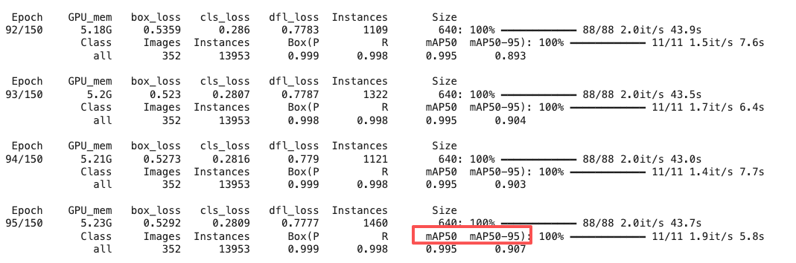

# Google Colab 训练 YOLO 模型（布局检测模型）全流程

本文档详细介绍了如何在 Google Colab 平台上，使用 YOLOv8 模型对自定义数据集进行训练的完整流程。包括设置 Colab 环境、准备并上传数据集、编写训练代码以及保存和导出最终模型的步骤。

## 一、 设置 Google Colab 环境

### 1. 创建 Colab Notebook

- 访问 [colab.research.google.com](https://colab.research.google.com)。
- 点击 文件-在云端硬盘新建笔记本（`File` -> `New notebook`）， 创建一个新的 Notebook📝。

### 2. 启用 GPU 加速 (关键步骤)

- 点击菜单栏的 `代码执行程序` -> `更改运行时类型`（`Runtime` -> `Change runtime type`）。
- 在 `硬件加速器` 下拉菜单中，选择 `T4 GPU`。
- 点击 `Save`。这会为您分配一个免费的GPU，极大加速训练过程🚀。

### 3. 挂载 Google Drive

- 为了方便地存取数据和保存训练结果（Colab实例是临时的，关闭后文件会丢失），我们需要将您的 Google Drive 挂载到 Colab 环境中 📂。
- 在第一个代码单元格中，输入并运行以下代码：

  ```python
  from google.colab import drive
  drive.mount('/content/drive')
  ```

  运行后，它会提供一个授权链接。点击链接，登录您的Google账号，复制授权码，然后粘贴回Colab的输入框并按回车（第一次需要）🔑。

### 4. 安装 YOLOv8

- 在新的代码单元格中，使用pip安装 `ultralytics` 包，它包含了YOLOv8的所有功能🔧。

  ```bash
  !pip install ultralytics
  ```

## 二、 准备并上传数据集

### 1. 压缩并上传数据集

- 在您的**本地电脑**上，将整个数据集 `dataset_augmented` 文件夹压缩成一个 `.zip` 文件。mac用户可以使用`zip -r dataset_augmented.zip dataset_augmented`命令，前提是先 `cd` 到`dataset_augmented`文件夹所在目录🗜️。
- 在 [Google Drive](https://drive.google.com/) 的主目录中（通常，打开后默认就在主目录），上传这个 `dataset_augmented.zip` 文件（将 dataset_augmented.zip 文件直接用鼠标拖拽到 Google Drive 的浏览器窗口的文件列表区域）。通过浏览器上传单个大文件远比上传成千上万个小文件要快⚡。
- 确保您的 `dataset_augmented.zip` 文件已成功上传到 Google Drive 的主目录，检查 Colab Notebook 中是否能看到这个文件✔️。

### 2. 在 Colab 中解压数据集

- 现在，在 Colab Notebook 中，使用 `!unzip` 命令将您上传的压缩包解压到工作目录📂。

  ```bash
  # 路径要和您在Google Drive中存放的位置匹配
  !unzip /content/drive/MyDrive/dataset_augmented.zip -d /content/
  ```

- 运行后，在 Colab 的左侧文件浏览器中，您应该能看到 `/content/dataset_augmented` 文件夹。

  

### 3. 划分数据集（可选，如果没有划分训练集和验证集）

- 为了评估模型的泛化能力，我们需要将数据集划分为训练集和验证集🔍。
- 我们将在 Colab 环境中的 `/content/dataset_augmented/images` 文件夹中，随机打乱顺序，将前 80% 作为训练集，剩余的 20% 作为验证集（常见的 80/20 分割）🔢。
- 在 Colab 笔记本中，创建一个新的代码单元格并运行以下代码

  ```Python
    import os
    import random
    import shutil

    # --- Configuration ---
    SOURCE_DIR = '/content/dataset_augmented'
    # The root directory for our newly structured dataset
    OUTPUT_DIR = '/content/final_dataset'
    # 80% for training, 20% for validation
    TRAIN_RATIO = 0.8

    # --- Setup Paths ---
    source_images_dir = os.path.join(SOURCE_DIR, 'images')
    source_labels_dir = os.path.join(SOURCE_DIR, 'labels')

    # Create the new directory structure
    train_images_path = os.path.join(OUTPUT_DIR, 'train', 'images')
    train_labels_path = os.path.join(OUTPUT_DIR, 'train', 'labels')
    val_images_path = os.path.join(OUTPUT_DIR, 'val', 'images')
    val_labels_path = os.path.join(OUTPUT_DIR, 'val', 'labels')

    os.makedirs(train_images_path, exist_ok=True)
    os.makedirs(train_labels_path, exist_ok=True)
    os.makedirs(val_images_path, exist_ok=True)
    os.makedirs(val_labels_path, exist_ok=True)

    print("Created new directory structure at:", OUTPUT_DIR)

    # --- Get all image files and shuffle them ---
    image_files = [f for f in os.listdir(source_images_dir) if f.endswith(('.jpg', '.png', '.jpeg'))]
    random.shuffle(image_files)

    # --- Calculate the split point ---
    split_index = int(len(image_files) * TRAIN_RATIO)
    train_files = image_files[:split_index]
    val_files = image_files[split_index:]

    print(f"Total images: {len(image_files)}")
    print(f"Training images: {len(train_files)}")
    print(f"Validation images: {len(val_files)}")

    # --- Function to move files ---
    def move_files(file_list, dest_image_path, dest_label_path):
        for image_name in file_list:
            # Construct source paths
            source_image_file = os.path.join(source_images_dir, image_name)
            label_name = os.path.splitext(image_name)[0] + '.txt'
            source_label_file = os.path.join(source_labels_dir, label_name)

            # Construct destination paths
            dest_image_file = os.path.join(dest_image_path, image_name)
            dest_label_file = os.path.join(dest_label_path, label_name)

            # Move the image
            shutil.move(source_image_file, dest_image_file)

            # Move the corresponding label file, if it exists
            if os.path.exists(source_label_file):
                shutil.move(source_label_file, dest_label_file)

    # --- Move the files into their new homes ---
    print("\nMoving training files...")
    move_files(train_files, train_images_path, train_labels_path)

    print("Moving validation files...")
    move_files(val_files, val_images_path, val_labels_path)

    print("\nData splitting complete!")
  ```

### 4. 修正数据集标签ID错误（可忽略）

**<font color="red">实战错误修正，非必须步骤</font>**，这一问题最好在数据标注时就避免。

在实际操作中，我发现由于使用 **LabelImg** 进行标注时出现了标签ID错误的问题，原因是我新加的label、value标签被**LabelImg**错误的追加到其固有标签的后面，导致数据集的标签ID生成错误（。

label和value的ID分别是15和16），从而影响模型的训练。

因此，我们需要编写一个脚本来修正这些标签文件中的ID，将15改为0，16改为1。

**修正数据脚本**：

```python
import os

# --- 配置 ---
# 这是最关键的部分：请定义错误的ID到正确ID的映射
# 您需要知道 'label' 和 'value' 被错误地分配成了哪个ID。
# 假设通过查看原始的 classes.txt 或您的记忆，'label' 变成了 15，'value' 变成了 16。
# 如果不确定，可以随机打开一个原始标签文件看看第一个数字是什么。
ID_MAPPING = {
    15: 0,  # 将所有旧的ID 15 (假设是'label') 映射到新的ID 0
    16: 1,  # 将所有旧的ID 16 (假设是'value') 映射到新的ID 1
    # 如果还有其他错误ID，也在这里添加映射
}

# 指向您已经拆分好的数据集的根目录
DATASET_ROOT_DIR = '/content/final_dataset'

# --- 脚本执行 ---
def fix_labels_in_directory(directory_path):
    fixed_files_count = 0
    total_lines_count = 0
    fixed_lines_count = 0

    if not os.path.exists(directory_path):
        print(f"警告：目录不存在，跳过: {directory_path}")
        return

    for filename in os.listdir(directory_path):
        if filename.endswith('.txt'):
            file_path = os.path.join(directory_path, filename)

            corrected_lines = []
            made_change = False
            try:
                with open(file_path, 'r') as f:
                    lines = f.readlines()

                total_lines_count += len(lines)

                for line in lines:
                    parts = line.strip().split()
                    if len(parts) == 5:
                        # 尝试将第一个部分转换为整数
                        try:
                            old_id = int(float(parts[0]))
                        except ValueError:
                            # 如果无法转换，保留原始行
                            corrected_lines.append(line.strip())
                            continue

                        # 如果旧ID在我们的映射表中，就替换它
                        if old_id in ID_MAPPING:
                            new_id = ID_MAPPING[old_id]
                            parts[0] = str(new_id)
                            corrected_lines.append(" ".join(parts))
                            made_change = True
                            fixed_lines_count += 1
                        else:
                            # 如果不在映射表中，保留原始行 (以防万一)
                            corrected_lines.append(line.strip())
                    else:
                        # 如果行格式不正确，保留原始行
                        corrected_lines.append(line.strip())

                # 只有在做出更改后才写回文件
                if made_change:
                    with open(file_path, 'w') as f:
                        f.write("\n".join(corrected_lines))
                    fixed_files_count += 1

            except Exception as e:
                print(f"处理文件 {filename} 时出错: {e}")

    print(f"在 {directory_path} 中：")
    print(f"  - 检查了 {total_lines_count} 行标签。")
    print(f"  - 修正了 {fixed_lines_count} 行标签。")
    print(f"  - 共修改了 {fixed_files_count} 个文件。")


# --- 对 train 和 val 目录都执行修复 ---
print("开始修正训练集标签...")
fix_labels_in_directory(os.path.join(DATASET_ROOT_DIR, 'train', 'labels'))

print("\n开始修正验证集标签...")
fix_labels_in_directory(os.path.join(DATASET_ROOT_DIR, 'val', 'labels'))

print("\n--- 所有标签文件修正完成！---")
```

### 5. 创建数据集配置文件 (`.yaml`)

- YOLOv8 需要一个 `.yaml` 文件来了解您的数据集：训练集和验证集在哪里，以及类别⚙️名称是什么。
- 在新的代码单元格中，运行以下 "magic command" 来直接在 Colab 中创建这个文件。

  ```yaml
  %%writefile /content/final_dataset/body_scale_data.yaml

  # The path is now the root of our new dataset structure
  path: /content/final_dataset

  # Point to the correct subdirectories
  train: train/images/
  val: val/images/

  # Class names remain the same
  names:
      0: label
      1: value
  ```

## 三、 执行训练命令

现在，一切准备就绪，我们只需要一条命令就可以开始训练🚀。

- **选择模型**: 我们将使用 **迁移学习 (Transfer Learning)** 的方式，即在一个非常庞大的通用数据集（COCO）上预训练好的 `yolov8n.pt` 模型的基础上，对您的特定数据进行微调。`n` 代表 "nano"，是最小最快的版本，非常适合Web部署 🤖。

- **运行训练命令**: 在新的代码单元格中，粘贴并运行以下命令。

  ```bash
  # !yolo task=detect mode=train model=yolov8n.pt data=/content/final_dataset/body_scale_data.yaml epochs=150 imgsz=640 batch=16

  # 创建一个专门存放 YOLO 结果的文件夹在你的 Google Drive
  # 这样所有项目的结果都会被整齐地组织起来

  DRIVE_RESULTS_DIR = '/content/drive/MyDrive/YOLOv8_Training_Results'

  !yolo task=detect mode=train \
  model=yolov8n.pt \
  data=/content/dataset_augmented/body_scale_data.yaml \
  epochs=150 \
  imgsz=640 \
  batch=16 \
  project='{DRIVE_RESULTS_DIR}' \
  name='BodyScale_LayoutDetector_Run1'
  ```

**命令参数详解**:

- `!yolo`: 调用 ultralytics 的命令行接口。
- `task=detect`: 我们正在执行一个目标检测任务。
- `mode=train`: 我们要进行训练。
- `model=yolov8n.pt`: 指定起始模型。它会自动下载这个预训练模型。
- `data=...`: 指向我们刚刚创建的 `.yaml` 配置文件。
- `epochs=150`: 训练轮次。表示整个数据集将被完整地训练150遍。对于一个自定义数据集，100-200轮通常是一个很好的起点。
- `imgsz=640`: 训练时，所有图片都会被缩放到 `640x640` 的尺寸。
- `batch=16`: 每次向GPU喂16张图片进行处理。如果遇到 "CUDA out of memory" 错误，可以适当减小这个值（例如 `8`）。

**监控训练过程**:

运行命令后，您会看到训练日志开始滚动，它会显示当前轮次、损失函数值（loss），以及最重要的评估指标 **mAP50** 和 **mAP50-95**📊。

- **mAP (mean Average Precision)** 是衡量目标检测模型好坏的核心指标，值越高越好 ✨。
- 观察 **mAP50-95** 是否在稳步提升。如果几十轮后它不再增长甚至开始下降，说明模型可能已经收敛或过拟合，可以提前停止训练⚠️。

  

## 阶段四 获取并转换最终模型

### 1. 找到最佳模型

- 训练完成后，所有的结果，包括权重文件（模型）、性能图表等，都会被保存在 `/content/runs/detect/train/` 目录下（如果多次运行，目录可能是`train2`, `train3`...）。
- 其中**最重要**的文件是 `/content/runs/detect/train/weights/best.pt`。这是在所有训练轮次中，验证集上表现最好的模型权重🌟。

### 2. 导出为 TensorFlow.js 格式 (最终目标)

- YOLOv8 内置了强大的导出功能。我们可以直接将 PyTorch 格式的 `.pt` 文件一键转换为您的 React 应用所需的 TF.js 格式🔄。
- 在新的代码单元格中运行：

  ```bash
  # 确保路径指向你训练出的 best.pt 文件
  # !yolo export model=/content/runs/detect/train2/weights/best.pt format=tfjs
  # 路径指向你保存在 Drive 里的最佳模型
  MODEL_PATH_IN_DRIVE = '/content/drive/MyDrive/YOLOv8_Training_Results/BodyScale_LayoutDetector_Run1/weights/best.pt'

  !yolo export model='{MODEL_PATH_IN_DRIVE}' format=tfjs
  ```

- **`format=tfjs`** 是这里的核心🔑。

### 3. 下载模型文件

- 导出命令执行成功后，会在 `/content/runs/detect/train2/weights/best.pt` 文件同目录下生成一个名为 `best_web_model` 的文件夹📁。
- 这个文件夹就是您在 React 项目中需要加载的 **布局检测模型**！
- 在 Colab 左侧的文件浏览器中，找到 `best_web_model` 文件夹，右键点击它，选择 `Download`。它会被打包成一个zip文件下载 📥 到您的本地电脑。
- ❌ 我没找到 `download` 按钮，资源就被回收了，所以放弃使用本方案🎭 🙃 🫠。

🎉 **恭喜！** 🎊 您已经成功地将您的自定义数据训练成了一个轻量化的、可直接用于Web端的 TensorFlow.js 布局检测模型。下一步就是重复这个流程来训练您的第二个模型——OCR模型。

---

---

---

# 标签ID的问题补充说明

数据标注时label和value的ID分别是错误的15和16，原因是我新加的label、value标签被**LabelImg**错误的追加到其固有标签的后面，导致数据集的标签ID生成错误。

于是想修改yaml脚本，将label和value的ID分别修改为15和16。

然而，AI 答案是：**强烈不推荐这样做，这会导致严重的模型设计和性能问题。**

修改数据（我们上一步的方案）是正确的做法。下面我将详细解释为什么不能简单地修改YAML文件。

### 为什么不能将 `names` 设置为 `15: label`, `16: value`？

#### 1. 模型架构被强制扩大 (核心原因)

当YOLOv8读取您的YAML文件时，它会找到最高的类别ID来确定模型的**输出层结构**。

- **正确情况**: 当您的ID是 `0` 和 `1` 时，最高的ID是 `1`。YOLO会创建一个能够区分 **2个类别** (`nc=2`) 的模型。这个模型的最后一层会预测每个边界框属于类别0或类别1的概率。

- **错误情况**: 当您将ID设置为 `15` 和 `16` 时，最高的ID是 `16`。YOLO为了兼容这个ID，会创建一个能够区分 **17个类别** (`nc=17`) 的模型，这些类别分别是 `0, 1, 2, ... , 14, 15, 16`。

**打个比方：**
您只需要一个能装两种水果（苹果和香蕉）的盒子。

- 正确做法是造一个有两个隔间的盒子。
- 您的提议相当于造一个有17个隔间的巨大货架，然后把苹果放在第16个隔间，香蕉放在第17个隔间，**而前面15个隔间永远是空的**。

**这会直接导致：**

- **模型体积变大**: 模型的最后一层需要更多的参数来处理17个类别，而不是2个。
- **计算效率降低**: 在训练和推理时，模型需要进行大量无用的计算（计算物体属于类别0到14的概率，而这些概率永远是0）。
- **训练难度增加**: 模型需要在一个更大的、更稀疏的输出空间中学习，可能会导致收敛变慢或效果变差。

#### 2. 违反了深度学习的普遍约定

几乎所有的深度学习框架和数据集都遵循一个基本约定：**类别标签是零索引 (zero-indexed) 且连续的 (contiguous)**。也就是说，如果你有N个类别，它们的ID就应该是 `0, 1, 2, ..., N-1`。

违反这个约定会导致：

- **迁移学习失效**: 您使用的 `yolov8n.pt` 是在一个遵循这个约定的数据集（COCO）上预训练的。当您加载它并试图在一个不连续的类别空间上进行微调时，可能会导致不可预测的错误或训练失败。
- **工具不兼容**: 很多相关的工具（如模型分析、部署转换器等）都默认数据遵循这个标准。使用非标准的标签可能会在后续步骤中引发各种奇怪的错误。

### 总结：修改数据 vs. 修改配置

为了让您更清晰地理解，我们对比一下两种方案：

| 特性              | 方案A：修改YAML配置 (错误方式) | 方案B：运行脚本修复数据 (正确方式) |
| :---------------- | :----------------------------- | :--------------------------------- |
| **模型大小**      | **更大** (为17个类别设计)      | **轻量化** (为2个类别设计)         |
| **训练/推理速度** | **更慢** (进行大量无效计算)    | **更快**                           |
| **内存占用**      | **更高**                       | **更低**                           |
| **行业标准**      | 违反标准                       | **符合标准**                       |
| **潜在错误**      | 风险高，可能在任何环节出错     | 风险低，数据源头干净               |
| **最终效果**      | 可能更差                       | **更优**                           |

**结论：**

因此，即使它看起来像一个聪明的“捷径”，通过修改YAML文件来适应错误的标签ID是一种**反模式 (anti-pattern)**。它会创建一个效率低下、体积庞大且不规范的模型。

**正确的、专业的做法永远是：保持配置文件的标准性，去修正数据源以匹配这个标准。**

所以，请务必使用我们之前讨论的修复脚本，将所有标签ID修正为 `0` 和 `1`。这是通往成功训练一个高质量、轻量化模型的唯一正确路径。
