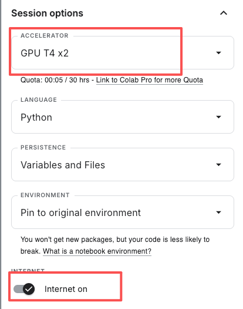

# Kaggle训练YOLO模型（布局检测模型）全流程

本文档详细介绍了如何在Kaggle平台上，使用YOLOv8模型对自定义数据集进行训练的完整流程。包括创建数据集、配置Notebook环境、编写训练代码以及保存和导出最终模型的步骤。

## 一、创建 Kaggle Dataset (一次性操作)

### 1. 准备压缩文件

在您的本地电脑上，将数据集 `dataset_augmented` 文件夹 📂（包含 `images` 和 `labels`）压缩成一个 `.zip` 文件。例如 `body_scale_dataset_augmented.zip`。

### 2. 访问 Kaggle Datasets

- 登录您的 Kaggle 账号。
- 点击顶部导航栏的 `Create` -> `Dataset` 或者其下方的 `Datasets` 按钮进入数据集页面点击 `New Dataset`按钮创建自己的数据集。

### 3. 上传并配置数据集

- **拖拽上传**: 将您刚才创建的 `.zip` 文件拖拽到上传区域。
- **填写标题**: 给您的数据集起一个清晰的标题，例如 `Body Scale UI Data`，Kaggle会自动生成URL（例如 `www.kaggle.com/datasets/mingchangge/body-scale-ui-data`）。
- **设置可见性**: 在右侧的 `Settings` 中，选择 `Private` (私有)，这样只有您自己能看到和使用这个数据集。
- **创建**: 点击 `Create` 按钮。Kaggle会在后台处理您的zip文件（可能需要几分钟）。处理完成后，您的数据集就创建好了。

现在，您的数据集被永久地、安全地托管在Kaggle上，可以在任何Notebook中重复使用。

## 二、设置 Kaggle Notebook

### 1. 创建 Notebook

- 点击顶部导航栏的 `Create` -> `Notebook`。

### 2. 配置 Notebook 环境 (右侧面板)

- **Accelerator (加速器)**: 这是最重要的设置。选择 `GPU T4 x2` 或 `GPU P100`。
- **Persistence (持久性)**: 建议选择 `Variables and Files`，有助于调试。
- **Internet (网络)**: **必须打开！** 点击开关，选择 `On`。这是为了让Notebook能下载YOLOv8的预训练模型 (`yolov8n.pt`)。

  

### 3. 添加您的数据集

- 在Notebook的右侧面板，点击 `+ Add Data` 按钮。
- 在弹出的窗口中，切换到 `Your Datasets` 标签页。
- 找到您刚刚创建的 `Body Scale UI Data` 数据集，点击旁边的 `Add` 按钮。
- 添加后，您会在 `Input` 目录下看到您的数据集。它的路径会是 `/kaggle/input/body-scale-ui-data` (根据您起的名字而定)。**这个目录是只读的**。

至此，您的Kaggle Notebook环境已经配置完成，您可以开始编写代码并执行训练了。

## 三、编写代码并执行训练

### 1. 安装 YOLOv8

在第一个代码单元格中，安装 `ultralytics`。

```bash
!pip install ultralytics -q
```

### 2. **从Input复制数据到Working目录**:

您的数据集位于只读的 `/kaggle/input` 目录。我们需要将它复制到可读写的 `/kaggle/working/` 目录中，所有操作都在这里进行。

```bash
# -r 参数表示递归复制整个文件夹
# 请确保下面的源路径与您在右侧Input面板中看到的一致

# 源路径 (只读)
SOURCE_DIR="/kaggle/input/body-scale-ui-data/dataset_augmented"

# 目标路径 (可读写)
DEST_DIR="/kaggle/working/dataset_augmented"

print(f"正在从 {SOURCE_DIR} 复制数据到 {DEST_DIR} ...")
!cp -r {SOURCE_DIR} {DEST_DIR}
print("数据复制完成！")
```

### 3. 划分数据集（可选，如果没有划分训练集和验证集）

- 为了评估模型的泛化能力，我们需要将数据集划分为训练集和验证集🔍。
- 我们将在 kaggle 环境中的 `/kaggle/working/dataset_augmented/images` 文件夹中，随机打乱顺序，将前 80% 作为训练集，剩余的 20% 作为验证集（常见的 80/20 分割）🔢。
- 在 kaggle 笔记本中，创建一个新的代码单元格并运行以下代码

  ```Python
  import os
  import random
  import shutil

  # --- Configuration ---
  SOURCE_DIR = '/kaggle/working/dataset_augmented'
  # The root directory for our newly structured dataset
  OUTPUT_DIR = '/kaggle/working/final_dataset'
  # 80% for training, 20% for validation
  TRAIN_RATIO = 0.8

  # --- Setup Paths ---
  source_images_dir = os.path.join(SOURCE_DIR, 'images')
  source_labels_dir = os.path.join(SOURCE_DIR, 'labels')

  # Create the new directory structure
  train_images_path = os.path.join(OUTPUT_DIR, 'train', 'images')
  train_labels_path = os.path.join(OUTPUT_DIR, 'train', 'labels')
  val_images_path = os.path.join(OUTPUT_DIR, 'val', 'images')
  val_labels_path = os.path.join(OUTPUT_DIR, 'val', 'labels')

  os.makedirs(train_images_path, exist_ok=True)
  os.makedirs(train_labels_path, exist_ok=True)
  os.makedirs(val_images_path, exist_ok=True)
  os.makedirs(val_labels_path, exist_ok=True)

  print("Created new directory structure at:", OUTPUT_DIR)

  # --- Get all image files and shuffle them ---
  image_files = [f for f in os.listdir(source_images_dir) if f.endswith(('.jpg', '.png', '.jpeg'))]
  random.shuffle(image_files)

  # --- Calculate the split point ---
  split_index = int(len(image_files) * TRAIN_RATIO)
  train_files = image_files[:split_index]
  val_files = image_files[split_index:]

  print(f"Total images: {len(image_files)}")
  print(f"Training images: {len(train_files)}")
  print(f"Validation images: {len(val_files)}")

  # --- Function to move files ---
  def move_files(file_list, dest_image_path, dest_label_path):
      for image_name in file_list:
          # Construct source paths
          source_image_file = os.path.join(source_images_dir, image_name)
          label_name = os.path.splitext(image_name)[0] + '.txt'
          source_label_file = os.path.join(source_labels_dir, label_name)

          # Construct destination paths
          dest_image_file = os.path.join(dest_image_path, image_name)
          dest_label_file = os.path.join(dest_label_path, label_name)

          # Move the image
          shutil.move(source_image_file, dest_image_file)

          # Move the corresponding label file, if it exists
          if os.path.exists(source_label_file):
              shutil.move(source_label_file, dest_label_file)

  # --- Move the files into their new homes ---
  print("\nMoving training files...")
  move_files(train_files, train_images_path, train_labels_path)

  print("Moving validation files...")
  move_files(val_files, val_images_path, val_labels_path)

  print("\nData splitting complete!")
  ```

### 4. 修正数据集标签ID错误（可忽略）

**<font color="red">实战错误修正，非必须步骤</font>**，这一问题最好在数据标注时就避免。

在实际操作中，我发现由于使用 **LabelImg** 进行标注时出现了标签ID错误的问题，原因是我新加的label、value标签被**LabelImg**错误的追加到其固有标签的后面，导致数据集的标签ID生成错误（。

label和value的ID分别是15和16），从而影响模型的训练。

因此，我们需要编写一个脚本来修正这些标签文件中的ID，将15改为0，16改为1。

**修正数据脚本**：

```python
import os

# --- 配置 ---
# 这是最关键的部分：请定义错误的ID到正确ID的映射
# 您需要知道 'label' 和 'value' 被错误地分配成了哪个ID。
# 假设通过查看原始的 classes.txt 或您的记忆，'label' 变成了 15，'value' 变成了 16。
# 如果不确定，可以随机打开一个原始标签文件看看第一个数字是什么。
ID_MAPPING = {
    15: 0,  # 将所有旧的ID 15 (假设是'label') 映射到新的ID 0
    16: 1,  # 将所有旧的ID 16 (假设是'value') 映射到新的ID 1
    # 如果还有其他错误ID，也在这里添加映射
}

# 指向您已经拆分好的数据集的根目录
DATASET_ROOT_DIR = '/kaggle/working/final_dataset'

# --- 脚本执行 ---
def fix_labels_in_directory(directory_path):
    fixed_files_count = 0
    total_lines_count = 0
    fixed_lines_count = 0

    if not os.path.exists(directory_path):
        print(f"警告：目录不存在，跳过: {directory_path}")
        return

    for filename in os.listdir(directory_path):
        if filename.endswith('.txt'):
            file_path = os.path.join(directory_path, filename)

            corrected_lines = []
            made_change = False
            try:
                with open(file_path, 'r') as f:
                    lines = f.readlines()

                total_lines_count += len(lines)

                for line in lines:
                    parts = line.strip().split()
                    if len(parts) == 5:
                        # 尝试将第一个部分转换为整数
                        try:
                            old_id = int(float(parts[0]))
                        except ValueError:
                            # 如果无法转换，保留原始行
                            corrected_lines.append(line.strip())
                            continue

                        # 如果旧ID在我们的映射表中，就替换它
                        if old_id in ID_MAPPING:
                            new_id = ID_MAPPING[old_id]
                            parts[0] = str(new_id)
                            corrected_lines.append(" ".join(parts))
                            made_change = True
                            fixed_lines_count += 1
                        else:
                            # 如果不在映射表中，保留原始行 (以防万一)
                            corrected_lines.append(line.strip())
                    else:
                        # 如果行格式不正确，保留原始行
                        corrected_lines.append(line.strip())

                # 只有在做出更改后才写回文件
                if made_change:
                    with open(file_path, 'w') as f:
                        f.write("\n".join(corrected_lines))
                    fixed_files_count += 1

            except Exception as e:
                print(f"处理文件 {filename} 时出错: {e}")

    print(f"在 {directory_path} 中：")
    print(f"  - 检查了 {total_lines_count} 行标签。")
    print(f"  - 修正了 {fixed_lines_count} 行标签。")
    print(f"  - 共修改了 {fixed_files_count} 个文件。")


# --- 对 train 和 val 目录都执行修复 ---
print("开始修正训练集标签...")
fix_labels_in_directory(os.path.join(DATASET_ROOT_DIR, 'train', 'labels'))

print("\n开始修正验证集标签...")
fix_labels_in_directory(os.path.join(DATASET_ROOT_DIR, 'val', 'labels'))

print("\n--- 所有标签文件修正完成！---")
```

### 5. 创建数据集配置文件 (`.yaml`)

- YOLOv8 需要一个 `.yaml` 文件来了解您的数据集：训练集和验证集在哪里，以及类别⚙️名称是什么。
- 在 `/kaggle/working/` 目录下，创建一个新的文本文件 `body_scale_data.yaml`。这个文件将包含您的数据集的配置信息。
- 注意 `yaml` 文件中的缩进必须是 **2个空格**，不能使用制表符或其他空格。

  ```yaml
  %%writefile /kaggle/working/final_dataset/body_scale_data.yaml

  # The path is now the root of our new dataset structure
  path: /kaggle/working/final_dataset

  # Point to the correct subdirectories
  train: train/images/
  val: val/images/

  # Class names remain the same
  names:
    0: label  # Correct: Indented with 2 spaces
    1: value  # Correct: Indented with 2 spaces
  ```

### 6. 执行训练命令

```bash
!yolo task=detect mode=train \
  model=yolov8n.pt \
  data= /kaggle/working/final_dataset/body_scale_data.yaml \
  epochs=150 \
  imgsz=640 \
  batch=16
```

命令成功运行后，训练日志会开始滚动。所有结果（模型、图表等）都会被自动保存在 `/kaggle/working/runs/detect/train/` 目录下。

## 四、 保存并获取最终模型

### 1. 保存版本 (Save Version)

- 当您对代码满意后（或者在训练代码的单元格下方），点击Notebook右上角的 **`Save Version`** 按钮。
- 在弹出的窗口中，选择 `Save & Run All (Commit)`。

点击 `Save & Run All (Commit)` 后，Kaggle会启动一个全新的、干净的环境，在后台从头到尾完整地运行您的Notebook一次，这确保了结果的可复现性。此时您就可以关掉浏览器，Kaggle会在云端为您完成这一切。您可以在您的Notebooks列表页看到它的运行进度。

### 2. 获取最终模型 (Get Final Model)

- 当“保存版本”运行成功后（可能需要一些时间，取决于您的训练时长），回到这个Notebook的页面（此时它是一个静态的查看页面，而不是编辑页面）。
- 点击页面上的 **`Your Work`** 标签进入您的工作页面。
- 点击您最近保存的版本（通常是最新的）笔记。
- 在 `Output` 部分，您会看到一个目录，通常是 `/kaggle/working`。
- 逐级点击进入： `runs` -> `detect` -> `train` -> `weights`。
- 您会在这里看到 `best.pt` 和 `last.pt` 文件！
- 您可以直接点击文件名旁边的下载按钮来下载 `best.pt`。

### 3. 导出为 TensorFlow.js 格式

为了得到最终的Web模型，您需要在Notebook中**再增加一步**。

- 回到Notebook的编辑模式 (`Edit`按钮)。
- 在训练命令的**下方**，添加一个新的代码单元格用于导出：

```bash
# 导出命令，它会自动找到训练好的最佳模型
!yolo export model=/kaggle/working/runs/detect/train/weights/best.pt format=tfjs
```

- 再次点击 **`Save Version`** -> **`Save & Run All (Commit)`**。
- 当这次运行完成后，回到 `Data` -> `Output` 标签页，您会在 `weights` 文件夹旁边看到一个 **`best_web_model`** 文件夹。
- 您可以点击整个文件夹旁边的下载按钮，Kaggle会将其打包成zip文件供您下载。

这个流程确保了您的所有工作和产出都被永久保存，彻底解决了Colab的临时性问题。

---

---

---

# 标签ID的问题补充说明

数据标注时label和value的ID分别是错误的15和16，原因是我新加的label、value标签被**LabelImg**错误的追加到其固有标签的后面，导致数据集的标签ID生成错误。

于是想修改yaml脚本，将label和value的ID分别修改为15和16。

然而，AI 答案是：**强烈不推荐这样做，这会导致严重的模型设计和性能问题。**

修改数据（我们上一步的方案）是正确的做法。下面我将详细解释为什么不能简单地修改YAML文件。

### 为什么不能将 `names` 设置为 `15: label`, `16: value`？

#### 1. 模型架构被强制扩大 (核心原因)

当YOLOv8读取您的YAML文件时，它会找到最高的类别ID来确定模型的**输出层结构**。

- **正确情况**: 当您的ID是 `0` 和 `1` 时，最高的ID是 `1`。YOLO会创建一个能够区分 **2个类别** (`nc=2`) 的模型。这个模型的最后一层会预测每个边界框属于类别0或类别1的概率。

- **错误情况**: 当您将ID设置为 `15` 和 `16` 时，最高的ID是 `16`。YOLO为了兼容这个ID，会创建一个能够区分 **17个类别** (`nc=17`) 的模型，这些类别分别是 `0, 1, 2, ... , 14, 15, 16`。

**打个比方：**
您只需要一个能装两种水果（苹果和香蕉）的盒子。

- 正确做法是造一个有两个隔间的盒子。
- 您的提议相当于造一个有17个隔间的巨大货架，然后把苹果放在第16个隔间，香蕉放在第17个隔间，**而前面15个隔间永远是空的**。

**这会直接导致：**

- **模型体积变大**: 模型的最后一层需要更多的参数来处理17个类别，而不是2个。
- **计算效率降低**: 在训练和推理时，模型需要进行大量无用的计算（计算物体属于类别0到14的概率，而这些概率永远是0）。
- **训练难度增加**: 模型需要在一个更大的、更稀疏的输出空间中学习，可能会导致收敛变慢或效果变差。

#### 2. 违反了深度学习的普遍约定

几乎所有的深度学习框架和数据集都遵循一个基本约定：**类别标签是零索引 (zero-indexed) 且连续的 (contiguous)**。也就是说，如果你有N个类别，它们的ID就应该是 `0, 1, 2, ..., N-1`。

违反这个约定会导致：

- **迁移学习失效**: 您使用的 `yolov8n.pt` 是在一个遵循这个约定的数据集（COCO）上预训练的。当您加载它并试图在一个不连续的类别空间上进行微调时，可能会导致不可预测的错误或训练失败。
- **工具不兼容**: 很多相关的工具（如模型分析、部署转换器等）都默认数据遵循这个标准。使用非标准的标签可能会在后续步骤中引发各种奇怪的错误。

### 总结：修改数据 vs. 修改配置

为了让您更清晰地理解，我们对比一下两种方案：

| 特性              | 方案A：修改YAML配置 (错误方式) | 方案B：运行脚本修复数据 (正确方式) |
| :---------------- | :----------------------------- | :--------------------------------- |
| **模型大小**      | **更大** (为17个类别设计)      | **轻量化** (为2个类别设计)         |
| **训练/推理速度** | **更慢** (进行大量无效计算)    | **更快**                           |
| **内存占用**      | **更高**                       | **更低**                           |
| **行业标准**      | 违反标准                       | **符合标准**                       |
| **潜在错误**      | 风险高，可能在任何环节出错     | 风险低，数据源头干净               |
| **最终效果**      | 可能更差                       | **更优**                           |

**结论：**

因此，即使它看起来像一个聪明的“捷径”，通过修改YAML文件来适应错误的标签ID是一种**反模式 (anti-pattern)**。它会创建一个效率低下、体积庞大且不规范的模型。

**正确的、专业的做法永远是：保持配置文件的标准性，去修正数据源以匹配这个标准。**

所以，请务必使用我们之前讨论的修复脚本，将所有标签ID修正为 `0` 和 `1`。这是通往成功训练一个高质量、轻量化模型的唯一正确路径。
