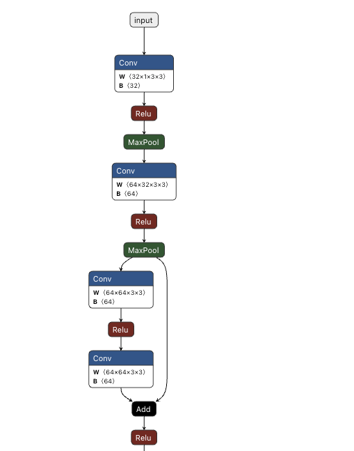

# App UI截图识别：Layout-OCR双模型训练实战指南

本文将详细介绍如何针对手机App UI截图，训练两个轻量化自定义模型（布局检测+文本识别），实现结构化GUI信息提取。整体思路为 **“文档/UI布局分析 -> 文本识别”**，因UI截图字体、布局固定，稳定性远超真实世界照片处理~ 🚀

## 核心策略：Layout-OCR双模型方案

采用“先定位区域，再识别文本”的两步法，兼顾精度与效率：

- 模型一：布局检测模型（Layout Detection Model）

  **任务**：识别截图中所有关键信息区域的边界框，仅需区分两个类别：
  - `label`：项目名称（如“体重”“BMI”“体脂率(%)”）
  - `value`：结果数据（如“61.70 公斤”“26”“偏胖”）

  **输出**：带类别（`label`/`value`）和坐标的边界框列表

- 模型二：文本识别模型（OCR Model）

  **任务**：接收模型一裁剪的文本小图，输出对应字符串
  - **输入**：单区域文本截图（如含“61.70 公斤”的图片块）
  - **输出**：结构化字符串（如 `“61.70 公斤”`）

> **💡最终流程**：
>
> 原始截图 → 布局检测模型 → 得到label/value坐标 → 裁剪小图 → OCR模型识别文本 → 坐标配对label&value → 输出结构化JSON

# 🛠️ 实战一、训练布局检测模型（Model 1）

## 1. 数据收集 ❌

单一图片无法保证泛化能力，理想数据获取方式：

1. **不同状态**：App内多次测量/手动输入不同数据，生成多样报告截图

2. **不同设备**：在不同分辨率、屏幕尺寸的手机上截图

3. **滚动截图**：截取App不同滚动位置的界面

**<font color='red'>鉴于现实情况，只用我手里现有的22张图片进行模型训练，所以数据收集这一步其实完成的不够。但我还是选择接受下面AI的建议，先做一个demo出来，在考虑是否要继续完善数据收集。</font>**

**对于您的具体案例，我建议您：**

1.  **开始阶段**：先用您手头有的**10-20张**图片进行标注。
2.  **数据增强**：编写脚本，为每张图片生成 **50-100张** 增强版本，得到一个 **1000-2000张** 的数据集。
3.  **初步训练**：用这个数据集训练你的YOLO模型。你会很快得到一个能在你的测试图片上表现不错的模型。
4.  **测试与迭代**：用一张你**从未用于训练或增强**的、故意弄得有点不一样的截图（比如滚动一点点）来测试它。如果失败了，就把这张失败的样本加入到你的原始数据集中，然后重新标注、增强、训练。这个过程被称为**“困难样本挖掘 (Hard Case Mining)”**，是持续改进模型性能最有效的方法。

## 2. 数据标注 ✔️

这是最关键的手动✏️ 工作，标注时需要注意：

- **工具**: 使用免费的标注软件，如 **LabelImg** 或 **CVAT**。
- **标注类别**: 只需创建两个类别：`label` 和 `value`。
- **标注方法**:
  - 用 `label` 框住所有的中文项目名，如“体重”、“BMI”、“基础代谢”。
  - 用 `value` 框住所有的结果数据，如“61.70 公斤”、“26”、“标准”、“肥胖型”。
  - **要点**: 尽量紧密地框住文本区域。

详细操作记录在[安装使用labelImg进行数据标注](https://github.com/mingchangge/MachineLearning-python/blob/master/%E5%AE%89%E8%A3%85%E4%BD%BF%E7%94%A8labelImg%E8%BF%9B%E8%A1%8C%E6%95%B0%E6%8D%AE%E6%A0%87%E6%B3%A8.md)

> 💡 **<font color='red'>提醒：</font>** 数据标注时需要注意标注的类型id是否从 **0** 开始。

## 3. 数据增强 ✔️

✨**数据增强 (Data Augmentation)**: 即使只有几十张原始截图，通过数据增强也能**扩充**成上千张。

对每张图片进行轻微处理：

- 亮度/对比度调整
- 色彩抖动
- 添加少量高斯噪声
- 极其微小的旋转（±1-2度）

实操：使用python `Albumentations` 库，项目本地运行命令 `python augment_data_init.py` 即可。

代码参考：[使用Albumentations进行数据增强代码](https://github.com/mingchangge/MachineLearning-python/blob/master/laoutModel/augment_data_init.py)

## 4. 模型训练（核心步骤）✔️

### 选择模型架构与训练

- **模型推荐**:🔥
  - **YOLOv8n** 或 **YOLOv5n**: 强烈推荐。它们在速度、精度和模型大小上取得了极佳的平衡，非常适合在浏览器中运行。
  - **SSD MobileNetV2**: TensorFlow官方支持的模型，也是一个优秀的选择。
- **训练环境**:
  - 优先 **Kaggle**（解决Colab资源配额问题，自动保存结果）
  - 备选 **Google Colab**（免费GPU，需手动保存结果）， 提供免费的GPU，是训练这类模型的最佳选择。

    📊 Colab vs. Kaggle 核心优势对比

    | 特性         | Google Colab                    | Kaggle Notebooks                        | 对您的好处                                                   |
    | :----------- | :------------------------------ | :-------------------------------------- | :----------------------------------------------------------- |
    | **数据存储** | 依赖手动挂载Google Drive        | **集成Kaggle Datasets**                 | 数据集一次上传，永久可用，版本清晰，与代码分离。**更规范！** |
    | **结果保存** | 需手动指定输出到Drive，否则丢失 | **自动保存输出** (通过"Save Version")   | **彻底解决模型丢失问题！** 每次运行的结果都被永久保存。      |
    | **GPU配额**  | 每日动态配额，易耗尽            | 每周30+小时固定配额                     | 更可预测，适合长时间或多次实验。                             |
    | **网络**     | 默认开启                        | 需手动开启                              | 一个需要注意的小步骤。                                       |
    | **输出目录** | `/content/` (临时)              | `/kaggle/working/` (可写, 最终会被保存) |                                                              |

> **💡为什么选择Kaggle？**
> ✅ 我在Colab上训练YOLO模型时，频繁遇到“资源配额已用尽”的问题，导致训练中断。
> ❌ 这着实叫我有些恼火💢🔥，所以直接改用**Kaggle**进行模型训练❗

- **框架**: 使用 [Ultralytics YOLOv8](https://github.com/ultralytics/yolov8) 框架，它极大地简化了训练流程。你只需上传标注好的数据集，修改一个配置文件，然后运行一条命令即可开始训练。
- **训练过程**: 框架会自动加载预训练权重，并在你的自定义数据集上进行微调。通常训练几百个轮次（epochs）后就能得到一个高精度的模型。

### 前提条件

1.  **准备好的数据集**: 您已经拥有一个名为 `dataset_augmented` 的文件夹，其中包含 `images` 和 `labels` 两个子文件夹。
2.  **科学上网**: 确保您的网络环境能够访问 Google Colab 和 Google Drive。
3.  **Google 账号**: 用于访问 [Google Colab](https://colab.research.google.com/) 和 [Google Drive](https://drive.google.com/drive/)。
4.  **Kaggle 账号**: 用于访问 [Kaggle Notebooks](https://www.kaggle.com/)。

### 完整训练步骤

| Colab 训练笔记 (markdown笔记)       | Kaggle 训练笔记(markdown笔记)                             |
| ----------------------------------- | --------------------------------------------------------- |
| [一]训练布局检测模型（双类别标注）  | [二]训练布局检测模型（双类别标注）                        |
| [三] 训练布局检测模型（三类别标注） | [终] 训练布局检测模型（单类别标注、双平台都有、模型微调） |

---

# 🛠️ 实战二、训练文本识别模型 (Model 2)

## 1. 数据集准备 (关键步骤) ✔️

- **方法A：从已标注数据中裁剪**：
- 编写脚本，根据你为模型一标注的`.xml`或`.json`文件，自动从原始图片中裁剪出所有的`label`和`value`小图片。
- **缺点**: 数据量依赖于你的截图数量，可能不足。字符种类可能不全。

- **方法B：合成数据 (强烈推荐)**：✔️
- 这是创建高质量OCR模型的秘诀，可以让你完全控制数据集。
- **1. 确定字符集**: 列出截图中出现的所有字符。
  - **数字**: `0, 1, 2, 3, 4, 5, 6, 7, 8, 9`
  - **符号**: `.` (小数点), `%`
  - **汉字**: `体, 重, 公, 斤, 脂, 率, 水, 分, 骨, 骼, 肌, 蛋, 白, 质, 肉, 内, 脏, 指, 数, 皮, 下, 去, 身, 年, 龄, 型, 基, 础, 代, 谢, 活, 动, 建, 议, 控, 制, 偏, 胖, 高, 低, 标, 准, 肥, 大, 卡` (等等...)
- **2. 找到字体**: 找到App中使用的字体文件（或一个非常相似的开源字体，例如思源黑体、苹方、vivo vivo Sans等）。
- **3. 编写生成脚本**: 使用Python的 **Pillow (PIL)** 或 **OpenCV** 库。
  - 创建一个循环，随机组合字符集中的字符生成文本（例如 "58.3%", "偏低", "1350 大卡"）。
  - 将生成的文本渲染到不同颜色（截图中出现的蓝色、绿色、橙色、灰色等）的背景上。
  - 对生成的每个小图片应用数据增强：轻微的缩放、模糊、亮度变化。
  - 将生成的图片保存，并同时生成一个标签文件，内容就是图片中的文本。通过这种方式，你可以轻松生成几十万张完美的训练数据。
  - 代码示例：[合成高质量的OCR训练数据](https://github.com/mingchangge/MachineLearning-python/blob/master/%E5%90%88%E6%88%90%E9%AB%98%E8%B4%A8%E9%87%8F%E7%9A%84OCR%E8%AE%AD%E7%BB%83%E6%95%B0%E6%8D%AE.md)

## 2. 选择模型架构与训练 ✔️

- **模型推荐**: **CRNN (Convolutional Recurrent Neural Network)**。这是OCR任务的黄金标准架构。
- **卷积层 (CNN)**: 负责从图像中提取视觉特征。
- **循环层 (RNN - 通常是LSTM或GRU)**: 负责将特征序列化，理解字符的顺序关系。
- **CTC Loss (Connectionist Temporal Classification)**: 一个特殊的损失函数，它允许模型在没有精确字符分割的情况下学习整个文本序列。
- **训练**:
- 在Keras/TensorFlow中可以自己搭建一个轻量级的CRNN模型。
- 也可以参考一些开源的轻量级OCR实现，如 [Keras-OCR](https://github.com/faustomorales/keras-ocr) 的模型结构，并在你自己的合成数据集上进行训练。
- 同样，使用Google Colab进行训练。

## 3. 导出ONNX模型 ✔️

原计划使用Keras/TensorFlow导出模型，但因为其与kaggle环境的兼容问题，最终改为使用 `PyTorch` 导出模型。✔️

原计划将pth模型转换为onnx模型✔️，在将其转为tfjs模型❌。google colab 也好，kaggle 也好，他们的环境都是最新的，还是会遇到一些依赖库的兼容问题。为了解决这些问题，一次又一次的降级依赖版本，但是依赖之间也存在着依赖关系，有的包甚至不支持在新环境中使用。最后只得放弃转换，直接使用onnx模型直接在浏览器中运行。

## 4. 完整训练步骤

| Colab 训练笔记(markdown笔记)      | Kaggle 训练笔记(markdown笔记) |
| --------------------------------- | ----------------------------- |
| [二]训练文本识别模型              | [一]训练文本识别模型          |
| [三] 训练文本识别模型（不完整版） | [终] 训练文本识别模型         |

---

# 🛠️ 实战三：在React中整合与后处理

你的React代码逻辑将如下：

1.  **加载模型**: 并发加载上面训练好的两个模型。
2.  **执行布局检测**: 用户上传图片后，将其送入**布局检测模型**，得到一个包含所有`label`和`value`边界框的列表。
3.  **批量裁剪与识别**:
    - 遍历所有边界框。
    - 使用Canvas API根据每个框的坐标从原图中裁剪出小图片。
    - 将这些小图片**批量**送入**OCR模型**进行识别。批量处理会比一张张识别快得多。
4.  **配对与结构化 (后处理)**:
    - 现在你有了两组数据：一组是所有`label`的文本和坐标，另一组是所有`value`的文本和坐标。
    - 编写一个配对算法。最简单有效的方法是：**对于每一个`value`，在所有`label`中找到与它Y坐标最接近、且位于其左侧的那个`label`。**
    - 例如，算法会发现 `value("61.70 公斤")` 的Y坐标最接近 `label("体重")`，从而将它们配对。
5.  **输出结果**: 将配对好的数据整合成一个JSON对象并显示在界面上。

    ```json
    {
      "体重": "61.70 公斤",
      "BMI": "26",
      "体脂率(%)": "36.9%",
      ...
    }
    ```

## 部分实现

### 1. 安装新依赖：

首先，我们需要安装`@tensorflow/tfjs`来运行布局模型，以及`onnxruntime-web`来运行文本识别模型。

```bash
npm install @tensorflow/tfjs onnxruntime-web
```

### 2. 存放模型文件

将您训练好的两个模型文件放入项目的 `public` 目录下。这样，它们就可以像普通静态资源一样被访问。

- `public/models/layout_model/model.json` (以及所有对应的 `*.bin` 文件)
- `public/models/ocr_model/your_ocr_model.onnx`

### 3. 创建AI服务模块 (`src/services/recognitionService.ts`)

**1. 加载布局模型和OCR模型：**

```ts
export async function initializeModels() {
  if (isInitialized) {
    console.log('模型已初始化。')
    return
  }

  try {
    console.log('正在初始化模型...')

    await tf.setBackend('webgl')

    // 2. 配置 ONNX Runtime Web (可选但推荐)， 这里的属性是同步设置的，不是异步等待
    ort.env.wasm.wasmPaths = '/ort-wasm-files/' // 建议指定 ONNX wasm 文件的路径
    ort.env.wasm.proxy = true // 明确启用代理，以在单独的 worker 中运行，防止在进行复杂计算时UI线程被阻塞。

    const [loadedLayoutModel, loadedOcrSession] = await Promise.all([
      tf.loadGraphModel('/models/layout_model/model.json'),
      ort.InferenceSession.create('/models/ocr_model/crnn_model_final.onnx', {
        executionProviders: ['wasm']
      })
    ])

    layoutModel = loadedLayoutModel
    ocrSession = loadedOcrSession
    isInitialized = true
    console.log('所有模型加载并初始化成功！')
  } catch (error) {
    console.error('模型初始化失败:', error)
    // 抛出错误，让调用方（UI组件）可以捕获并处理
    throw new Error('模型初始化失败，请检查网络或模型文件。')
  }
}
```

**代码解释：**

- `ort.env.wasm.wasmPaths = '/models/ocr_model/'` 指定 ONNX wasm 文件的路径，我们使用vite-plugin-static-copy（`npm install --save-dev vite-plugin-static-copy`）插件将其从 `node_modules/onnxruntime-web/dist/` 复制到 `public/models/ocr_model/`里面。

  <font color='red' size='4'>**注意：`public/ort-wasm-simd-threaded.jsep.wasm` 文件是之前增加的文件和本次增加的wasm文件无关！**</font>

- 处理 Cross-Origin 策略：使用**线程版本**的 WASM (`ort-wasm-simd-threaded.wasm`) 时，浏览器为了安全，要求你的网站启用特定的响应头 (COOP 和 COEP)。Vite 开发服务器默认不开启。为了开启这两个响应头，安装vite-plugin-mkcert（`npm install --save-dev vite-plugin-mkcert`）插件，并在vite.config.ts中添加如下配置：

  ```ts
  import mkcert from 'vite-plugin-mkcert' // 导入插件

  export default defineConfig({
    plugins: [react(), mkcert()], // 使用插件
    server: {
      headers: {
        'Cross-Origin-Opener-Policy': 'same-origin',
        'Cross-Origin-Embedder-Policy': 'require-corp'
      }
    },
    // 预览服务器也需要配置
    preview: {
      headers: {
        'Cross-Origin-Opener-Policy': 'same-origin',
        'Cross-Origin-Embedder-Policy': 'require-corp'
      }
    }
  })
  ```

  安装vite-plugin-mkcert插件后，首次运行项目需要输入密码（一般是开机密码）后才能正常启动https服务。这与vite-plugin-mkcert插件的工作原理有关，它需要在启动https服务时生成自签名证书。 它会首先在您的电脑上创建一个**本地的根证书颁发机构 (CA)**。然后，最关键的一步，它会尝试将这个**本地CA安装到您操作系统的系统信任库中**（例如，在macOS上是“钥匙串访问”，在Windows上是“受信任的根证书颁发机构”）。 一旦系统的信任库信任了这个本地CA，那么由这个CA签发的任何证书（比如为您 `localhost` 签发的证书）都会被您电脑上的所有浏览器（Chrome, Firefox, Edge等）自动信任。

- **OCR模型的输入/输出**

  可以用**Netron** 的工具（有桌面版和[网页版](https://netron.app/)）打开你的 `.onnx` 文件，它会可视化你的模型结构，你可以清楚地看到输入和输出节点的名称。
  

代码：略

### 4. 整合到React组件（`src/components/RecognitionController_recognitionService.tsx`）

代码：略

这个方案虽然工作量巨大（主要在数据标注和合成数据脚本上），但它是唯一能构建出真正高质量、鲁棒且轻量化的自定义识别系统的正确途径。

---

---

---

# 补充说明

## 1. 数据收集的补充说明

### 快速验证 / 针对“黄金样本”

提供10-20张原始图片，但这有一个非常大的前提：

您所说的“固定一种图片”必须是**极其严格**的。这意味着：

- **同一部手机**: 屏幕分辨率、长宽比完全一致。
- **同一版本的App**: UI布局、字体、颜色、间距没有任何变化。
- **数据状态相似**: 截图中显示的数值长度、状态标签（偏胖、标准）的种类基本覆盖。
- **无干扰项**: 截图时没有弹窗、通知栏图标变化等。

在这种近乎“像素级模板匹配”的理想情况下，10-20张精心挑选的、覆盖了主要数值变化的原始图片，**再结合强力的数据增强**，可以让模型学会识别这个特定的UI模板。

**风险**:

- **严重过拟合 (Overfitting)**: 模型可能会“背诵”这10-20张图片的布局，而不是真正“理解”它。例如，它可能不是在找“体重”这个标签，而是在记忆“屏幕顶部往下300像素位置的那个数字是体重”。
- **极其脆弱**: 哪怕App更新后某个标签移动了2个像素，或者系统状态栏多了一个蓝牙图标导致整个界面下移了一点点，模型可能就会完全失效。

### **构建一个可靠鲁棒的系统**

一个可靠的系统需要具备泛化能力，能够应对现实世界中各种微小的变化。为了达到这个目的，您的原始数据集需要包含**多样性**。

**您至少应该努力收集 50-100 张原始图片，并确保它们之间存在差异：**

1.  **数据值的变化**: 包含不同数值的截图（例如，体重61.70kg, 102.5kg, 59.0kg）。数字的长度和存在的小数点会影响布局。
2.  **状态的变化**: 包含所有可能的状态标签（偏胖、偏高、标准、偏低）。
3.  **设备的变化 (如果可能)**: 如果能找到2-3部不同分辨率的手机进行截图，模型的泛化能力会指数级提升。
4.  **滚动位置的变化**: 轻微上下滚动的截图，让模型学会即使在不同位置也能找到目标。
5.  **系统状态的变化**: 在有/无通知、不同时间、不同电量图标的情况下截图。

### 数据增强过程中产出多少张又是合适的呢？

这里的关键不是追求一个绝对的数量，而是**为原始数据的多样性“加杠杆”**。

一个非常实用的**经验法则**是：将你的数据集增强到**总共几千张图片**的规模。这个规模对于训练像YOLOv8n这样轻量级的现代模型来说，是一个非常健康和有效的范围。

#### **具体计算方法:**

假设你有 **N** 张原始图片，你希望最终数据集大小为 **T**。那么每张原始图片需要生成的增强图片数量 **M** 就是：

`M = (T / N) - 1`

**我们来套用一下这个公式：**

- **如果你从15张原始图片开始 (PoC阶段):**
  - 目标数据集大小：1500张 (一个不错的起点)
  - 每张需要生成：`(1500 / 15) - 1 = 99` 张增强图片。

- **如果你从50张原始图片开始 (推荐的起点):**
  - 目标数据集大小：2500张
  - 每张需要生成：`(2500 / 50) - 1 = 49` 张增强图片。

- **如果你有100张原始图片 (很好的基础):**
  - 目标数据集大小：3000张
  - 每张需要生成：`(3000 / 100) - 1 = 29` 张增强图片。

#### **重要建议**:

1.  **避免过度增强**: 不要生成几万甚至几十万张。这会带来**边际效益递减**——训练时间大大增加，但模型性能的提升却微乎其微。对于这个固定的UI识别任务，几千张就足够了。
2.  **增强的多样性比数量更重要**: 与其用同一种方法（例如只改变亮度）生成100张图片，不如用5种不同的增强方法（亮度、旋转、噪声、色彩、裁剪）各生成20张。`Albumentations`的`Compose`功能就是为此而生的。
3.  **保持增强的合理性**: 对于UI截图，**极其微小的旋转（±2度）**是有效的，但30度的旋转就是无效的噪声数据，因为用户不会那样截图。亮度/对比度的变化可以是中等范围，模拟日间/夜间模式。
4.  在AVD管理器中创建3-4个具有代表性的虚拟设备（例如：一个高分辨率的新款手机，一个低分辨率的老款手机，一个长宽比奇怪的手机），然后在这些设备上运行App并截图。

### 总结与行动指南

| 阶段               | 原始图片数量                         | 每张生成增强图数量 | 总数据集规模 (约)  | 目标                                       |
| :----------------- | :----------------------------------- | :----------------- | :----------------- | :----------------------------------------- |
| **快速验证 (PoC)** | **10 - 20 张**                       | **~ 100 张**       | **1000 - 2000 张** | 快速验证流程是否可行，得到一个初步模型。   |
| **可靠起点**       | **50 - 100 张**                      | **~ 40 张**        | **2000 - 4000 张** | 构建一个有一定泛化能力、效果不错的模型。   |
| **生产级模型**     | **200+ 张** (包含多种设备和边缘情况) | **~ 20 张**        | **4000+ 张**       | 构建一个在多种情况下都表现稳定可靠的模型。 |

## 2. 除了Google Colab还有没有其他方式训练模式？

绝对有！Google Colab 只是众多选择中的一个，它以免费和易于上手而广受欢迎。当您开始遇到资源限制或需要更稳定的环境时，探索其他方式是非常明智的。

以下是除 Google Colab 之外，主流的模型训练方式，我将它们分为三大类，并分析各自的优缺点，以便您选择最适合自己的方案。

### 类别一：其他云端 Notebook 服务 (最直接的替代品)

这类服务提供了与 Colab 非常相似的体验：基于 Web 的 Jupyter Notebook 环境，预装了常用库，并提供免费的 GPU/TPU 资源。

#### 1. Kaggle Notebooks (强烈推荐)

- **简介**: Kaggle 是一个数据科学竞赛平台，它提供了一流的、免费的 Notebook 环境。
- **优点**:
  - **极其慷慨的免费资源**: 通常提供每周 **30+ 小时** 的 GPU 使用时长和 **20+ 小时** 的 TPU 使用时长，配额比 Colab 更宽松。
  - **强大的硬件**: 免费提供的 GPU 通常是 NVIDIA P100 或 T4，性能出色。
  - **数据集集成**: 可以无缝访问 Kaggle 上数以万计的公开数据集，或轻松上传自己的数据集。
  - **持久化**: Notebook 和数据集会永久保存在您的 Kaggle 账户中，不像 Colab 那样有严格的断连机制。
- **缺点**:
  - 单次会话有时间限制（通常是12小时），之后需要重启。
  - 需要网络连接才能运行。
- **适用场景**: **Colab 的完美替代品**。如果您喜欢 Colab 的模式但厌倦了它的资源限制，Kaggle 是您的首选。

#### 2. Paperspace Gradient

- **简介**: 一个专注于 AI 和机器学习的云平台，提供 Notebook 服务。
- **优点**:
  - 提供**永久免费的 GPU 实例**，虽然性能较低且有存储限制，但对于小型实验足够了。
  - **付费方案灵活**: 只需很低的费用（例如每月8美元）就可以升级到更强大的 GPU 和持久化存储，感觉更像拥有一台自己的云端机器。
- **缺点**:
  - 免费版的 GPU 性能和时长不如 Kaggle 或 Colab。
- **适用场景**: 适合想要稍微投入一点预算，以换取更稳定、更专属环境的严肃爱好者或学生。

### 类别二：云端计算平台 (更专业、更强大)

这是“进阶”选项。您不再是使用一个 Notebook 服务，而是在云上**租用一台完整的、带有强大GPU的虚拟机**。您拥有这台机器的完全控制权。

#### 1. Google Cloud Platform (GCP) - Vertex AI Workbench

- **简介**: Colab 的“专业版”和“付费版”的源头。您可以在 Google 的基础设施上创建自己的、持久化的 Notebook 实例。
- **优点**:
  - **完全控制**: 您可以选择想要的 GPU 型号（A100, V100, T4...）、CPU、内存和存储空间。
  - **环境持久化**: 您的所有文件、安装的库和配置都会被永久保存，随时可以启动和关闭。
  - **新用户免费额度**: Google 通常会提供 **$300 美元** 的免费抵用金，足够您进行大量的实验和训练。
- **缺点**:
  - **成本警告**: 免费额度用完后，**忘记关闭实例会导致高昂的费用**！这是最大的风险。
  - 设置比 Colab 复杂。

#### 2. Amazon Web Services (AWS) - SageMaker / EC2

- **简介**: 全球最大的云服务提供商，提供多种机器学习服务。
- **优点**:
  - **工业标准**: 是企业和专业研究人员最常用的平台。
  - **极其灵活**: 您可以通过 EC2 实例租用几乎任何配置的机器，并使用预置了所有驱动和库的“深度学习 AMI（亚马逊机器镜像）”来快速启动。
- **缺点**:
  - **成本警告**: 与 GCP 同样，忘记关闭实例会产生持续费用。
  - 对于初学者来说，AWS 的控制台可能有些令人望而生畏。

### 类别三：在您自己的本地机器上训练

这是最具挑战性但也是最终拥有最高自由度和最低长期成本的方案。

#### 1. 硬件要求

- **GPU (最关键)**: 必须是 **NVIDIA GPU**，因为主流的深度学习框架（TensorFlow, PyTorch）都依赖于 NVIDIA 的 **CUDA** 平台。
  - **入门级**: RTX 3060 (12GB VRAM) 是一个非常好的起点。
  - **推荐级**: RTX 3070/4060/4070 或更高。
  - **VRAM (显存)**: **至关重要**。8GB 是最低门槛，**12GB 或更多** 会让您在处理高分辨率图片时游刃有余。
- **CPU/内存**: 一个现代的多核 CPU 和至少 **16GB** 的内存（推荐 **32GB** 或更多）。
- **存储**: **SSD (固态硬盘)** 是必须的，它能极大加速数据的读取速度。

#### 2. 软件设置

- **操作系统**: Windows 10/11 (配合 **WSL2** 使用 Linux 环境) 或原生 **Linux (如 Ubuntu)** 是最佳选择。
- **环境配置**:
  1.  安装 NVIDIA 显卡驱动。
  2.  安装 CUDA Toolkit 和 cuDNN 库。
  3.  使用 **Conda (Miniconda)** 或 Python 的 `venv` 来创建独立的虚拟环境，以避免不同项目间的库版本冲突。
  4.  在虚拟环境中安装 `tensorflow` 或 `pytorch` 以及 `ultralytics`。

#### 3. 优缺点

- **优点**:
  - **一次性投资**: 购买硬件后，没有持续的云端费用。
  - **完全控制**: 您的数据和代码完全私有，您可以 24/7 不间断地运行训练。
  - **无延迟**: 直接在本地操作，没有网络延迟。
- **缺点**:
  - **高昂的初始成本**: 购买一台带强大GPU的电脑价格不菲。
  - **复杂的配置和维护**: 您需要自己处理驱动安装、环境配置和故障排除。
  - 硬件会过时，且会产生电费。

### 总结与建议

| 方式                    | 成本        | 设置复杂度 | 稳定性/持久性               | 适用人群                     |
| :---------------------- | :---------- | :--------- | :-------------------------- | :--------------------------- |
| **Google Colab**        | 免费        | 非常低     | 低 (易断连, 文件临时)       | 初学者、快速原型验证         |
| **Kaggle Notebooks**    | 免费        | 非常低     | 中等 (会话有期限, 文件持久) | **Colab的最佳免费替代者**    |
| **Paperspace Gradient** | 免费/低     | 低         | 中到高 (付费版很稳定)       | 愿意花小钱的严肃爱好者       |
| **GCP / AWS**           | 免费额度/高 | 中等       | 非常高 (完全持久化)         | 专业人士、有预算的研究者     |
| **本地机器**            | 高 (硬件)   | 高         | 非常高 (完全由您控制)       | 长期投入者、数据隐私要求高者 |

**给您的具体建议：**

1.  **立即尝试**: **转向 Kaggle Notebooks**。这是最无缝、最简单的过渡，可以立即解决您遇到的 Colab 资源限制问题。
2.  **下一步进阶**: 如果您发现自己每周都需要超过 Kaggle 提供的30小时，并且愿意投入少量资金，可以尝试 **Paperspace Gradient 的付费方案** 或 **开始使用 GCP/AWS 的免费额-度**。
3.  **长期投资**: 如果您确定将长期深入这个领域，并希望拥有最大的自由度，那么**攒钱配置一台带有强大NVIDIA显卡的本地电脑**是最终的、也是最划算的选择。
