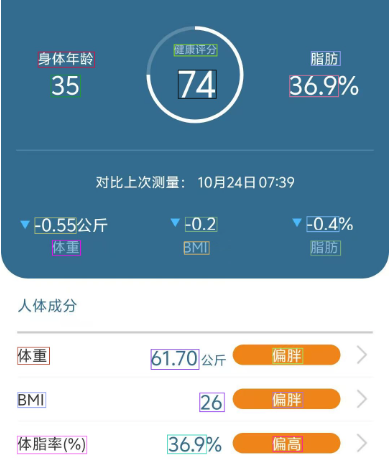
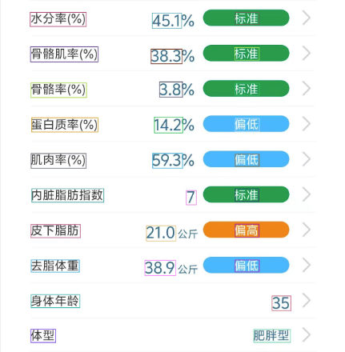
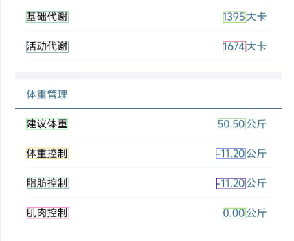

# 训练布局检测模型（单类别标注）

## 经验教训

### 我们的YOLO文本识别探索之旅：从屡败屡战到柳暗花明 🚀

在我们的项目中，最初的目标看似简单直接：利用YOLO模型，精准识别出UI界面中的`item_name`（项目名）和`item_value`（数值）等多个类别。然而，这场看似寻常的航行，却很快将我们带入了一片充满挑战的风暴海域。

#### 🤯 **第一道难关：令人抓狂的“双胞胎”混淆**

我们很快就遇到了一个核心障碍：对于模型而言，`item_name`和`item_value`简直就像一对难以分辨的双胞胎！

- **视觉上太相似**：它们都是由中文字符构成，共享着相似的字体和背景。
- **空间上太多变**：一会是经典的“左-右”布局，一会又变成了“上-下”结构。

这导致模型陷入了严重的混淆，完全无法建立起一个可靠的识别规则。我们为此付出了巨大的努力，反复尝试了双类别、五类别、三类别乃至最终的单类别数据标注方案。尽管每一次的训练报告（`results.png`）都给了我们喜人的高分 ✅，但在前端用同一张图片进行实地测试时，结果却总是惨不忍睹 😭。

#### 💡 **“Aha!”时刻：与其强模型所难，不如各司其职**

为了不让数周的心血付诸东流，我们迎来了项目中最关键的“Aha!”时刻。我们意识到，强迫YOLO去理解这种复杂的、基于上下文的逻辑关系，本身可能就是一条走不通的路。

最终，我们做出了一个决定性的战略转移：**放弃让模型做困难的“分类题”，只让它做最擅长的“圈地题”**。我们将所有检测框都视为单一的`text_block`类别，然后将分类和配对的“大脑”——那些复杂的坐标和内容判断逻辑——完全交给了前端代码。

这深刻地揭示了YOLO这类通用检测模型，在处理需要深度布局和关系理解的特定任务时，确实存在其能力边界 🤔。

#### 🛠️ **血泪教训#1：预处理，模型的“半条命”！**

在整个调试过程中，耗时最长、最令人痛苦的，莫过于解决层出不穷的坐标定位错误。我们与坐标格式、缩放算法（信箱填充 vs 扭曲拉伸）进行了艰苦卓绝的斗争。

这段经历让我们铭记了一个真理：**“推理与训练的预处理，必须达到像素级的完全一致”** 🤝。前端的图像预处理绝不是一个可有可无的辅助步骤，它就是模型定义的核心组成部分，是必须被精确复刻的“DNA蓝图”。

#### 🛠️ **血泪教训#2：数据增强，要的是“智慧”而非“暴力”**

我们也认识到，针对UI文本识别这类任务，数据增强策略必须精雕细琢。我们果断关闭了像`Mosaic`、`垂直/水平翻转`等在通用任务中效果拔群，但在这里却极具破坏性的操作。因为这些操作会彻底破坏文字的可读性和UI布局的内在稳定性。为我们的任务量身定制温和的增强策略，才是通往成功的正确道路。

这段旅程虽然曲折，但最终的收获远超预期。我们不仅得到了一个可用的模型，更重要的是，我们深刻理解了模型的能力边界，并掌握了打通训练与部署之间“最后一公里”的关键秘诀。🏆

## 成果展示

| 图片一                                                 | 图片二                                                   | 图片三                                                   |
| ------------------------------------------------------ | -------------------------------------------------------- | -------------------------------------------------------- |
|  |  |  |

## 模型训练过程

### 1. 数据标注

这是最关键的手动✏️ 工作，标注时需要注意：

- **工具**: 使用免费的标注软件，如 **LabelImg** 或 **CVAT**。
- **标注类别**: 只需创建两个类别：`label` 和 `value`。
- **标注方法**:
  - 用 `label` 框住所有的中文项目名，如“体重”、“BMI”、“基础代谢”。
  - 用 `value` 框住所有的结果数据，如“61.70 公斤”、“26”、“标准”、“肥胖型”。
  - **要点**: 尽量紧密地框住文本区域。

详细操作记录在[安装使用labelImg进行数据标注](https://github.com/mingchangge/MachineLearning-python/blob/master/%E5%AE%89%E8%A3%85%E4%BD%BF%E7%94%A8labelImg%E8%BF%9B%E8%A1%8C%E6%95%B0%E6%8D%AE%E6%A0%87%E6%B3%A8.md)

> 💡 **<font color='red'>提醒：</font>** 数据标注时需要注意标注的类型id是否从 **0** 开始。

### 2. 数据集划分训练集和验证集

为了评估模型的泛化能力，我们需要将数据集划分为训练集和验证集🔍。通常，我们会将数据集的80%用于训练，20%用于验证。

于是直接使用 [randomly_generated_dataset.py](https://github.com/mingchangge/MachineLearning-python/blob/master/laoutModel/randomly_generated_dataset.py) 划分训练集和验证集。

### 3. 训练集数据增强

#### 核心增强策略

我们将采用以下对文字识别任务最有效的增强方法：

1.  **仿射变换 (Affine Transforms)**: 这些变换保持线条的平直和并行，非常适合模拟拍照时的轻微变化。
    - **平移 (Shift)**: 模拟截图区域的微小移动。
    - **缩放 (Scale)**: 模拟不同屏幕分辨率或距离。
    - **旋转 (Rotate)**: 模拟手机的轻微倾斜。**我们会将旋转角度限制在很小的范围内（例如±5度）**，以防文字变得难以辨认。

2.  **光照与噪声 (Lighting & Noise)**: 这些变换模拟不同的环境条件。
    - **亮度/对比度调整**: 模拟不同环境光下的屏幕显示效果。
    - **高斯噪声**: 模拟相机传感器的电子噪声或图像压缩带来的伪影。

3.  **模糊 (Blur)**:
    - **运动模糊**: 这是一个极佳的增强方法，可以有效模拟拍照时轻微的手部抖动。

我们将**严格避免**以下操作，因为它们会严重破坏文字的结构：

- **弹性变换 (ElasticTransform)**, **网格畸变 (GridDistortion)**: 会将文字扭曲成不规则的波浪形。
- **垂直翻转 (VerticalFlip)**: 对文字来说毫无意义。
- **大幅度旋转**: 超过10度的旋转就会对文字识别造成困难。
- **中值模糊 (MedianBlur)**: 容易抹除文字的细节和笔画。

[数据增强脚本](https://github.com/mingchangge/MachineLearning-python/blob/master/laoutModel/augment_data.py)

### 4. 上传数据集到Google Drive

- 在您的**本地电脑**上，将整个数据集 `dataset_augmented_final` 文件夹压缩成一个 `.zip` 文件。mac用户可以使用`zip -r dataset.zip dataset_augmented_final`命令，前提是先 `cd` 到`dataset_augmented_final`文件夹所在目录🗜️。
- 在 [Google Drive](https://drive.google.com/) 的主目录中（通常，打开后默认就在主目录），新建一个文件夹（最好新建一个文件夹存放本次训练的相关内容，包括数据集），上传这个 `dataset.zip` 文件（将 dataset.zip 文件直接用鼠标拖拽到 Google Drive 的浏览器窗口的文件列表区域）。通过浏览器上传单个大文件远比上传成千上万个小文件要快 ⚡。
- 确保您的 `dataset.zip` 文件已成功上传到 Google Drive 中 ✔️。

### 5. 环境设置与Drive挂载

#### 1. 创建 Colab Notebook

- 访问 [colab.research.google.com](https://colab.research.google.com)。
- 点击 文件-在云端硬盘新建笔记本（`File` -> `New notebook`）， 创建一个新的 Notebook📝。

#### 2. 启用 GPU 加速 (关键步骤)

- 点击菜单栏的 `代码执行程序` -> `更改运行时类型`（`Runtime` -> `Change runtime type`）。
- 在 `硬件加速器` 下拉菜单中，选择 `T4 GPU`。
- 点击 `Save`。这会为您分配一个免费的GPU，极大加速训练过程🚀。

#### 3. Drive挂载与环境检查

```python
# 1. 挂载 Google Drive
# 点击链接并授权，使 Colab 可以访问您的 Drive 文件
from google.colab import drive
drive.mount('/content/drive')

# 2. 安装 YOLOv8
# -q 参数表示静默安装，减少不必要的输出
!pip install -q ultralytics

# 3. 检查 GPU 环境
# 确保 Colab 为您分配了 GPU，这是高效训练的保证
print("--- 检查 GPU ---")
!nvidia-smi
print("\n如果上面没有显示 GPU 信息，请点击菜单栏的 '代码执行程序' -> '更改运行时类型' -> 选择 'T4 GPU'，然后重新运行此单元格。")
```

### 6. 解压数据集

将您上传的ZIP文件从Drive复制到Colab的本地运行时（这比直接从Drive读取要快得多），然后解压缩。

```python
import os

# --- 关键：定义您的Google Drive项目文件夹路径 ---
# 所有输入和输出都将基于此路径
drive_project_dir = '/content/drive/MyDrive/train_layout_detection_model'

# 定义数据集ZIP文件和本地解压路径
zip_path_in_drive = os.path.join(drive_project_dir, 'dataset.zip')
local_dataset_path = '/content' # 在Colab运行时中解压，以获得最快的读取速度

# 检查数据集ZIP文件是否存在于指定位置
if not os.path.exists(zip_path_in_drive):
    print(f"错误：在指定的路径找不到数据集ZIP文件: {zip_path_in_drive}")
    print("请确保您已将 'dataset.zip' 上传到 Drive 的 'train_layout_detection_model' 文件夹中。")
else:
    print("成功找到数据集ZIP文件。")
    # 1. 从 Drive 复制到 Colab 本地运行时，以加速训练
    print(f"正在从 Google Drive 复制数据集...")
    !cp "{zip_path_in_drive}" /content/

    # 2. 解压缩数据集
    print("正在解压缩...")
    !unzip -q "/content/dataset.zip" -d {local_dataset_path}
    print(f"数据集已成功解压到 Colab 的本地路径: {local_dataset_path}")
```

### 7. 创建数据集配置文件

```python
%%writefile /content/dataset.yaml
# 将 path 指向包含 train 和 val 文件夹的真实路径
path: /content/dataset_augmented_final

# train 和 val 的路径是相对于上面的 path 来定义的，所以它们保持不变
train: train/images
val: val/images

# 类别名称
names:
  0: text_block
```

### 8. 训练模型

```python
# --- 开始 YOLOv8 训练 ---
# 通过设置 'project' 参数，所有训练结果（模型权重、日志、图表）
# 将在训练过程中被实时、安全地写入到您的Google Drive文件夹中。

!yolo task=detect mode=train \
model=yolov8n.pt \
data=/content/dataset/dataset.yaml \
epochs=300 \
imgsz=640 \
batch=16 \
project='{drive_project_dir}/training_runs' \
name='BodyFatDetector_CustomAug' \
degrees=0.0 \
shear=0.0 \
perspective=0.0 \
flipud=0.0 \
fliplr=0.0 \
mosaic=0.0 \
mixup=0.0 \
copy_paste=0.0 \
translate=0.1 \
scale=0.1 \
hsv_h=0.015 \
hsv_s=0.4 \
hsv_v=0.4

# --- 参数说明 ---
# project: 【关键】指定所有训练结果的保存根目录。
#          我们将其设置为您Drive项目文件夹下的一个新子目录 'training_runs'，
#          这样可以保持项目文件夹的整洁。
# name:    本次训练运行的具体名称。YOLOv8会创建这个子文件夹来存放所有文件。
# epochs:  训练轮数。根据您的数据集大小和计算能力，
#          您可以调整此值。300轮通常是一个合理的起点。
# imgsz:   输入图像大小。640是一个常用的默认值，
#          但您可以根据需要调整（如320或416）。
# batch:   每个训练批次的样本数量。16是一个常用值，
#          但根据您的GPU内存，您可以调整为8或32。
# 其他参数：
# degrees:  图像旋转角度。0.0表示不旋转。
# shear:    图像剪切角度。0.0表示不剪切。
# perspective: 透视变换参数。0.0表示不透视。
# flipud:   垂直翻转概率。0.0表示不翻转。
# fliplr:   水平翻转概率。0.0表示不翻转。
# mosaic:   Mosaic增强概率。0.0表示不使用。
# mixup:    Mixup增强概率。0.0表示不使用。
# copy_paste: Copy-Paste增强概率。0.0表示不使用。
# translate: 图像平移概率。0.1表示10%的平移。
# scale:    图像缩放概率。0.1表示10%的缩放。
# hsv_h:    HSV颜色空间中色调通道的变化范围。0.015表示1.5%的变化。
# hsv_s:    HSV颜色空间中饱和度通道的变化范围。0.4表示40%的变化。
# hsv_v:    HSV颜色空间中值通道的变化范围。0.4表示40%的变化。
```

> **优势**：即使Colab意外断开连接，您的训练进度（检查点）和已完成的结果都已保存在Drive中，不会丢失。

### 9. 从 .pt 导出为TensorFlow.js格式

```python
import os
import shutil

# --- 1. 定义路径 (保持不变) ---
drive_project_dir = '/content/drive/MyDrive/train_layout_detection_model'
run_name = 'BodyFatDetector_CustomAug' # <--- 请确保这里是您最新的运行名称

pt_model_path = os.path.join(drive_project_dir, 'training_runs', run_name, 'weights/best.pt')
# 我们期望的最终导出位置
export_dir = os.path.join(drive_project_dir, 'exported_models')
os.makedirs(export_dir, exist_ok=True) # 确保目标文件夹存在

if not os.path.exists(pt_model_path):
    print(f"错误：找不到模型文件: {pt_model_path}")
else:
    print(f"成功找到待导出的模型: {pt_model_path}")

    # --- 2. 执行导出命令 (保持不变) ---
    # 我们知道它会把结果保存在 pt_model_path 旁边
    !yolo export model='{pt_model_path}' format=tfjs imgsz=640 nms=True iou=0.45 conf=0.5

    # --- 3. 【关键修复】移动生成的文件到目标位置 ---

    # YOLOv8 会在 .pt 文件同级目录下创建 'best_web_model' 文件夹
    source_model_dir = os.path.join(drive_project_dir, 'training_runs', run_name, 'weights/best_web_model')

    # 我们想要移动到的最终目标路径
    target_model_dir = os.path.join(export_dir, 'best_web_model')

    print(f"\n--- 正在从 {source_model_dir} 移动模型到 {target_model_dir} ---")

    # 在移动前，先检查源文件夹是否存在
    if os.path.exists(source_model_dir):
        # 如果目标文件夹已存在，先删除它以进行覆盖
        if os.path.exists(target_model_dir):
            shutil.rmtree(target_model_dir)

        shutil.move(source_model_dir, target_model_dir)

        print("\n--- 移动完成！---")
        print(f"您的 TensorFlow.js 模型文件已保存在:")
        print(target_model_dir)

        # 列出最终位置的文件以供确认
        !ls -l "{target_model_dir}"
    else:
        print(f"错误：在预期的源路径找不到导出的 TF.js 模型: {source_model_dir}")
        print("请检查上面的导出日志寻找线索。")
```

# 模型微调

在使用中发现模型没有学会识别`0`，所以 **在现有模型的基础上，用我们新增的“0”值样本，对它进行一次短暂而专注的“补充训练”或“微调”（Fine-tuning）。**

- 生成新的训练数据集，包含所有旧样本和新增的“0”值样本。
  - [生成微调数据集的脚本](https://github.com/mingchangge/MachineLearning-python/blob/master/laoutModel/generate_data.py)
  - [最终版、最全困难样本靶向增强脚本](https://github.com/mingchangge/MachineLearning-python/blob/master/laoutModel/generate_data_augment2.py)
  - [专项困难样本合成脚本](https://github.com/mingchangge/MachineLearning-python/blob/master/laoutModel/generate_data_augment3.py)
- 用新数据集对现有模型进行微调训练。（微调也不是一次完整的训练，而是在原有模型基础上，用新样本进行补充训练，以提高模型在新任务上的性能。可能需要调整训练参数，如学习率、批次大小等，也不一定一次就能完全优化，但我们只记录一次微调过程就行。）

  ```python
  # ===================================================================
  # 单元格 1: 环境配置 (Kaggle 最新环境最终修复版)
  # ===================================================================

  import sys
  import os

  # 打印初始环境，便于调试
  print("--- 初始环境 ---")
  !pip list | grep -E 'torch|ultralytics'

  # --- 第2步: 使用更强制的手段，直接安装我们需要的包 ---
  # 我们使用 "--no-deps" 来避免pip在卸载时检查过多依赖，然后用 "--upgrade" 来强制覆盖
  # 最后，我们明确地安装所有需要的包，确保版本一致性
  # 这个命令会告诉pip：“我只要这三个包的最新兼容版本，其他的依赖冲突请暂时忽略。”
  !pip install --upgrade --quiet "ultralytics" "torch" "torchvision"

  # --- 第3步: 验证最终安装是否成功 ---
  # 使用try-except来确保即使某个包导入失败，代码也不会崩溃
  print("\n--- 最终环境 ---")
  try:
      import ultralytics
      import torch
      import torchvision

      print("✅ 环境配置成功！")
      print(f"   - Python 版本: {sys.version.split(' ')[0]}")
      print(f"   - Ultralytics 版本: {ultralytics.__version__}")
      print(f"   - PyTorch 版本: {torch.__version__}")
      print(f"   - Torchvision 版本: {torchvision.__version__}")

  except ImportError as e:
      print(f"❌ 安装后导入失败: {e}")
      print("   请尝试重启Kaggle Kernel (点击顶部的刷新或“Restart Session”按钮) 后再试。")
      # 清理工作区，以防部分安装导致后续步骤失败
      os._exit(1)

  # ===================================================================
  # 单元格 2: 复制数据集文件及微调模型到指定目录
  # ===================================================================
  !cp -r /kaggle/input/dataset-finetune/finetune_layout_dataset/ /kaggle/working/
  !cp -r /kaggle/input/layoutmodel-finetune/best.pt /kaggle/working/

  # ===================================================================
  # 单元格 3: 编写微调配置文件
  # ===================================================================
  %%writefile /kaggle/working/finetune_layout.yaml
  # 将 path 指向包含 train 和 val 文件夹的真实路径
  path: /kaggle/working/finetune_layout_dataset

  # train 和 val 的路径是相对于上面的 path 来定义的，所以它们保持不变
  train: images/train
  val: images/val

  # 类别名称
  names:
  0: text_block

  # ===================================================================
  # 单元格 4: 微调模型
  # ===================================================================
  from ultralytics import YOLO

  # 1. 加载您最初训练好的、最强的模型
  model = YOLO('/kaggle/working/best.pt')
  # 2. 使用新的“均衡”数据集进行微调
  results = model.train(
  data='/kaggle/working/finetune_layout.yaml', # <-- 使用新的配置文件
  epochs=200,
  patience=50,
  imgsz=640,
  batch=16,
  lr0=0.0005,      # 使用一个更小的学习率进行精细微调
  mosaic=0.5,
  project='/kaggle/working/layout_model/training_runs',
  name='layout_model_finetuned'
  )
  ```

# 补充说明

## 1. yolo训练参数说明

### 1. 关闭 Mosaic、Mixup、Erasing

- **Mosaic**: 将四张不同的训练图片拼接成一张进行训练。
- **Mixup**: 将两张图片按一定比例混合（像素叠加）在一起。
- **Erasing**: 随机擦除训练图片中的一部分区域，模拟遮挡。

**关闭原因：**

- **破坏空间结构**: App截图具有**非常稳定且重要的空间布局**（项目名在左，数值在右）。Mosaic会将四张不同截图的碎片拼接在一起，创造出一个“弗兰肯斯坦”式的、在现实世界中**永远不可能存在**的UI布局。这会严重干扰模型对“左边是`item_name`，右边是`item_value`”这一核心规则的学习。
- **产生无意义的图像**: Mixup会将两张截图叠加，导致文字重叠，变得完全无法辨认。这等于是在给模型投喂“垃圾”数据。
- **产生“标签噪声”**：由于检测目标（文本框）本身就**非常小**，一个随机的遮挡块很可能**将一个完整的文本框（如“偏低”或“26”）完全擦除掉**，造成标注文件里说这里有一个目标，但图片上对应的区域却是一片空白，这会严重误导模型的训练。

**关闭方式：**

- 在您的`yolo`训练命令中，可以添加参数 `mosaic=0` 和 `mixup=0`。但更简单、更规范的方法是在训练的最后一个阶段关闭它们。YOLOv8默认会在最后10个epochs自动关闭Mosaic，但对于您的任务，我们最好从一开始就不用或大幅减少。最稳妥的方式是在训练命令中直接指定。
- **Erasing**: 在YOLOv8中通常通过`copy_paste`参数控制（`copy_paste: 0.0`），或者在更底层的配置中找到`erasing`并将其概率设为0。

### 2. 调整数据增强参数

| 参数                  | 默认值 (约) | 对任务的影响                                                      | **推荐配置**                              |
| :-------------------- | :---------- | :---------------------------------------------------------------- | :---------------------------------------- |
| **fliplr** (水平翻转) | 0.5         | **致命性危害**。翻转后的文字无法被OCR识别，且完全破坏了左右布局。 | `fliplr: 0.0` **(必须关闭)**              |
| **flipud** (垂直翻转) | 0.0         | (默认关闭) 同样有害，保持关闭。                                   | `flipud: 0.0` **(必须关闭)**              |
| **translate** (平移)  | 0.1         | **有益**。模拟截图不完全居中的情况。                              | `translate: 0.1` (保留)                   |
| **scale** (缩放)      | 0.5         | **过于激进**。缩放到50%会让小字变得模糊不清，难以识别。           | `scale: 0.1` (更保守的缩放，例如90%-110%) |
| **hsv_h** (色调)      | 0.015       | **基本无害**。轻微的色调变化可以保留。                            | `hsv_h: 0.015` (保留)                     |
| **hsv_s** (饱和度)    | 0.7         | **过于激进**。高饱和度变化可能影响带颜色的状态文字（蓝/绿/橙）。  | `hsv_s: 0.4` (降低强度)                   |
| **hsv_v** (亮度)      | 0.4         | **有益但可降低**。模拟不同屏幕亮度。                              | `hsv_v: 0.4` (可以保留或略微降低)         |
