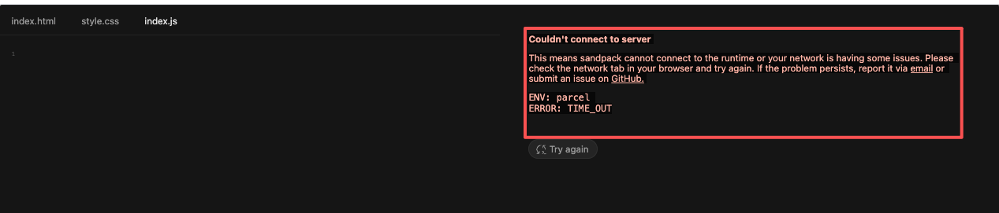

## 代码编辑预览工具使用感受

- @monaco-editor/react 和 @codesandbox/sandpack-react 搭配使用
  - 安装命令：`npm i @monaco-editor/react @codesandbox/sandpack-react`
  - @monaco-editor/react 用于代码编辑
  - @codesandbox/sandpack-react 用于代码预览，（也支持代码编辑）但是加载缓慢，国内很容易time out，卸载命令：`npm uninstall @codesandbox/sandpack-react`。Sandpack 是 CodeSandbox 团队开源的浏览器内打包器，依赖全部走本地 ServiceWorker，首次 1-2 s，后续 50 ms 热更新。说的很好听，用起来不太方便，刷新页面加载慢，预览容易time out。
    
- @stackblitz/sdk：可以同时支持代码编辑和预览
  - 安装命令：`npm i -D @stackblitz/sdk`
  - 包含webcontainer/api 插件，用于在浏览器中运行代码
  - 经常连不上 WebContainer（VM），报错`Timeout: Unable to establish a connection with the StackBlitz VM`
  - 但 **StackBlitz 的冷启动阶段**（几十毫秒级）就已经去 / 拉文件了，当在 index.tsx 里动态地把 index.html 的内容（或其它文件）写到 **StackBlitz** 的 `fileSystem`，真正通过 project API 把文件写进去时，VM 早就因为「没发现 index.html」而回退到默认模板，于是看到的就是慢加载 + 默认页。而读取默认模板，会有js文件报错：`net::ERR_CONNECTION_CLOSED`。比如：`https://cdn.segment.com/analytics.js/v1/ta1kDK49qdEDEfd8KYxI37mW0GPkLKn1/analytics.min.js`
  - 以及加载成功后，会报一些权限类的错误，比如：`Uncaught (in promise) Error: Permission denied to access property "writeFile"`
  - 但编辑预览功能还能使用，不过因为加载缓慢，还是考虑不用这个插件，卸载命令：`npm uninstall @stackblitz/sdk`
- @webcontainer/api插件，专门的预览插件，但是因为导出commonjs模块，报一堆类型错误，以弃用。
  - 安装命令：`npm install @webcontainer/api --save-dev`
  - 卸载命令：`npm uninstall @webcontainer/api`。

- CodeSandbox Embed：本地无 SDK、无 Timeout，国内网络可正常访问。初识加载缓慢，已弃用
  - 初识加载缓慢，但是后续加载很快
  - 支持代码编辑和预览

- Monaco + esbuild-wasm：在用，加载很快
  - 安装命令：`npm i -D monaco-editor esbuild-wasm vite-plugin-monaco-editor`
  - 编辑页面简单，但是预览功能较弱
  - 预览功能较弱，因为没有代码打包功能，只能预览静态文件

## 剩余选择

| 方案                | 集成成本          | 功能              | 网络要求 | 适用场景             | 备注   |
| ------------------- | ----------------- | ----------------- | -------- | -------------------- | ------ |
| react-online-editor | 最低（npm 即用）  | 中                | 国内直连 | DEMO、教学、轻量项目 | 没试过 |
| react-playground    | 中（npm）         | 高（支持 npm 包） | 国内 CDN | 需要第三方依赖的示例 | 没试过 |
| CodeSandbox Embed   | 高（需一次 POST） | 最高（完整 IDE）  | 国内加速 | 复杂项目、团队协作   | 已弃用 |

# TODO （二选一）

- 卸载不使用的插件：
  - 稍后卸载monaco-editor插件，`npm uninstall @monaco-editor/react`
  - 稍后卸载stackblitz插件，`npm uninstall @stackblitz/sdk`
- 增加菜单栏，记录每个插件的使用

## Monaco + esbuild-wasm编辑预览vue、react、node等可行性与方案

Monaco Editor（VS Code核心编辑器）结合esbuild-wasm（WebAssembly版本的esbuild打包工具）可以实现对Vue、React、Node等内容的编辑和预览，但需要针对不同类型的内容做特定处理，具体可行性和限制如下：

### 1. React 支持

**可行度：高**

- **编辑层面**：Monaco原生支持JavaScript/TypeScript语法，通过配置`language`为`javascriptreact`或`typescriptreact`即可完美支持JSX/TSX语法高亮、智能提示。
- **预览层面**：esbuild-wasm可以直接处理JSX语法（通过`jsx: "transform"`配置），将React代码转译为浏览器可执行的JavaScript。配合React的UMD版本（通过CDN引入），可以在浏览器中实时渲染预览。
- **关键处理**：
  - 需要在打包时指定`jsxImportSource: "react"`（针对React 17+）。
  - 预览环境需提前引入`react`和`react-dom`的全局变量。

### 2. Vue 支持

**可行度：中**

- **编辑层面**：Monaco默认不支持`.vue`单文件组件（SFC），需要额外引入插件（如`monaco-vue`）来实现`<template>`、`<script>`、`<style>`的语法高亮和分区编辑。
- **预览层面**：esbuild本身不直接支持Vue SFC，需要配合编译工具：
  - 可以使用`@vuedx/compiler-sfc`等工具在浏览器中解析SFC，拆分为模板、脚本和样式。
  - 脚本部分通过esbuild-wasm打包，模板部分通过`vue-template-compiler`编译为渲染函数，最后结合Vue的UMD版本运行。
- **限制**：SFC中的样式隔离、自定义块等高级功能实现复杂度较高。

### 3. Node.js 支持

**可行度：低（编辑可行，预览受限）**

- **编辑层面**：Monaco可以通过配置支持Node.js相关的语法（如`require`、`module`等）和内置模块提示（需引入`@types/node`类型定义）。
- **预览层面**：存在根本性限制：
  - esbuild-wasm运行在浏览器环境，无法模拟Node.js的原生模块（如`fs`、`path`、`child_process`等）。
  - 即使通过`rollup-plugin-node-polyfills`等工具 polyfill 部分API，也无法完全模拟Node.js运行时，涉及系统操作、进程管理的代码无法正常执行。
- **替代方案**：仅能预览纯JavaScript逻辑（不依赖Node原生API的代码），或通过WebSocket连接后端Node服务执行代码并返回结果（非纯前端预览）。

### 实现核心思路

1. **编辑器配置**：通过Monaco的`defineTheme`、`setModelLanguage`等API配置对应语言的语法支持，必要时引入第三方语法插件。
2. **打包处理**：使用esbuild-wasm的`transform`或`build`API，根据内容类型（React/Vue/纯JS）配置相应的loader（如`jsx`、`tsx`）和插件。
3. **预览渲染**：
   - 对于React/Vue，将打包后的代码注入到预览iframe中，结合全局引入的框架 runtime 执行。
   - 对于Node.js，仅做语法校验和静态分析，运行预览需依赖后端环境。

### 总结

- **推荐支持**：React（实现简单，兼容性好）。
- **谨慎支持**：Vue（需额外处理SFC编译，功能受限）。
- **有限支持**：Node.js（仅编辑，预览需牺牲部分功能）。

实际实现中，还需要处理依赖管理（如通过CDN引入外部库）、错误捕获（编译和运行时错误提示）等问题，才能提供流畅的编辑预览体验。
